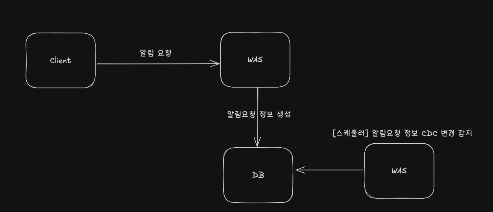

## 알림 서비스 CDC 테스트

- MySQL
- [mysql-binlog-connector-java](https://mvnrepository.com/artifact/com.zendesk/mysql-binlog-connector-java/0.25.0)

 

**2025.08.23**

- 업데이트 시
  - 업데이트 처리는 Spring Transaction 을 통해서 더티체킹 처리
  - 그렇기 때문에 이전값과 같은 값으로 업데이트할 경우 해당 이벤트는 처리되지 않음 → 좀더 정확히는 쿼리자체가 발생하지 않음
