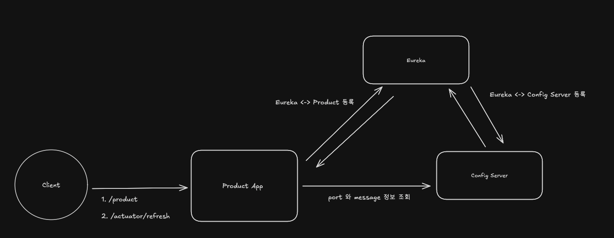

## Config Server [Spring Cloud Config]

**구조**

1. Client 가 `Product` 조회
   - Product App 은 port 와 message 를 Config Server 에서 조회
2. Client 가 POST `actuator/refresh` 요청 (`@RefreshScope` 를 적용한 Application 에서 요청해야함)
   - Config Server 에서 정보를 가져와서 Product 에 반영
