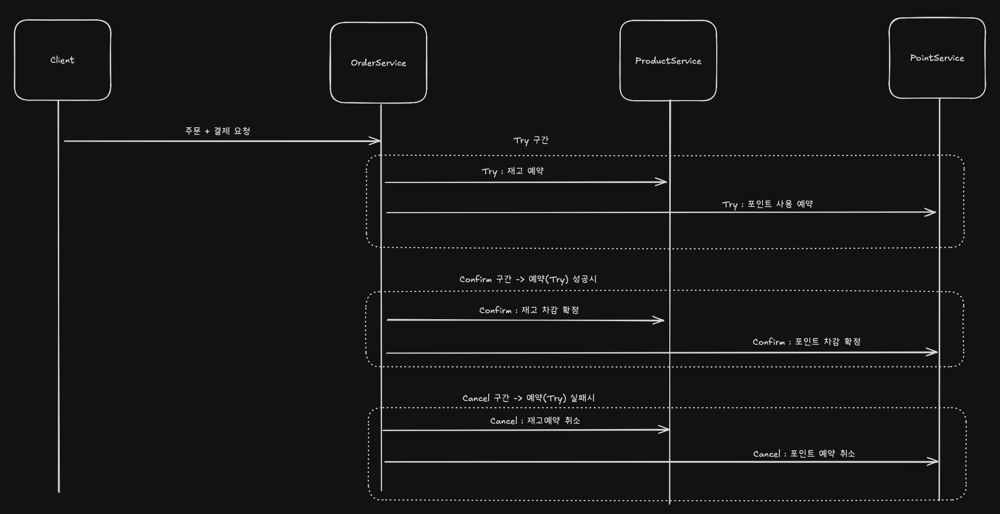
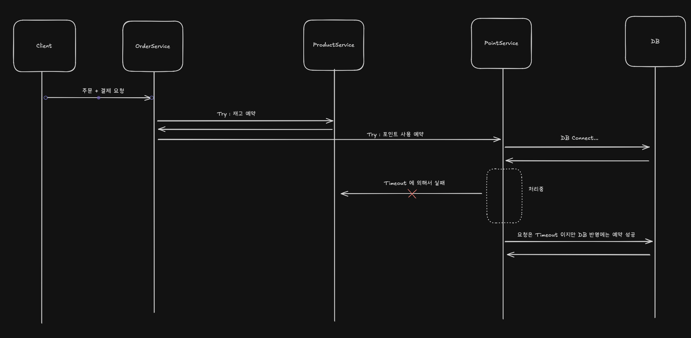
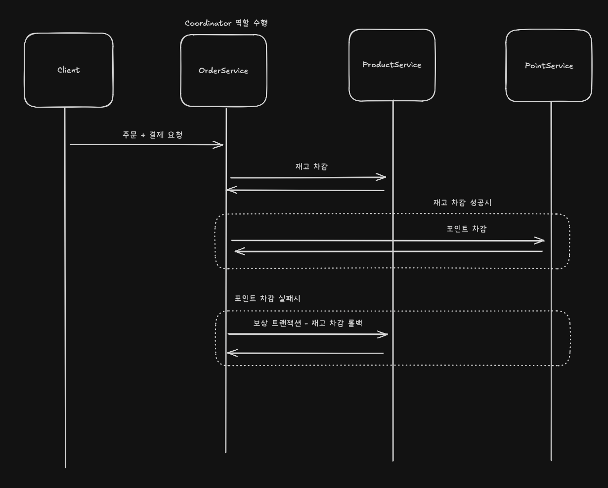

## 분산 트랜잭션 맛보기

- TCC, SAGA 패턴 맛보기

 
 

### TCC 패턴

- TCC(Try-Confirm-Cancel) 는 분산 시스템에서 데이터 정합성을 보장하기 위해 사용하는 분산 트랜잭션 처리 방식
- 트랜잭션을 애플리케이션 레이어에서 논리적으로 관리한다
- 세 단계로 나뉨
  - Try : 필요한 리소스를 점유할 수 있는지 검사하고 임시로 예약
  - Confirm : 실제 리소스를 확정 처리하여 DB 에 반영
  - Cancel : 문제가 생긴 경우, 예약 상태를 취소하여 원복한다

**코드 예시**

- 주문 + 결제 요청 시 OrderService 가 Coordinator 가 되는 상황

**Entity**

- Point
  - Point / PointReservation
- Product
  - Product / ProductReservation

**동시성 처리**

- Redis SETNX 로 Lock 획득/해제

**느낀 단점**

- 예약을 위한 엔티티를 필요한 도메인에 추가해야하므로 복잡해지며 문제가 생길때도 두 엔티티를 확인해야 함
- 네트워크 요청 문제시 이를 모두 예외처리하기 어려움
  - `OrderService` 에서 시작해서 재고 예약까지는 수행했지만 포인트 사용 예약에 실패할 경우

- 한가지 방법은 오류 발생시 재시도 처리 → 정상 처리로 유도
  - 재시도를 안전하게 처리하려면 시스템이 반드시 멱등성있게 설계되어야 함
  - 여기서는 `requestId` 를 통해서 Lock 핸들링 + 각 요청에 대한 상태 확인

 
 
 

### Saga

- 분산 시스템에서 데이터 정합성을 보장하기 위해 사용하는 분산 트랜잭션 처리 방식
- 각 작업을 개별 트랜잭션으로 나누어 실패시에 보상 트랜잭션을 수행하여 정합성을 맞추는 방식
- TCC 와 달리 즉시 상태 변경 수행
- Choreography 방식과 Orchestration 방식이 존재

**Saga - Orchestration 방식**

- 주문 + 결제 요청시 재고 차감 + 포인트 차감 처리
- `OrderService` 가 Coordinator 역할을 수행

**느낀 단점**

- 이 역시 TCC 와 유사하게 Coordinator 역할을 하는 서비스가 존재해야 하므로 결합도가 증가하게 된다
- 더불어 시간이 지날수록 Coordinator 역할이 무거워지고 복잡해진다
- 롤백 도중에 에러가 발생한 경우 명확한 디버깅이 어렵다
  - 롤백 도중에 발생하는 에러의 경우 이를 기록하는 처리를 수행
