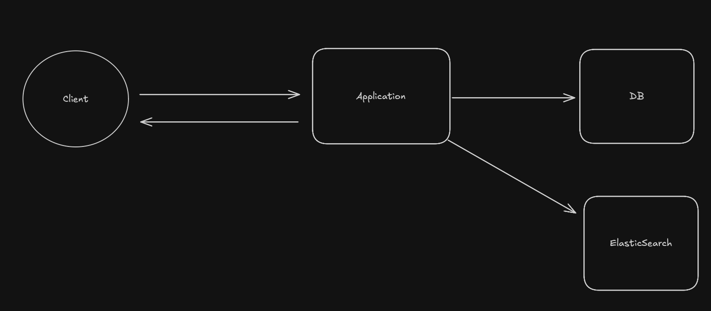

## ElasticSearch 맛보기

- 목표
  - 검색시 자동완성 기능
  - 검색 기능 향상
    - 오타 허용
    - 조회시 평점 오름차순
    - 일치하는 키워드 하이라이팅
    - 페이지네이션
    - 동의어 설정
    - 한글, 영어 혼용 검색 기능
    - 상품명, 설명, 카테고리 가중치 검색 (3:1:2)

### 아키텍쳐

- 일반적으로 데이터 일관성을 위해 가운데 메시지 큐 혹은 브로커를 두고 관리하지만 검색 기능의 초점을 두고 있기 때문에 애플리케이션 레벨에서 데이터 일관성 처리

