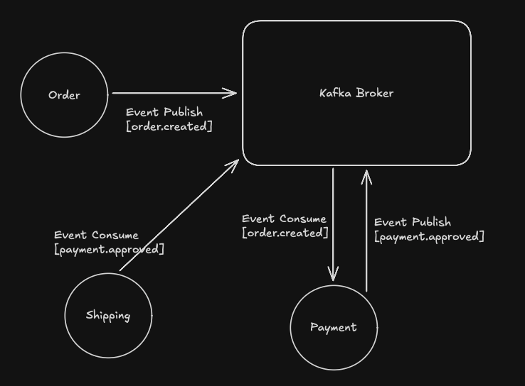

## Event Driven Architecture 테스트 [Spring Cloud Stream, Kafka]

- 주문(Order), 결제(Payment), 출하(Shipping) 도메인

 

### 이벤트 처리 흐름 및 구성도

1. 주문 생성 → `Stream` 을 통해 "주문 생성" 토픽 이벤트 발행
2. 결제 승인 → "주문 생성" 이벤트 소비 및 "결제 승인" 이벤트 발행
3. 출하 → "결제 승인" 이벤트 소비
