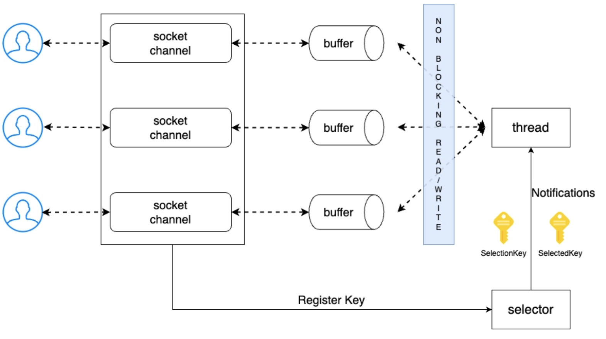

## NIO Selector Multiplexing 기반 다중 접속 서버 

- Java NIO 에서 `configureBlocking(false)` 를 설정했다고 해서 곧바로 효율적인 서버가 되는 것은 아니다
- Non-Blocking 소켓을 사용하더라도 하나의 스레드가 모든 소켓을 반복적으로 순회하며 `read()` 를 호출해 직접 확인한다면 이 방식은 여전히 비효율적이며 Polling 방식에 해당한다
  - Non-Blocking 이지만 효율적이지 않은 구조가 된다

### Polling 이 아닌 이벤트 기반 처리 

- Polling 처럼 비효율적인 방식을 해결하려면 변화가 생기면 알려주는 Push/Event 기반 구조로 변경해야 한다 
- 이벤트 기반 모델에서는 아래 상황이 발생했을때 이를 감지하여 스레드가 깨어나 작업을 수행하게 된다 
  - 읽을 수 있는 상태가 되었을때, 새 연결이 들어왔을 때
- Java NIO 에서 이 역할을 담당하는 컴포넌트가 바로 `Selector` 이다

### Selector 는 어떻게 가능한건가?



출처: https://mark-kim.blog/understanding-non-blocking-io-and-nio/

- Selector 는 이벤트 리스너 역할을 수행
- Non-blocking Channel 에 Selector를 등록하면 클라이언트의 커넥션 요청 혹은 데이터 읽기/쓰기 작업이 필요한 경우 Channel 이 Selector 에 이벤트를 통보 
- Selector 는 미리 등록해둔 Key 의 상태를 변경하여 특정 Channel 에 대한 작업을 수행하므로 미리 등록된 콜백 메서드를 실행하면서 Thread 에 비즈니스 로직을 위임 
- 운영체제는 이미 오래전부터 다중 소켓 이벤트 감지 API 를 제공해왔다 
  - `selector` / `poll` / `epoll (Linux)` / `kqueue (BSD / macOS)`
  - Java 의 Selector 는 내부적으로 SelectorProvider 를 통해 운영체제와 환경에 맞는 멀티플렉싱 기술을 선택해 사용한다 

### Selector, Channel, Thread 역할 분리 

**Selector (멀티플렉서)**

- 여러 채널을 동시에 감시 
- I/O 이벤트가 발생한 채널만 선별 
- 이벤트가 발생하면 스레드에 전달 

**Channel + ByteBuffer**

- 소켓의 생성, 연결, 읽기, 쓰기를 담당 
- Stream 기반과 달리 양방향 통신이 가능 
- Blocking / Non-blocking 모두 지원 
- ByteBuffer 를 통해 명시적인 버퍼 제어 

**Thread**

- Selector 이벤트 루프를 담당하는 스레드 
- 필요하다면 비즈니스 처리를 분리한 워커 스레드 역할을 수행 
- 항상 일하지 않고 필요할 때만 동작하여 처리 

### Multiplexing I/O 동작 흐름 (읽기 → 쓰기)

**0. 셀렉터 생성 및 서버 소켓 채널 설정**

- `configureBlocking` 설정을 통해 서버 소켓을 Non-blocking 으로 변경
- 이후 셀렉터 생성 (`Selector.open()`)

---

**1. 연결 수립**

- 새로운 연결 요청이 발생 
- `ServerSocketChannel` 에서 `OP_ACCEPT` 이벤트 감지 
- 연결 수락 후 `SocketChannel` 생성 
- Non-blocking 설정 후 `Selector` 에 등록 (`register()`)

```java
import java.nio.channels.SelectionKey;

SelectionKey register = serverSocket.register(selector, SelectionKey.OP_ACCEPT);
```

---

**2. 읽기 처리**

- 소켓에 데이터 도착 
- `OP_READ` 이벤트 발생 
- Selector가 해당 채널을 준비 상태로 전달 
- 스레드는 ByteBuffer 로 데이터를 읽음 

---

**3. 비즈니스 처리**

- 읽은 데이터 기반으로 비즈니스 로직 수행 
- 결과를 ByteBuffer 에 기록 
- 다음 단계는 쓰기 단계이므로 관심 이벤트를 `OP_WRITE` 로 변경 

---

**4. 쓰기 처리**

- 소켓이 쓰기 가능한 상태가 되면 `OP_WRITE` 이벤트 발생 
- ByteBuffer 의 데이터를 소켓으로 전송 
- 전송이 끝나면 다시 `OP_READ` 상태로 전환 

### 이벤트 

- 서버 소켓이 요청 받는 I/O 채널(`SocketChannel`) 에서 발생하는 이벤트를 리스너해줄 Selector 와 해당 채널에서 발생하는 이벤트 중 해당 Selector 를 통해 확인하고자하는 이벤트 종류를 전달 
- 이때 이벤트는 네가지 종류가 있으며 `SelectionKey` 상수로 표현한다 
  - `OP_CONNECT` / `OP_ACCEPT` / `OP_READ` / `OP_WRITE`
- 채널 등록(`register()`) 후 메서드 반환값으로 `SelectionKey` 객체가 반환되는데 해당 객체는 다음과 같은 속성을 가진다 
  - Interest set : Selector 에 등록된 채널이 확인하고자 하는 이벤트를 의미 
  - Ready set : Selector 에 등록된 채널에서 바로 처리할 수 있도록 준비된 이벤트들

### Polling 과 변경된 점들 

```java
while (true) {
    // Selector 에 등록된 채널들의 이벤트를 감지한다
    selector.select(); // 이벤트가 있을 때만 깨어남

    Set<SelectionKey> selectionKeys = selector.selectedKeys();
    Iterator<SelectionKey> it = selectionKeys.iterator();

    while (it.hasNext()) {
        SelectionKey key = it.next();
        it.remove();
                    
        if (!key.isValid()) continue;

        if (key.isAcceptable()) {
            // 연결 처리
            acceptEvent(key);
        } else if (key.isReadable()) {
            // 읽기 처리
            readEvent(key);
        } else if (key.isWritable()) {
            // 쓰기 처리
            writeEvent(key);
        }
    }
}
```

- `select()` 에서 이벤트가 없다면 블로킹으로 처리 
- 준비된 채널만 처리 
- 불필요한 polling 루프 제거 
- CPU 사용률과 스레드 수 최소화 
