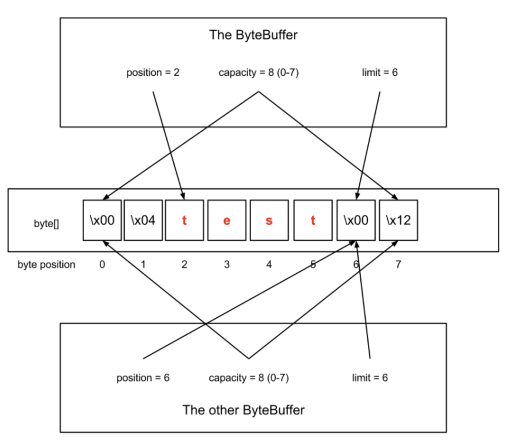

## NIO 를 이용한 Polling 방식 

- Blocking 방식의 멀티 스레드 모델 서버는 구현하기 쉽고 이해하기 쉽지만 컴퓨터 리소스를 제대로 사용하지 못하는 문제가 있다 
- 이 문제를 해결하는 방법은 I/O 작업을 Non-Blocking 하게 변경하여 적은 수의 Thread 로 여러 개의 커넥션을 처리하도록 한다 
- 자바도 New I/O(NIO) 를 도입 
  - 대표적으로 Netty 

</br>

### 기존 Java I/O 가 느린 이유 

- Blocking 방식으로 처리되는 문제도 있지만 또 다른 이유는 데이터 복사 경로와 메모리 구조상의 한계도 있다
- Java 초기 I/O 모델에서는 OS 커널 영역에 존재하는 커널 버퍼(kernel buffer)에 Java 코드가 직접 접근할 수 없기 때문에 반드시 JVM 힙 메모리 내부 버퍼로 한번 더 복사하는 구조를 가질 수 밖에 없었다
- 이로 인해 불필요한 메모리 복사와 GC 부담 그리고 I/O 수행 중 스레드 블로킹 문제가 발생한다

**동작 방식**

- Java 애플리케이션이 파일 또는 소켓으로부터 데이터를 읽이 위해 JVM 을 통해 OS 커널에 I/O 요청을 전달 
- OS 커널은 시스템 콜(`read()`)을 통해 디스크 컨트롤러 또는 네트워크 장치로부터 데이터를 읽어들임 
- 이때 실제 데이터 전송은 DMA (Direct Memory Access) 를 통해 커널 공간의 커널 버퍼(kernel buffer)로 복사된다 
- Java 애플리케이션은 커널 버퍼에 직접 접근할 수 없으므로 커널은 해당 데이터를 JVM 힙 메모리 내부의 Java 버퍼(`byte[]`) 로 다시 복사한다 
- JVM 은 이 힙 버퍼의 데이터를 기반으로 애플리케이션 로직을 수행한다 
- [Disk / Network] → (DMA) → [Kernel Buffer] → (CPU copy) → [JVM Heap Buffer] → [Java Application]

**문제점**

- kernel 버퍼에서 JVM 내부 버퍼로 복사할 때 CPU 자원 소비 
- 복사한 JVM 버퍼내 데이터 사용 후 GC가 수거해야함, CPU 자원 소비 
- 복사가 진행되는 동안 I/O 요청의 Thread 는 Blocking 

**DirectByteBuffer != 커널버퍼**

- DirectByteBuffer
  - JVM 힙 외부에 존재하는 유저 레벨(native) 메모리
  - 커널이 관리하는 메모리가 아님 
  - GC 의 직접 관리 대상도 아님 
- 커널 버퍼 (kernel buffer)
  - OS 커널 공간에 존재함 
  - 소켓/파일 I/O 시 커널이 관리함 

**DirectBuffer 의 역할**

- 커널 버퍼 자체를 사용하는 것이 아닌 커널과 유저 공간 간의 중간 복사 단계를 줄이기 위해 네이티브 메모리에 고정된 버퍼를 제공하는 역할을 한다 

</br>

### ByteBuffer 를 이용한 NIO

- 디스크 혹은 소켓에서 kernel 버퍼에 데이터를 가져오는 과정은 CPU 가 관여하지않고 보통 DMA 가 해주기 때문에 JVM 이 직접 kernel 버퍼에 접근하는 것이 용이하다 
- JDK 1.4 부터 JVM 내부 버퍼에 복사하는 문제를 해결하기 위해 kernel 버퍼에 직접 접근할 수 있는 기능을 제공했다 
  - `ByteBuffer` 클래스 
- ByteBuffer 는 직접 kernel 버퍼를 참조하고 있으며 위에서 발생한 복사문제로 인한 CPU 자원과 비효율적인 IO 요청 및 Blocking 문제점을 해결할 수 있다



출처: https://www.javacodegeeks.com/2012/12/the-java-bytebuffer-a-crash-course.html#google_vignette

- position
  - 읽기 또는 쓰기가 작업 중인 위치를 나타냄 
  - 버퍼 생성시 0으로 초기화되며 데이터 입력 혹은 읽을경우 자동으로 증가 
  - limit 과 capacity 보다 작거나 같다 
- limit
  - 읽고 쓸 수 있는 버퍼 공간의 최대치를 나타냄 
  - 이 값은 capacity 보다 크게 설정할 수 없다 
- capacity
  - 버퍼에 저장할 수 있는 데이터의 최대 크기로 한 번 정하면 변경이 불가능 
- ByteBuffer 는 버퍼 하나만을 가지고있으므로 읽기/쓰기의 position 이 공유된다
  - 읽고 쓰기를 할때 데이터가 꼬일 수 있는 경우가 있을 수 있다 

</br>

### NIO Polling 서버 

- Blocking 모드였던 `ServerSocket`, `Socket` 과는 다르게 Non-Blocking 모드부터는 NIO 의 `ServerSocketChannel`, `SocketChannel` 을 사용한다 

```java
socket.configureBlocking(false);
```
- 기존에 Blocking 방식은 언제 클라이언트가 연결 요청을 할지 모르기 때문에 `accept()` 에서 Blocking 된다 
- 심지어 `read()` 또한 언제 데이터를 전달받을지 몰라서 Blocking 된다 
- NIO SocketChannel 에서는 위와 같이 `configureBlocking(false)` 로 설정만해줘도 Blocking 없이 바로 return 된다 
  - `accept()` 호출시 연결된 socket이 없다면 null 로 바로 return 
- NIO Polling 방식은 아래 처럼 동작한다 
  - 특정 스레드가 서버에 연결된 모든 소켓을 순회하며 읽어들일 내용이 있는지 확인 
  - 특정 소켓에 읽어들일 내용이 있다면 로직을 수행한 후 소켓에 쓰기 작업을 수행한다 
- 즉 특정 소켓에서 어떤 일이 발생했는지 계속 확인해야하므로 지속된 kernel 에 I/O 시스템 콜을 계속 호출 
