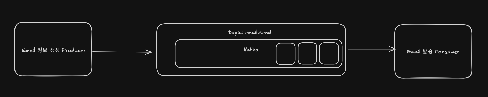
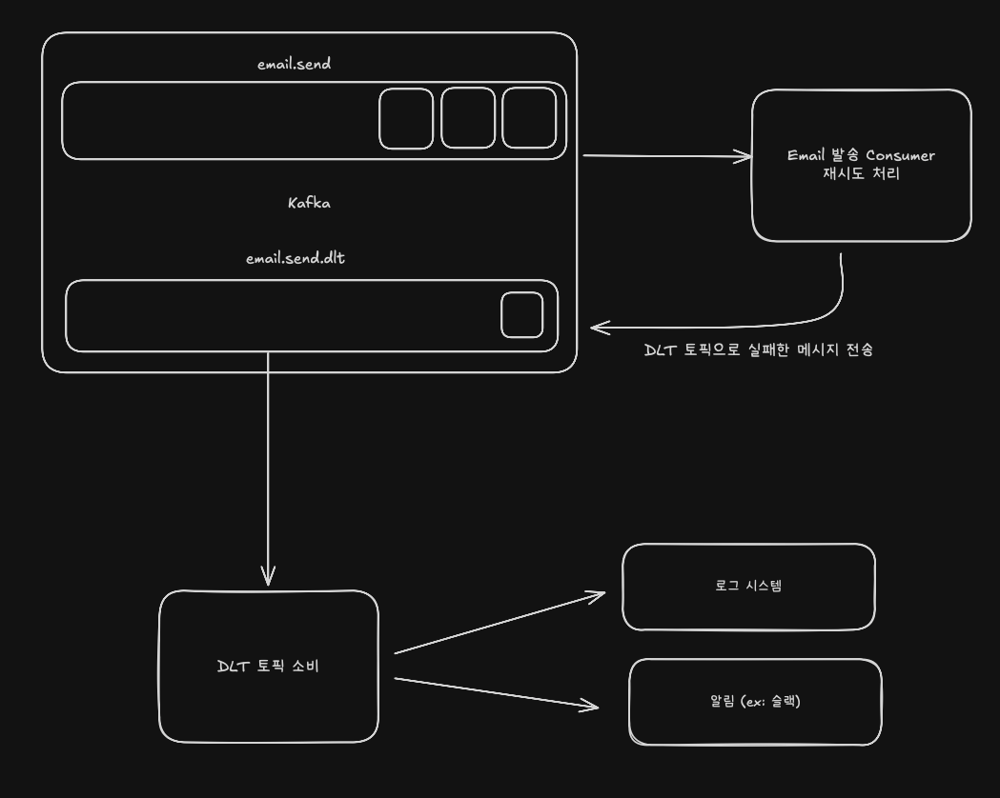

## Kafka 에서 Retry 와 DLT 테스트

**시나리오**

- 이메일 전송을 위한 서비스
- 이메일 발송 토픽 : `email.send`
- 이메일 정보 Producer
- 이메일 발송 Consumer

**Spring Kafka 에서 제공하는 재시도 처리**

- `import org.springframework.kafka.annotation.RetryableTopic`
- Consumer 서버에서 재시도에 대해 아무런 코드를 작성하지 않더라도 자동으로 재시도를 처리한다 → 기본값으로 재시도(retry) 전략이 설정되어 있다
- `interval` : 재시도를 하는 시간 간격 (ms)
  - `interval=0` 일 경우 실패하자마자 즉시 재시도 처리
- `maxAttempts` : 최대 재시도 횟수
  - `maxAttempts=9` 재시도를 9번까지 시도
- `currentAttemps` : 지금까지 시도한 횟수 (최소 시도 횟수 + 재시도 횟수)
  - `currentAttemps=10` 최소 시도를 1번 하고 재시도를 9번 시도
- 재시도 정책은 실제 지연시간을 고려해야함
  - 현재는 테스트를 위해 5번의 재시도와 지수적 증가로 재시도 로직 처리

 
 

### 재시도 실패 이후 DLT (Dead Letter Topic) 처리

- `email.send.dlt` 라는 토픽을 소비
- 첫번째로 로그 시스템에 전송
- 두번째로 슬랙 알림 전송
