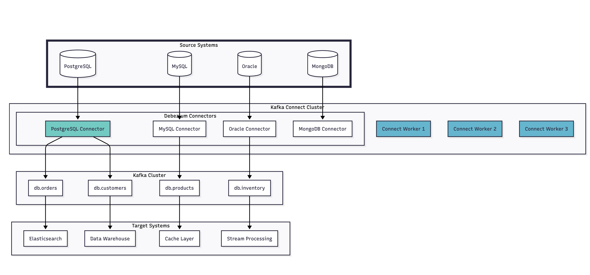

## 카프카 테스트

### 1. 단순한 카프카 Producer, Consumer

- OrderEvent 발행 및 소비

 

### 2. Kafka Stream 맛보기

- KStream/KGroupedStream → 전처리 → KTable
- OrderEvent 에 대한 KStream Input 을 집계
  - aggregate, map, filter

 

### 3. Avro, Schema Registry

- 프로듀서, 컨슈머 간의 객체 스키마는 변경될 경우 이를 각각 반영해야 한다
- 더불어 이 과정이 무중단으로 구성되는 것은 아주 복잡하고 어려운 작업이다
- Avro 의 개념을 도입하면 해당 값을 레코드 형태로 변환해서 원하는 값을 추출하여 사용하는 형태로 구현이 가능하다
  - 필드가 추가되는 상황에서 좀 더 유동적으로 동작할 수 있다

- Avro 포맷의 시퀀스 다이어그램
- 카프카에만 국한된 것은 아니다

1. Schema Registry 툴에 스키마 버전을 저장

   - 해당 버전을 기반으로 사용

2. 기능 요구사항으로 인해 필드 추가

   - Schema Registry 에 버전 업하여 저장 (v2)

3. 원하는 서비스는 v2 버전의 스키마를 사용

   - 이 시점에도 v1 스키마에 대해서는 읽고 처리할 수 있다

 

### 4. CDC(Change Data Capture) 데이터 처리

- 일반적인 CDC 동작 흐름
  - CDC Connector 가 트랜잭션 로그를 읽고 이벤트 발행(`Publish Change Event`)
- Push 방식
  - 소스 DB 가 데이터를 밀어주는 방식, DB의 변경사항을 캡처한 뒤 원하는 시스템으로 전송
- Pull 방식
  - 소스 DB 가 직접 작업을 수행하지 않음
  - 데이터의 변경사항을 테이블 열에 기록 및 대상 시스템이 주기적으로 폴링하여 데이터를 가져옴
    - 최신의 데이터가 아닐 수 있다
- 카프카와의 CDC
  - 
  - debezium 내부 동작
  - 
  - MySQL Debezium Connector 설정예시
  - 
