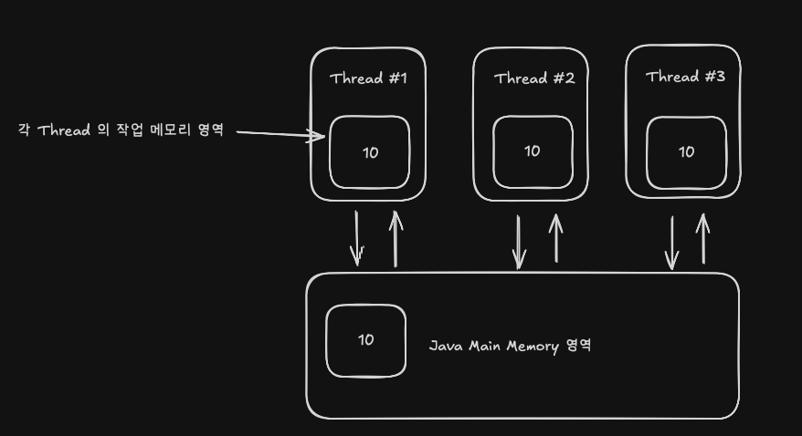

## JVM 메인 메모리와 작업 메모리 알아보기 (JMM)

JVM 은 H/W + OS 같은 역할을 모두 수행한다

- C/C++ 개발자 관점의 JVM 은 사용자 모드 응용 프로그램
- 즉 CPU 캐시 등 실제 H/W 수준을 통제하는 대부분의 코드는 C/C++ 기반 코드이며 Java 에서는 논외의 문제로 치부된다
  - 예를들어 캐시 일관성 문제등도 JVM 이라는 가상 머신내에서는 별개의 문제로 다뤄야 한다 → 캐시 일관성은 H/W 수준에서의 문제

</br>
</br>

## JMM 메인 메모리와 작업 메모리

- JVM 은 H/W 와 비슷하게 구성되어 있다
  - Core / L1 Cache / L2 Cache 등
  - 기존 메모리 모델을 소프트웨어 상에서 추상화해놓은 것
- JVM 은 메인 메모리와 작업 메모리로 구별해놓음
  - 작업 메모리는 Thread 마다 부여된다
  - Thread 에 종속되는 메모리 공간 → 직접 사용자가 통제할 순 없다
  - 작업 메모리는 CPU 의 Cache 메모리와 비슷하게 구성 및 사용되어진다
  - 메인 메모리는 RAM 과 비슷하다
- Java 메모리 모델의 핵심 목표는 **변수에 접근(읽기, 쓰기) 규칙을 정하는 것**
  - 메인 메모리와 작업 메모리로 구분한다
  - 지역 변수와 매개변수는 제외 (Stack 사용) → Thread 마다 할당
- 규칙 → **모든 변수는 JVM 메인 메모리에 저장된다고 규정**
- **작업 메모리는 스레드가 사용하는 변수의 "사본"이 저장된다**
  - **그러므로 스레드 내부의 연산은 작업 메모리에만 반영된다**
  - 작업 메모리의 존재 의미는 캐시가 존재하는 것과 같은 원리이다
  - 스레드마다 독립적인 작업 메모리가 존재하며 접근이 불가하다 → JVM 이 통제하는 영역 + 관리
  - **스레드는 JVM 메인 메모리에 직접 접근이 불가능하다**
    - 변수와 변수의 사본이 똑같이 동기화되지 않는다면 문제가 발생한다



위 예시로 설명해보자

- 특정 하나의 스레드가 `int a` 의 변수에 대해 `20` 이라고 수정한다면
  1. 작업 메모리의 `a` 에 `20` 으로 수정
  2. 메인 메모리의 `a` 에 `20` 으로 수정
  3. 다른 스레드 (#1, #2, #3) 의 작업 메모리의 `a` 에 `20` 으로 수정
- 총 3번의 작업이 필요하다
- 각 작업은 원자적으로 처리해야하며 기본적으로는 원자적으로 처리되지 않는다

</br>
</br>

## 작업 메모리와 메인 메모리 동기화 이슈

하지만 동기화는 항상 하게될 경우 부하가 걸린다

그러므로 동기화가 필요한 시점에만 하는 것이 효율적이다

- 멀티 스레드에서 변수가 변경되면 모든 스레드의 작업 메모리에 전파해야함
- 이 과정은 부하가 생기며 특정 작업 스레드가 해당 변수를 필요로 할때만 동기화하는 것이 효율적
- 작업 메모리의 변화는 메인 메모리에 즉시 반영되지 않고 일정 시간 지연됨 (일괄 처리에 따른 성능 향상)
- 알려진 일반 변수의 동기화 시점
  - 명시적 동기화 (`synchronized`, `volatile`)
  - `Thread.start()`, `join()` 호출
  - `Lock`, `Atomic` 클래스 사용
  - 클래스 로딩 과정에서 정적 변수 초기화 시
  - 기타 JVM 이 정한 최적화, 동기화 기준 충족 시

</br>

> 참고) 만약 `System.out.println` 으로 출력을 하거나 `IDE(IntelliJ)` 를 통해서 브레이킹 포인트(디버그) 시 자동으로 동기화가 된다

`System.out.println()` 내부 동기화

```java
public void println(boolean x) {
    if (getClass() == PrintStream.class) {
        writeln(String.valueOf(x));
    } else {
      synchronized (this) {
          print(x);
          newLine();
      }
    }
}
```

</br>

**작업 메모리 동기화 - 스레드 시작,종료**

- 새로운 스레드가 시작될 때 부모 스레드의 작업 메모리에 저장된 변수 값을 메인 메모리로 동기화
  - 만일 기존에 이미 실행 중인 스레드가 있을 경우 이 시점에 동기화된 값을 확인할 수 있다
- 새로 시작된 스레드는 동기화가 완료된 메인 메모리에서 변수 값을 로딩
- 관련이 없었던 다른 스레드도 동기화해줄 가능성이 있음 → 이런 가능성(우연)에 의존하여 코드를 작성하면 안된다 (ex. `Thread.sleep()`)
