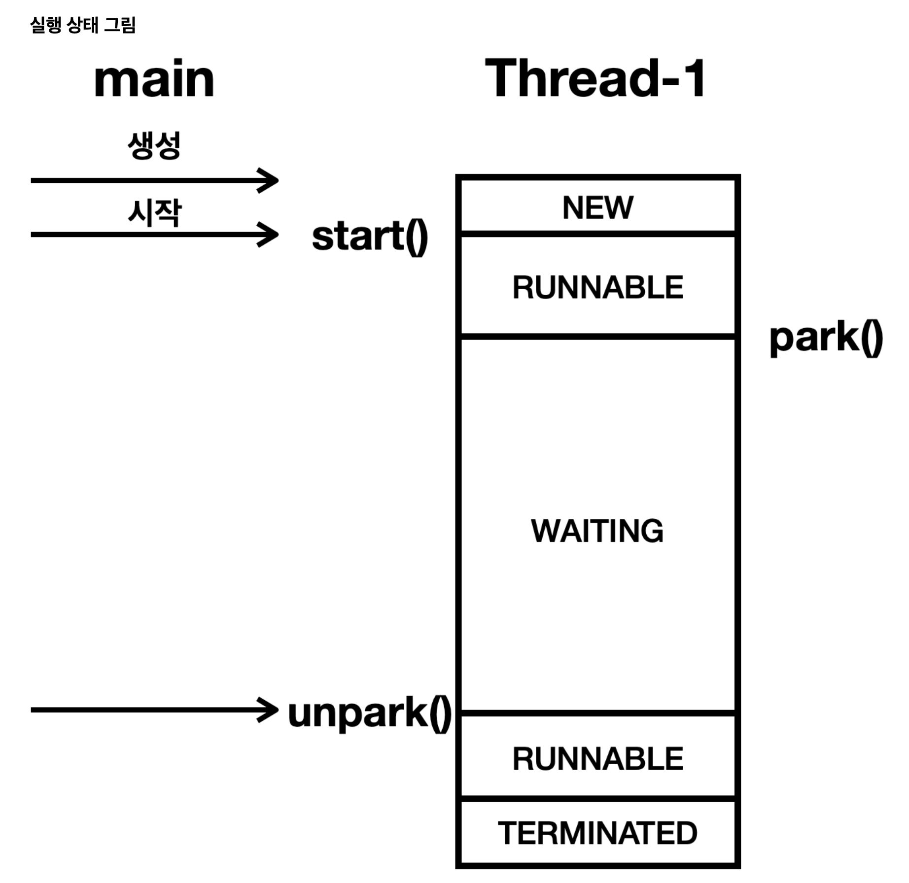
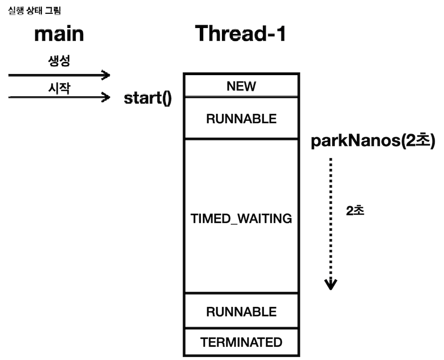

`synchronized` 는 자바 1.0 부터 제공되는 매우 편리한 기능이지만, 다음과 같은 한계가 존재한다

</br>

**synchronized 단점**

- **무한 대기**
  - `BLOCKED` 상태인 스레드는 락이 풀릴 때까지 무한 대기한다
  - 특정 시간까지만 대기하는 타임아웃은 없다
  - 중간에 인터럽트를 걸어도 동작하지 않는다
- **공정성**
  - 락이 돌아왔을때 `BLOCKED` 상태의 여러 스레드 중 어떤 스레드가 락을 획득할지 알 수 없다
  - 최악의 경우 특정 스레드가 너무 오랜기간 락을 획득하지 못할 수 있다

결국 더 유연하고, 더 세밀한 제어가 가능한 방법들이 필요하게 되었다

이런 문제를 해결하기 위해 자바 1.5 부터 `java.util.concurrent` 라는 동시성 문제 해결을 위한 라이브러리 패키지가 추가되었다

이 라이브러리에는 수 많은 클래스가 있지만, 가장 기본이 되는 `LockSupport` 에 대해서 먼저 알아보자

`LockSupport` 를 사용하면 `synchronized` 의 가장 큰 단점인 무한 대기 문제를 해결할 수 있다

</br>
</br>

## LockSupport 기능

`LockSupport` 는 스레드를 `WAITING` 상태로 변경한다

`WAITING` 상태는 누가 깨워주기 전까지는 계속 대기한다. 그리고 CPU 실행 스케줄링에 들어가지 않는다

</br>

**`LockSupport` 의 대표적인 기능들**

- `park()`
  - 스레드를 `WAITING` 상태로 변경한다
  - 스레드를 대기 상태로 둔다. 참고로 `park` 의 뜻은 "주차하다, 두다" 라는 뜻이다
- `parkNanos(nanos)`
  - 스레드를 나노 초 동안만 `TIMED_WAITING` 상태로 변경한다
  - 지정한 나노초가 지나면 `TIMED_WAITING` 상태에서 빠져나오고 `RUNNABLE` 상태로 변경된다
- `unpark(thread)`
  - `WAITING` 상태의 대상 스레드를 `RUNNABLE` 상태로 변경한다

예시)

```java
public class Main {

    public static void main(String[] args) {
        Thread thread = new Thread(new ParkTask(), "Thread-1");
        thread.start();

        // 잠시 대기하며 "Thread-1" 이 대기상태에 빠질 시간을 준다
        Thread.sleep(100);

        LockSupport.unpark(thread);
    }

    static class ParkTask implements Runnable { // Thread-1 의 작업

        @Override
        public void run() {
            System.out.println("park 시작");
            LockSupport.park();
        }
    }
}
```

실행 상태 흐름



1. main 스레드가 "Thread-1" 을 `start()` 하면 "Thread-1" 은 `RUNNABLE` 상태가 된다
2. "Thread-1" 은 `Thread.park()` 를 호출한다
3. 호출함으로 인해 "Thread-1" 은 `RUNNABLE` → `WAITING` 상태로 변경되면서 대기하게 된다
4. main 스레드가 "Thread-1" 을 `unpark()` 으로 깨운다
5. "Thread-1" 은 대기 상태에서 실행 가능 상태로 변경된다, `WAITING` → `RUNNABLE` 상태로 변경된다

</br>

이처럼 `LockSupport` 는 특정 스레드를 `WAITING` 상태로 또는 `RUNNABLE` 상태로 변경할 수 있다

그런데 대기 상태로 바꾸는 `LockSupport.park()` 는 매개변수가 없는데, 실행 가능 상태로 바꾸는 `LockSupport.unpark(thread)` 는 왜 특정 스레드를 지정하는 매개변수가 존재할까?

- 이유는 실행 중인 스레드는 `LockSupport.park()` 를 호출해서 스스로 대기 상태에 빠질 수 있지만, 대기 상태의 스레드는 자신의 코드를 실행할 수 없기 때문이다
- 따라서 외부 스레드의 도움을 받아야 깨어날 수 있다

</br>
</br>

## 인터럽트 사용

`WAITING` 상태의 스레드에 인터럽트가 발생하면 `WAITING` 상태에서 `RUNNABLE` 상태로 변하면서 깨어난다

아래처럼 `LockSupport.unpark(thread)` 대신 `thread.interrupt()` 를 사용해보자

```java
// LockSupport.unpark(thread);
thread.interrupt(); // 인터럽트 사용
```

이 역시 마찬가지로 스레드가 `RUNNABLE` 상태로 깨어난 것을 확인할 수 있다

그리고 해당 스레드의 인터럽트 상태 또한 `true` 이다

\*\*이처럼 `WAITING` 상태의 스레드는 인터럽트를 걸어서 중간에 깨울 수 있다 (+ `TIMED_WAITING`)

(`BLOCKED` 는 인터럽트를 걸어도 깨울 수 없다)

</br>
</br>

## LockSupport 의 시간 대기

이번에는 스레드를 특정 시간 동안만 대기하는 `parkNanos(nanos)` 에 대해 알아보자

- `parkNanos(nanos)`
  - 스레드를 나노 초 동안만 `TIMED_WAITING` 상태로 변경한다
  - 지정한 나노 초가 지나면 `TIMED_WAITING` 상태에서 빠져나온 뒤 `RUNNABLE` 상태로 변경된다
  - 참고로 밀리 초 동안만 대기하는 메서드는 없다
  - `parkUntil(밀리초)` 라는 메서드가 있는데, 이 메서드는 특정 에포크(Epoch) 시간에 맞추어 깨어나는 메서드이다
  - 정확한 미래의 에포크 시점을 지정해야 한다

예시)

```java
public class Main {

    public static void main(String[] args) {
        Thread thread = new Thread(new ParkTask(), "Thread-1");
        thread.start();

        // 잠시 대기하며 "Thread-1" 이 대기상태에 빠질 시간을 준다
        Thread.sleep(100);
    }

    static class ParkTask implements Runnable { // Thread-1 의 작업

        @Override
        public void run() {
            System.out.println("park 시작");
            LockSupport.parkNanos(2000_000000); // parkNanos 사용
        }
    }
}
```

- 여기서는 스레드를 깨우기 위한 `unpark()` 를 사용하지 않는다
- `parkNanos(시간)` 를 사용하면 지정한 시간 이후에 스레드가 깨어난다
- 1초 = 1,000 밀리초 (ms)
- 1 밀리초 = 1,000,000 나노초 (ns)
- 2 밀리초 = 2,000,000 나노초 (ns)

실행 상태 흐름



- "Thread-1" 은 `parkNanos(2초)` 를 사용해서 2초간 `TIMED_WAITING` 상태에 빠진다
- "Thread-1" 은 2초 이후에 시간 대기 상태 (`TIMED_WAITING`) 를 빠져나온다

</br>
</br>

## BLOCKED vs WAITING

`WAITING` 상태에 특정 시간까지만 대기하는 기능이 포함되는 것이 `TIMED_WAITING` 이다

여기서는 둘이 묶어서 `WAITING` 상태라 표현하겠다

</br>

### 인터럽트

- `BLOCKED` **상태는 인터럽트가 걸려도 대기 상태를 빠져나오지 못한다. 여전히 `BLOCKED` 상태이다**
- `WAITING`, `TIMED_WAITING` **상태는 인터럽트가 걸리면 대기 상태를 빠져나온다. 그래서 `RUNNABLE` 상태로 변한다**

</br>

### 용도

- `BLOCKED` 상태는 자바의 `synchronized` 에서 락을 획득하기 위해 대기할 때 사용된다
- `WAITING`, `TIMED_WAITING` 상태는 스레드가 특정 조건이나 시간 동안 대기할 때 발생하는 상태이다
- `WAITING` 상태는 다양한 상황에서 사용된다. 예를들어 `Thread.join()`, `LockSupport.park()`, `Object.wait()` 와 같은 메서드 호출 시 `WAITING` 상태가 된다
- `TIMED_WAITING` 상태는 `Thread.sleep(ms)`, `Object.wait(long timeout)`, `Thread.join(long millis)`, `LockSupport.parkNanos(ns)` 등과 같은 시간 제한이 있는 대기 메서드를 호출할 때 발생한다

</br>

### 대기(WAITING) 상태와 시간 대기 상태(TIMED_WAITING) 는 서로 짝이 있다

- `Thread.join()` / `Thread.join(long millis)`
- `Thread.park()` / `Thread.parkNanos(long millis)`
- `Object.wait()` / `Object.wait(long timeout)`

</br>

`BLOCKED`, `WAITING`, `TIMED_WAITING` 상태 모두 스레드가 대기하며, 실행 스케줄링에 들어가지 않기 때문에 CPU 입장에서 보면 실행하지 않는 비슷한 상태이다

- `BLOCKED` 상태는 `synchronized` 에서만 사용하는 특별한 대기 상태라고 이해하면 된다
- `WAITING`, `TIMED_WAITING` 상태는 범용적으로 활용할 수 있는 대기 상태라고 이해하면 된다

</br>
</br>

## 정리

`LockSupport` 를 사용하면 스레드를 `WAITING`, `TIMED_WAITING` 상태로 변경할 수 있고, 또 인터럽트를 받아서 스레드를 깨울 수도 있다

이런 기능들을 잘 활용하면 `synchronized` 의 단점인 무한 대기 문제를 해결할 수 있을 것 같다

**synchronized 단점**

- **무한 대기**
  - `BLOCKED` **상태의 스레드는 락이 풀일 때 까지 무한 대기한다**
  - **특정 시간까지만 대기하는 타임아웃 X → `parkNanos()` 를 사용하면 특정 시간까지만 대기할 수 있음**
  - \*\*중간에 인터럽트 X → `park()`, `parkNanos()` 는 인터럽트를 걸 수 있음

</br>

이처럼 `LockSupport` 를 활용하면 무한 대기하지 않는 락 기능을 만들 수 있다. 물론 그냥 되는 것은 아니고 `LockSupport` 를 활용해서 안전한 임계 영역을 만드는 어떤 기능을 개발해야 한다

락(`lock`) 이라는 클래스를 만들고 특정 스레드가 먼저 락을 얻으면 `RUNNABLE` 로 실행하고 락을 얻지 못하면 `park()` 를 사용해서 대기 상태로 만드는 것 이다

그리고 스레드가 임계 영역의 실행을 마치고 나면 락을 반납하고, `unpark()` 를 사용해서 대기 중인 다른 스레드를 깨우는 것 이다

물론 `parkNanos()` 를 사용해서 너무 오래 대기하면 스레드가 스스로 중간에 깨어나게 할 수도 있다

</br>

하지만 이런 기능을 직접 구현하기는 매우 어렵다

어떤 스레드가 대기하고 있는지 알 수 있는 자료구조도 필요하다

더불어 대기 중인 스레드 중에 어떤 스레드를 깨울지에 대한 우선순위 결정도 필요하다

한마디로 `LockSupport` 는 너무 저수준이다

`synchronized` 처럼 더 고수준의 기능이 필요하다

자바는 `Lock` 인터페이스와 `ReentrantLock` 이라는 구현체로 이런 기능들을 이미 다 구현해 두었다

`ReetrantLock` 은 `LockSupport` 를 활용해서 `synchronized` 의 단점을 극복하면서 매우 편리하게 임계 영역을 다룰 수 있는 다양한 기능을 제공한다
