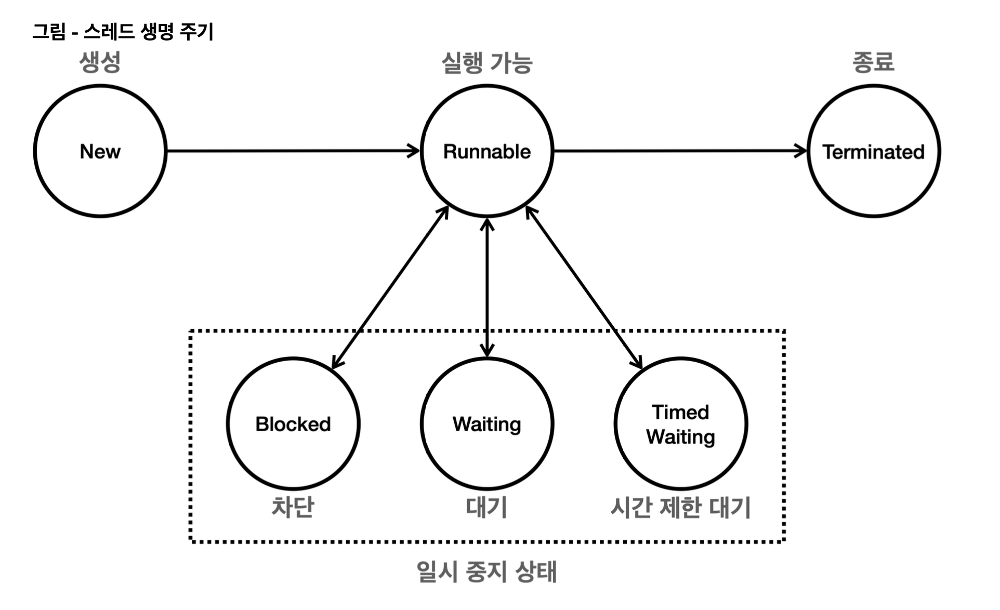

## 스레드의 생명주기



</br>

**스레드의 상태**

- **New (새로운상태)** : 스레드가 생성되었으나 아직 시작되지 않은 상태
- **Runnable (실행 가능 상태)** : 스레드가 실행 중이거나 실행될 준비가 된 상태
- **Blocked (차단 상태)** : 스레드가 동기화 락을 기다리는 상태 (일시 중지)
- **Waiting (대기 상태)** : 스레드가 무기한으로 다른 스레드의 작업을 기다리는 상태
- **Timed Waiting (시간 제한 대기 상태)** : 스레드가 일정 시간 동안 다른 스레드의 작업을 기다리는 상태
- **Terminated (종료 상태)** : 스레드의 실행이 완료된 상태

> 해당 상태는 Thread.State 열거형에 정의된 상수 중 하나이다

</br>

자바 스레드(Thread) 의 생명 주기는 여러 상태(State) 로 나뉘어지며, 각 상태는 스레드가 실행되고 종료되기 까지의 과정을 나타낸다

1. **New (새로운 상태)**
   - 스레드가 생성되고 아직 시작되지 않은 상태이다
   - 이 상태에서는 `Thread` 객체가 생성되지만, `start()` 메서드가 호출되지 않은 상태이다
   - 예시) `Thread thread = new Thread(runnable);`

</br>

2. **Runnable (실행 가능 상태)**
   - 스레드가 실행될 준비가 된 상태이다. 이 상태에서 스레드는 실제로 CPU 에서 실행될 수 있다
   - `start()` 메서드가 호출되면 스레드는 이 상태로 들어간다.
   - 예시) `thread.start();`
   - 이 상태는 스레드가 실행될 준비가 되어 있음을 나타내며, 실제로 CPU 에서 실행될 수 있는 상태이다. 그러나 Runnable 상태에 있는 모든 스레드가 동시에 실행되는 것은 아니다
     - 운영체제의 스케줄러가 각 스레드에 CPU 시간을 할당하여 실행하기 때문에, Runnable 상태에 있는 스레드는 스케줄러의 실행 대기열에 포함되어 있다가 차례로 CPU 에서 실행된다
   - 참고로 운영체제 스케줄러의 실행 대기열에 있든, CPU 에 실제 실행되고 있든 모두 `RUNNABLE` 상태이다. 자바에서 둘을 구분해서 확인할 수는 없다
   - 보통 실행 상태라고 부른다

</br>

3. **Blocked (차단 상태)**
   - 스레드가 다른 스레드에 의해 동기화 락을 얻기 위해 기다리는 상태이다
   - 예를 들어 `synchronized` 블록에 진입하기 위해 락을 얻어야 하는 경우, 이 상태에 들어간다
   - 예시) `synchronized (lock) {...}` 코드 블록에 진입하려고 할때, 다른 스레드가 이미 `lock` 의 락을 가지고 있는 경우

</br>

4. **Waiting (대기 상태)**
   - 스레드가 다른 스레드의 특정 작업이 완료되기를 무기한 기다리는 상태이다
   - `wait()`, `join()` 메서드가 호출될 때 이 상태가 된다
   - 스레드는 다른 스레드가 `notify()` 또는 `notifyAll()` 메서드를 호출하거나, `join()` 이 완료될 때까지 기다린다
   - 예시) `object.wait();`

</br>

5. **Timed Waiting (시간 제한 대기 상태)**
   - 스레드가 특정 시간 동안 다른 스레드의 작업이 완료되기를 기다리는 상태이다
   - `sleep(long millis)`, `wait(long timeout)`, `join(long millis)` 메서드가 호출될 때 이 상태가 된다
   - 주어진 시간이 경과하거나 다른 스레드가 해당 스레드를 깨우면 이 상태에서 벗어난다
   - 예시) `Thread.sleep(1000);`

</br>

6. **Terminated (종료 상태)**
   - 스레드의 실행이 완료된 상태이다
   - 스레드가 정상적으로 종료되거나, 에외가 발생하여 종료된 경우 이 상태로 들어간다
   - 스레드는 한 번 종료되면 다시 시작할 수 없다

</br>
</br>

## 자바 스레드의 상태 전이 과정

1. **New** → **Runnable** : `start()` 메서드를 호출하면 스레드가 `Runnable` 상태로 전이된다
2. **Runnable** → **Blocked/Waiting/Timed Waiting** : 스레드가 락을 얻지 못하거나, `wait()` 또는 `sleep()` 메서드가 호출될 때 해당 상태로 전이된다
3. **Blocked/Waiting/Timed Waiting** → **Runnable** : 스레드가 락을 얻거나, 기다림이 완료되면 다시 `Runnable` 상태로 돌아간다
4. **Runnable** → **Terminated** : 스레드의 `run()` 메서드가 완료되면 스레드는 `Terminated` 상태가 된다

</br>

`Thread.sleep()` 은 `InterruptedException` 이라는 체크 예외를 던진다

따라서 체크 예외를 잡아서 처리하거나 던져야 한다

`run()` 메서드 안에서는 체크 예외를 반드시 잡아야 한다

`InterruptedException` 은 인터럽트가 걸릴때 발생한다

</br>

### 왜 run() 메서드안에서 체크 예외를 반드시 잡아야 할까?

먼저 `Runnable` 인터페이스의 `run()` 메서드 시그니처를 보면

```java
public interface Runnable {
    void run();
}
```

- 반환 타입은 `void`
- `throws` 절이 없음 → 즉, 예외를 던질 수 없도록 설계되어 있음
- 체크 예외는 아래 두 가지 중 하나를 반드시 해야 컴파일 됨
  - `throws` 로 밖에 던지기 → 그런데 `run()` 메서드는 `throws` 를 쓸 수 없음
  - `try-catch` 로 내부에서 잡기

</br>

**왜 `run()` 은 예외를 던질 수 없게 설계되어 있을까?**

- `Runnable` 은 스레드용 콜백이기 때문에 **표준화된 단순한 인터페이스로 설계됨**
- 예외를 던지면 스레드 처리 흐름에 혼란이 생길 수 있고 안에서만 처리하도록 강제한 것
- `Thread.run()` 도 마찬가지로 `throws` 가 없다

> [[JAVA] 왜 Runnable 에서는 Exception 을 던질 수 없는가](https://github.com/leeMK09/MemoMemo/blob/main/%F0%9F%92%A3%20%EB%A9%80%ED%8B%B0%EC%8A%A4%EB%A0%88%EB%93%9C/%5BJAVA%5D%20%EC%99%9C%20Runnable%20%EC%97%90%EC%84%9C%EB%8A%94%20Exception%20%EC%9D%84%20%EB%8D%98%EC%A7%88%20%EC%88%98%20%EC%97%86%EB%8A%94%EA%B0%80.md)
