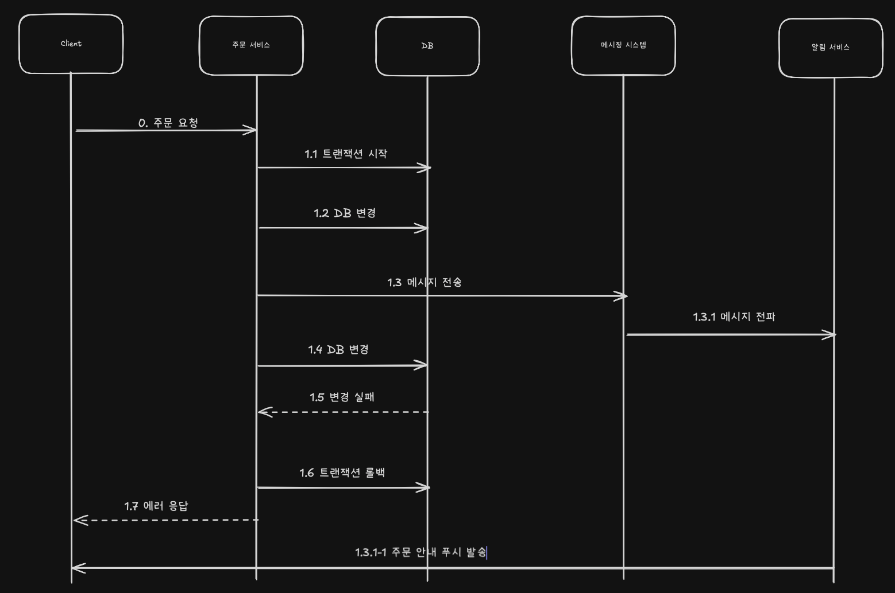
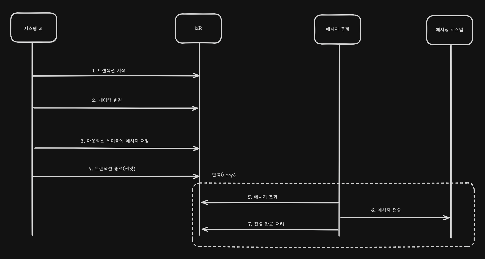

## 메시지 생성시 고려사항

- 메시지를 생성할 때 고려할 점은 메시지 유실에 대한 것이다
- 이때 오류 처리를 위해 선택할 수 있는 방법에는 3가지 방법이 있다
  - 무시한다.
  - 재시도한다.
  - 실패 로그를 남긴다.

 

**무시한다**

- 예를들어 단순 로그 메시지는 유실되어도 괜찮다.
- 나중에 로그를 조회할 때 로그가 없으면 아쉬울 수 있지만 기능 동작에는 문제가 없다

 

**재시도한다**

- 일시적인 네트워크 불안정과 같은 오류는 재시도를 통해 해결될 수 있다
- 하지만 메시지 전송을 재시도하는 과정에서 중복된 메시지가 전송될 수 있다
- 실제로 전송에 성공했는데 일시적인 네트워크 오류로 전송에 실패한 것으로 인지하고 재시도 할 수 있기 때문이다
- 메시징 시스템이 중복 수신을 방지하는 기능을 제공하지 않으면 메시지 소비자가 중복 메시지를 알맞게 처리해야 한다
- 메시지마다 고유 식별자를 사용하면 메시지 소비자가 중복 메시지 여부를 판단하는 데 도움이 된다

 

**실패 로그를 남긴다**

- 단순히 실패 로그를 남기는 것 이다
- 로그는 나중에 후처리를 하는 데 사용된다
- 실패 로그는 DB 에 저장할 수도 있고 파일에 남길 수도 있다
- 실패 로그는 후처리에 필요한 데이터를 담고 있어야 한다

 

**메시지 생산자는 DB 트랜잭션과의 연동도 고려해야 한다**

- DB 트랜잭션에 실패했는데 메시지가 발송되면 잘못된 데이터가 전달될 수 있기 때문이다

- 잘못된 메시지가 전송되는 문제를 방지하려면 트랜잭션이 끝난 뒤에 메시지를 전송해야 한다 → 메시지 전송 순서를 변경

 

> 글로벌 트랜잭션과 메시지 연동
>
> 여러 DB 를 하나의 트랜잭션으로 묶어서 처리할 수도 있다 → 글로벌 트랜잭션 (global transaction) 이 이에 해당한다
>
> 글로벌 트랜잭션을 사용하면 여러 자원(여러 DB) 에 대한 변경을 한 트랜잭션으로 묶어서 처리할 수 있다.
> 예를들어 A DB 는 성공적으로 처리했는데 B DB 를 처리할 때 오류가 발생하면 A 와 B 를 모두 롤백할 수 있다.
> 글로벌 트랜잭션을 구현하는 알고리즘으로 2 단계 커밋 (2-Phase Commit) 을 사용하는데, 그래서 글로벌 트랜잭션을 2PC 라고 표현하기도 한다
>
> 글로벌 트랜잭션을 지원하는 메시징 시스템도 있다. 액티브 MQ 가 이에 해당한다
> 액티브 MQ 를 사용하면 DB 수정과 메시지 전송/처리를 한 트랜잭션으로 묶을 수 있다. 즉, 메시지 전송에 실패하면 DB 를 롤백하거나 DB 가 롤백되면 메시지 전송을 취소할 수 있다
>
> 글로벌 트랜잭션이 반드시 필요한 상황이 아니라면 DB 처리와 메시지 연동을 묶지 말자.
> DB에 데이터를 반영한 뒤에 메시지를 최대한 유실 없이 보내고 싶다면 트랜잭션 아웃박스 패턴을 검초해보자

 
 

## 트랜잭션 아웃박스 패턴

- 잘못된 메시지 발송을 막기 위해 DB 트랜잭션이 완료된 후 메시지를 전송하자는 것을 권한다고 했다 → 그런데 이렇게 해도 완벽하지는 않다
- 메시지 데이터 자체가 유실되지 않도록 보장하는 방법은 먼저 해당 데이터를 DB에 안전하게 저장해두는 것 이다
- 그 뒤, 저장된 메시지를 읽어 메시징 시스템에 전송하면 된다 → 이처럼 메시지 데이터를 DB 에 보관하는 방식이 바로 트랜잭션 아웃박스 패턴 (Transaction Outbox Pattern) 의 핵심이다
- 트랜잭션 아웃박스 패턴은 하나의 DB 트랜잭션 내에서 다음 2가지 작업을 수행한다
  - 서비스 비즈니스 로직 실행
  - 이후 메시지 데이터를 아웃박스 테이블에 추가
- 아웃박스 테이블에 쌓인 메시지 데이터는 별도의 메시지 중계 프로세스가 주기적으로 읽어서 메시징 시스템을 전송한다

- DB 트랜잭션 범위에서 아웃박스 테이블에 메시지 데이터를 추가하므로 메시지 데이터가 유실되지 않는다
  - 트랜잭션을 롤백하면 메시지 데이터도 함께 롤백되므로 잘못된 메시지 데이터가 전송될 일도 없다
- 만약 특정 메시지를 전송하는데 실패하면 루프를 멈춘다
  - 루프를 멈추는 이유는 메시지를 순서대로 발송하기 위함이다
  - 메시지 전송 순서가 중요하다면 이 점에 유의해야 한다
- 발송완료 처리는 "아웃박스 테이블에 발송 상태 컬럼 두기" 와 "메시지 중계 서비스가 성공적으로 전송한 마지막 메시지 ID 를 별도로 기록하는 방식" 이다
- 일반적으로 발송 상태 컬럼으로 메시지 완료 처리를 한다
- 그러나 2개 이상의 메시지 중계 서비스가 하나의 아웃박스 테이블을 함께 사용하는 환경이라면 각 중계 서비스가 고유하게 마지막 메시지 ID 를 관리해야 하므로, 이 경우에는 마지막 메시지 ID 를 기록하는 방식이 더 적합할 수 있다
- 더불어 **메시지가 어떤 조건에서 실패할 상태로 바꿀지를 결정해야 한다**
  - 예를들어 메시지 발송에 5회 실패하면 "실패함" 상태로 바꾸고 다음 메시지를 처리할 수 있다
  - 또는 실패 횟수가 10회를 넘어가면 모니터링 시스템을 통해 메시지 발송이 지연되고 있다는 사실을 운영팀에 알리고 수동으로 실패함 처리를 할 수 있다
  - "실패함" 상태로 바뀐 메시지는 알맞은 후속 처리를 해야한다 → memo, remark 등과 같은 컬럼을 통해 실패 이유를 파악 등
  - 메시지 발송에 실패했다고 바로 "실패함" 상태로 바꾸지는 말자, 일시적으로 문제가 발생한 것이라면 한 두차례 재시도를 통해 성공적으로 메시지를 발송할 수 있기 때문이다
