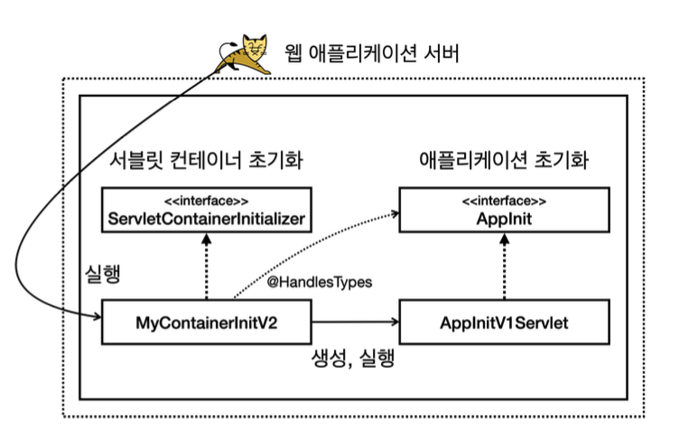

- WAS 를 실행하는 시점에 필요한 초기화 작업들이 존재한다.
  - 서비스에 필요한 필터와 서블릿 등록
  - 스프링을 사용한다면 스프링 컨테이너를 만들기
  - 서블릿과 스프링을 연결하는 디스패처 서블릿도 등록 등
- 서블릿은 `ServletContainerInitializer` 라는 초기화 인터페이스를 제공한다. 이름 그대로 서블릿 컨테이너를 초기화 하는 기능을 제공한다
- 서블릿 컨테이너는 실행 시점에 초기화 메서드인 `onStartup()` 을 호출해준다. 여기서 애플리케이션에 필요한 기능들을 초기화 하거나 등록할 수 있다

**ServletContainerInitializer**

```java
public interface ServletContainerInitializer {
    public void onStartup(Set<Class<?>> c, ServletContext ctx) throws ServletException;
}
```

- `Set<Class<?>> c` : 조금 더 유연한 초기화 기능을 제공, `@HandlesTypes` 애노테이션과 함께 사용
- `ServletContext ctx` : 서블릿 컨테이너 자체의 기능을 제공한다. 이 객체를 통해 필터나 서블릿을 등록할 수 있다 (서블릿 컨테이너라고 생각해도 된다)

더불어

- 추가로 WAR 에게 해당 `ServletContainerInitializer` 를 상속한 클래스를 알려주어야지만 WAR 가 초기화할때 해당 클래스를 실행한다
- `resources/META-INF/services/jakarta.servlet.ServletContainerInitializer`
  - 이런식으로 `main` 폴더 아래에 서블릿 초기화 라이브러리를 패키지명까지 포함해서 알려주고
  - 해당 파일안에 우리가 만든 서블릿 초기화 클래스 (ex. `hello.container.MyContainerInit`) 를 적는다

</br>
</br>

서블릿을 등록하는 2가지 방법

- `@WebServlet` 애노테이션
- 프로그래밍 방식

초기화는 두가지 이다

1. 서블릿 컨테이너 초기화
2. 애플리케이션 초기화

</br>

**ServletContext + 서블릿 프로그래밍 방식으로 등록하는 예시**

- 서블릿 필터나 여러가지를 등록할 수 있고 추가로 우리가 만든 서블릿 (ex. `MyServlet`) 을 등록할 수 있다

```java
public class AppInitServlet implemenets Appinit {
    @Override
    public void onStartup(ServletContext servletContext) {
        System.out.println("AppInitV1Servlet.onStartup");

        // 서블릿 등록 (프로그래밍 방식)
        ServletRegistration.Dynamic myServlet = servletContext.addServlet("myServlet", new MyServlet());
        myServlet.addMapping("/my-servlet");
    }
}
```

- `MyServlet` 을 자바 프로그래밍 방식으로 서블릿을 등록하고 요청 URL 을 매핑한 예시
  - 프로그래밍 방식
  - HTTP 로 `/my-servlet` 을 호출하면 `MyServlet` 서블릿이 실행된다

</br>

**@WebServlet 애노테이션으로 등록하는 예시**

- 프로그래밍 방식보다 더 간편하다

```java
package hello.servlet;

import jakarta.servlet.ServletException;
import jakarta.servlet.annotation.WebServlet;
import jakarta.servlet.http.HttpServlet;
import jakarta.servlet.http.HttpServletRequest;
import jakarta.servlet.http.HttpServletResponse;

import java.io.IOException;

@WebServlet(urlPatterns = "/test")
public class TestServlet extends HttpServlet {

    @Override
    protected void service(HttpServletRequest req, HttpServletResponse resp) throws ServletException, IOException {
        System.out.println("TestServlet.service");
        resp.getWriter().println("test");
    }
}
```

> 참고
>
> 프로그래밍 방식을 사용하는 이유
>
> `@WebServlet` 을 사용하면 애노테이션 하나로 서블릿을 편리하게 등록할 수 있다. 하지만 애노테이션 방식을 사용하면 유연하게 변경하는 것이 어렵다. 마치 하드 코딩된 것 처럼 동작한다
> 예시를 보면 `/test` 경로를 변경하고 싶으며 코드를 직접 변경해야 바꿀 수 있다
> 반면에 프로그래밍 방식은 코딩을 더 많이 해야하고 불편하지만 무한한 유연성을 제공한다
> 예를 들어
>
> - `/my-servlet` 경로를 상황에 따라서 바꾸어 외부 설정을 읽어서 등록할 수 있다
> - 서블릿 자체도 특정 조건에 따라서 `if` 문으로 분기해서 등록하거나 뺄 수 있다
> - 서블릿을 내가 직접 생성하기 때문에 생성자에 필요한 정보를 넘길 수 있다

</br>

**서블릿 컨테이너 초기화는 앞에서 알아보았다, 그런데 애플리케이션 초기화(`AppInit`)는 어떻게 실행되는 것일까?**

- 인터페이스도 우리가 만들고 인터페이스 밖에 없는데 어떻게 실행되는것인가?

```java
import jakarta.servlet.ServletContext;

public interface AppInit {
    void onStartup(ServletContext servletContext);
}
```

**서블릿 컨테이너 초기화와 애플리케이션 초기화는 다르다!**

- 서블릿 컨테이너 초기화는 서블릿을 등록하거나 필터를 등록하는 일을 할 수 있다
- 애플리케이션 초기화는 별개이다

</br>

**@HandlesType(Appinit.class)**

```java
import jakarta.servlet.ServletContext;

public interface AppInit {
    void onStartup(ServletContext servletContext);
}
```

- 위처럼 `Appinit` 이라는 인터페이스를 만들고 서블릿 컨텍스트를 인자로 받는 메서드를 추가한다

```java
package hello.container;

import hello.servlet.HelloServlet;
import jakarta.servlet.ServletContext;
import jakarta.servlet.ServletRegistration;

public class AppInitV1Servlet implements AppInit {
    @Override
    public void onStartup(ServletContext servletContext) {
        System.out.println("AppInitV1Servlet.onStartup");

        // 서블릿 등록 (프로그래밍 방식)
        ServletRegistration.Dynamic helloServlet = servletContext.addServlet("helloServlet", new HelloServlet());
        helloServlet.addMapping("/hello-servlet");
    }
}
```

- `Appinit` 인터페이스를 구현한 `AppInitV1Servlet` 클래스를 만들고 메서드(`onStartup()`) 안에서 서블릿을 등록한다

```java
package hello.container;

import jakarta.servlet.ServletContainerInitializer;
import jakarta.servlet.ServletContext;
import jakarta.servlet.ServletException;
import jakarta.servlet.annotation.HandlesTypes;

import java.util.Set;

@HandlesTypes(AppInit.class)
public class MyContainerInitV2 implements ServletContainerInitializer {
    @Override
    public void onStartup(Set<Class<?>> set, ServletContext servletContext) throws ServletException {
        System.out.println("MyContainerInitV2.onStartup");
        System.out.println("set = " + set);
    }
}
```

- 서블릿 컨테이너 초기화를 구현한 `MyContainerInitV2` 를 만들고 `@HandlesTypes` 애노테이션을 등록한다

**실행 결과**

```bash
resources/META-INF/services/jakarta.servlet.ServletContainerInitializer

hello.container.MyContainerInitV1
hello.container.MyContainerInitV2
```

- `resources/META-INF/~~~` 파일안에 우리가 만든 서블릿 컨테이너 초기화 클래스를 추가한다
- 이후 WAS 를 통해 `war` 를 실행하게 되면
- `MyContainerInitV2` 클래스에 있는 `set` 인자를 단순 출력하는 곳에서 값이 출력되게 되는데
- `set` 안에 있는 값은 우리가 `AppInit` 을 구현하여 만든 `AppInitV1Servlet` 클래스가 출력되게 된다

```bash
set = [class hello.container.AppInitV1Servlet]
```

- 이 값을 가지고 초기화할때 무언가를 할 수 있다

아래처럼 복잡하게 set 안에서 값을 가져와서 `onStartup()` 을 실행할 수도 있다

```java
@HandlesTypes(AppInit.class)
public class MyContainerInitV2 implements ServletContainerInitializer {
    @Override
    public void onStartup(Set<Class<?>> set, ServletContext servletContext) throws ServletException {
        System.out.println("MyContainerInitV2.onStartup");
        System.out.println("set = " + set);

        for (Class<?> appInitClass : set) { // 이 부분
            try {
                AppInit appInit = (AppInit) appInitClass.getDeclaredConstructor().newInstance();
                appInit.onStartup(servletContext);
            } catch (Exception e) {
                throw new RuntimeException(e);
            }
        }
    }
}
```

- `set` 은 인스턴스가 아닌 클래스 정보가 넘어오므로 인스턴스로 생성하기 위한 처리가 필요하다

</br>

**정리**



1. 웹 애플리케이션 서버가 시작할때 서블릿 컨테이너 초기화가 실행된다
2. 거기에 더불어서 `resources/META-INF/services/jakarta.servlet.ServletContainerInitializer` 파일에 적힌 클래스를 읽는다
3. 그런다음 읽은 클래스를 실행하는데 실행할때 한가지 일을 더한다
4. 바로 `@HandlesTypes` 라는 애노테이션이 있으면 해당하는 구현체를 모두 찾아서 `MyContainerInitV2` 에 정보를 넘겨준다
5. 이후 애플리케이션 초기화 구현체를 가지고 생성 하거나 실행할 수 있다

초기화는 다음 순서로 진행된다

1. 서블릿 컨테이너 초기화 실햏
   - `resources/META-INF/services/jakarta.servlet.ServletContainerInitializer`
2. 애플레킹션 초기화 실행
   - `@HandlesTypes(AppInit.class)`

</br>
</br>

**참고**

**서블릿 컨테이너 초기화만 있어도 될 것 같은데, 왜 이렇게 복잡하게 애플리케이션 초기화라는 개념을 만들었을까?**

1. 편리함
   - 서블릿 컨테이너를 초기화 하려면 `ServletContainerInitializer` 인터페이스를 구현한 코드를 만
     들어야 한다.
   - 여기에 추가로 `META-INF/services/jakarta.servlet.ServletContainerInitializer` 파일에 해당 코드를 직접 지정해주어야 한다.
   - **그러나 애플리케이션 초기화는 특정 인터페이스만 구현하면 된다.**
2. 의존성
   - 애플리케이션 초기화는 서블릿 컨테이너에 상관없이 원하는 모양으로 인터페이스를 만들 수 있다.
   - 이를 통해 애플리케이션 초기화 코드가 서블릿 컨테이너에 대한 의존을 줄일 수 있다.
   - 특히 `ServletContext ctx` 가 필요없는 애플리케이션 초기화 코드라면 의존을 완전히 제거할 수도 있다.
   - **`AppInit` 인터페이스 와 같이 `onStartup()` 메서드를 굳이 안만들고 그냥 막 만들어도 된다**
