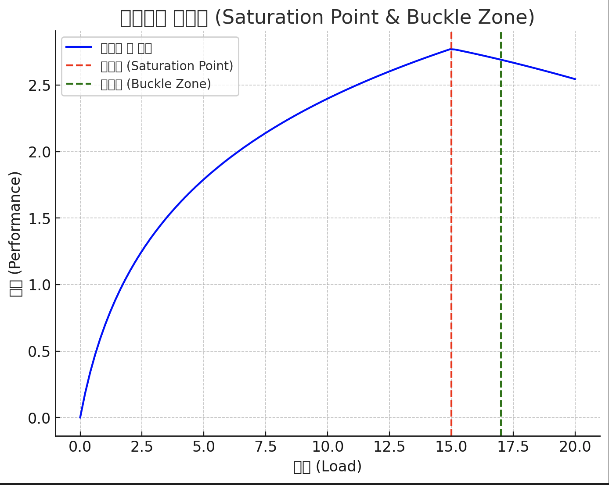

## 성능 테스트의 종류

- 성능 테스트란?
  - 일반적으로 특정 작업 부하 상태에서 응답성과 안정성 측면에서 시스템이 어떻게 작동하는지를 확인하기 위해 수행하는 테스트 관행이다 → 응답 시간, 처리량, 자원 사용량(CPU, 메모리 등)을 주로 측정한다
- 성능 테스트의 종류
  - 부하 테스트, 스트레스 테스트, 지속 부하 테스트, 스파이크 테스트

 

### 부하 (load) 테스트

- 특정한 예상 부하에서 시스템이 어떻게 동작하는지 확인한다
- 이 테스트를 통해 주요 기능의 응답 시간과 처리량 등의 성능 지표를 확인할 수 있고, 병목을 파악하는 데 도움이 된다

 

### 스트레스 (stress) 테스트

- 시스템의 최대 성능을 확인하기 위한 테스트이다
- 예상을 뛰어넘는 부하가 발생했을 때 시스템이 어디까지 성능을 낼 수 있는지를 확인한다

 

### 지속 부하 (soak) 테스트

- 시스템이 지속적인 부하를 견딜 수 있는지를 검증한다
- 장시간 동안 일정 수준의 부하를 주어 성능 저하가 발생하는 지 확인하며 메모리 누구도 탐지할 수 있다

 

### 스파이크 (spike) 테스트

- 급격하게 트래픽이 변화할 때 시스템의 반응성과 안정성을 검증하는 테스트이다
- 순간적으로 트래픽이 급증했을 때, 성능 저하나 실패가 발생하는 지를 확인한다

 
 

## 포화점과 버클존

성능 테스트를 진행하는 일반적인 방식은 낮은 부하에서 시작해서 점진적으로 부하를 높이는 것 이다

(예를들어 동시 사용자수를 100명에서 시작해 200명, 300명으로 단계적으로 부하를 높여가며 성능을 측정한다)

이렇게 부하를 증가시키면 초기에는 처리량도 함께 증가한다

그러다 일정 부하 구간에 도달하면 처리량의 증가 폭이 줄어들기 시작하고, 어느 시점부터는 처리량과 응답 시간이 급격히 저하된다

이때 성능이 저하되기 전에 최대 처리량을 포하점(saturation point 또는 tipping point) 이라고 한다

포화점은 시스템이 감당할 수 있는 성능 한계 지점이다

포화점을 지나 성능이 꺾이기 시작하는 구간을 버클존 (buckle zone) 이라고 한다

**버클 (buckle)**

- 버클링 (buckling) 은 물리 현상에서 빌려온 개념으로 세로로 긴 구조물을 세로 방향으로 압축할 때 어느 순간 압축 하중을 견디지 못하고 구부러지는 것을 말한다
- 버클존의 버클 (buckle) 은 이 현상에서 빌려온 단어로 시스템이 한계를 초과했을 때 급격하게 성능이 저하되는 상황을 표현한다

포화점이 목표로 한 성능보다 높다면 아주 좋은 결과를 낸 성능 테스트 입니다

**하지만 포화점이 목표치보다 낮거나 같다면 병목 지점을 찾아 제거해야 합니다**

일반적으로 웹 서버의 병목 지점은 호출 비중이 높으면서도 응답 시간이 긴 기능과 관련되어 있습니다.

다음 요인들이 응답 시간에 영향을 줍니다

- DB 연동 (쿼리 실행 시간)
- 외부 연동 시간
- 트래픽 대비 부족한 커넥션 풀 크기

어떤 시점에서 병목이 발생하는지 확인한 뒤, 서버 확장, 캐시 적용, 비동기 연동과 같은 수단을 강구해서 응답시간을 줄여야 한다
