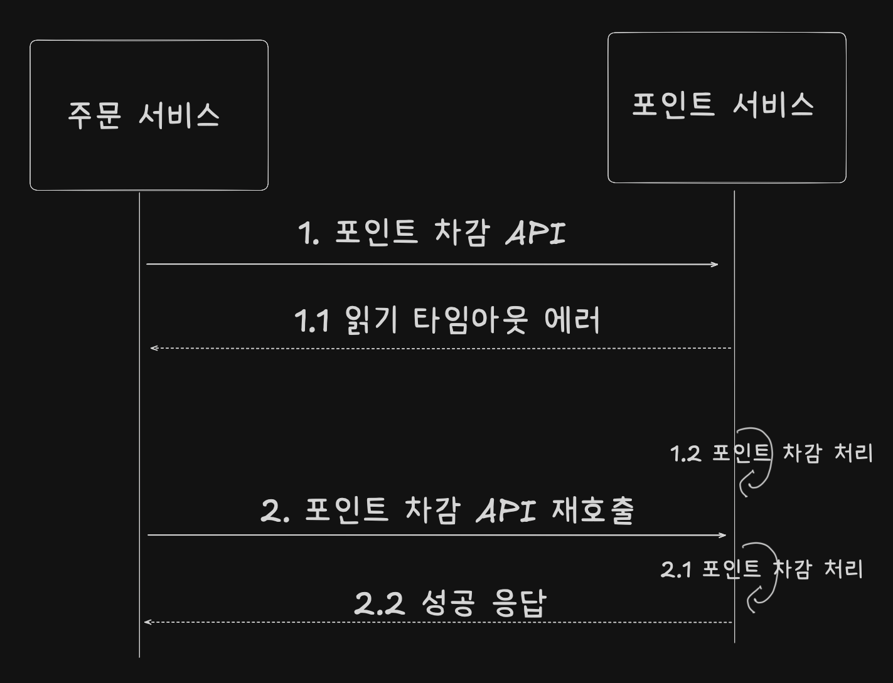

## 재시도

- 항상 재시도를 할 수 있는 것은 아니다.
- 연동 API 를 다시 호출해도 되는 조건인지 확인한 뒤 재시도를 요청해야 한다
- 예시) 재시도 중복 처리 실패 예시

재시도해도 문제가 없는 경우에만 재시도를 해야 한다

재시도를 해도 되는 조건은 다음 3가지로 정리할 수 있다

- 단순 조회 기능
- 연결 타임아웃
- 멱등성 (idempotent) 을 가진 변경 기능

단순 조회기능은 재시도를 통해 성공 확률을 높일 수 있다.
포인트 내역 조회 같은 기능은 다시 호출해도 포인트 중복 차감 같은 데이터 문제가 생기지 않는다

연결 타임아웃도 마찬가지다.
연결 타임아웃이 발생했다는 것은 연동 서비스에 아직 연결되지 않은 상태라는 뜻이며 연동 서비스가 요청을 처리하고 있지 않은 상태이므로 재시도를 통해 연결에 성공할 가능성이 있다

읽기 타임아웃은 재시도할 때 주의해야 한다

이 경우 이미 연동 서비스가 요청을 처리하고 있는 중이기 때문이다.
읽기 타임아웃이 발생한 상황에서 재시도를 하면 포인트가 중복 차감되는 데이터 문제가 생길 수 있다

상태를 변경하는 연동 API 를 재시도할 때는 멱등성을 고려해야 한다

멱등성이란 연산을 여러번 적용해도 결과가 달라지지 않는 성질을 말한다

더불어 같은 API 라도 실패 원인에 따라 재시도 여부를 결정해야 한다

검증 오류가 발생했다면 재시도를 해도 동일하게 실패할 가능성이 높다

 
 

## 재시도 횟수와 간격

- 재시도를 할때는 다음 2가지를 결정해야 한다
  - 재시도 횟수
  - 재시도 간격
- 재시도를 무한정 할 수는 없다. 재시도 횟수만큼 응답 시간도 함께 증가하기 때문이다
- 재시도 간격도 중요하다
- 바로 재시도를 할 경우 같은 문제로 실패할 가능성이 있어 어느정도 간격을 두고 재시도하면 성공할 가능성이 있다
  - 여러 차례 재시도할 때는 재시도 간격을 점진적으로 늘리기도 한다
  - 예를들어 첫 번째 시도는 1초 뒤에, 두 번째 재시도는 2초 뒤에 하는 등

 

> 재시도 폭풍 (retry storm) 안티 패턴
>
> 재시도를 통해 성공 가능성을 높일 수 있지만, 반대로 연동 서비스에는 더 큰 부하를 줄 수 있다
> 연동 서비스의 성능이 느려 읽기 타임아웃이 발생할 때 바로 재시도를 하면 연동 서비스는 같은 요청을 두배로 받게 된다
>
> 따라서 재시도를 검토할 때는 연동 서비스의 성능 상황도 고려해야 한다

 
 

## 동시요청 제한 - 벌크헤드 (Bulkhead)

- 최대 100개 요청을 동시에 처리가능한 서비스가 있을때
- 한번에 300개의 요청을 받으면 100개는 동시 처리하고 200개는 바로 에러를 응답한다
- 이렇게 함으로써 해당 서비스는 오류가 발생하지만 해당 서비스를 연동하는 나머지 기능은 정상동작할 수 있다
- 이렇게 동시 요청을 제한하는 방식은 벌크헤드 패턴을 활용한 것 이다
  - 벌크헤드 패턴은 각 구성요소를 격리함으로써 한 구성 요소의 장애가 다른 구성 요소에 영향을 주지 않도록 하는 설계 패턴이다

 
 

## 서킷 브레이커

- 서킷 브레이커는 누전 차단기와 비슷하다
- 과전류가 흐르면 차단기가 내려가 전기를 끊는 것 처럼 서킷 브레이커도 과도한 오류가 발생하면 연동을 중지시키고 바로 에러를 응답한다
- 이렇게 하면 연동 서비스로의 요청 전달을 차단할 수 있다
- 서킷 브레이커는 닫힘(Closed), 열림(Open), 반 열림(Half-Open) 의 3가지 상태를 갖는다

서킷 브레이커는 닫힘 상태로 시작한다

닫힘 상태일 때는 모든 요청을 연동 서비스에 전달한다

외부 연동 과정에서 오류가 발생하기 시작하면 지정한 임계치를 초과했는지 확인한다

실패 건수가 임계치를 초과하면 서킷 브레이커는 열림 상태가 된다

임계치의 조건들

- 시간 기준 오류 발생 비율
  - 10초 동안 오류 비율이 50% 초과
- 개수 기준 오류 발생 비율
  - 100개 요청 중 오류 비율이 50% 초과

열림 상태가 되면 연동 요청은 수행하지 않고, 바로 에러 응답을 리턴한다

열림 상태가 지정된 시간 동안 유지된다.

이 시간이 지나면 반 열림 상태로 전환된다. 반 열림 상태가 되면 일부 요청에 한해 연동을 시도한다

일정 개수 또는 일정 시간 동안 반 열림 상태를 유지하며, 이 기간 동안 연동에 성공하면 닫힘 상태로 복귀한다

반대로 연동에 실패하면 다시 열림 상태로 전환되어 연동을 차단한다

 
 

## 빠른 실패

- 서킷 브레이커는 문제 상황이 감지되면 해당 기능을 더 이상 실행하지 않고 바로 실패로 처리한다.
- 이처럼 실패를 빠르게 감지하고, 문제가 있는 기능을 실행하지 않고 중단시키는 방식을 빠른 실패(fail fast) 라고 한다
- 빠른 실패는 장애가 발생한 기능에 부하가 더해지는 것을 방지할 뿐 아니라 불필요한 자원 낭비를 줄여 전체 서비스의 안정성을 유지하는 데도 도움이 된다
