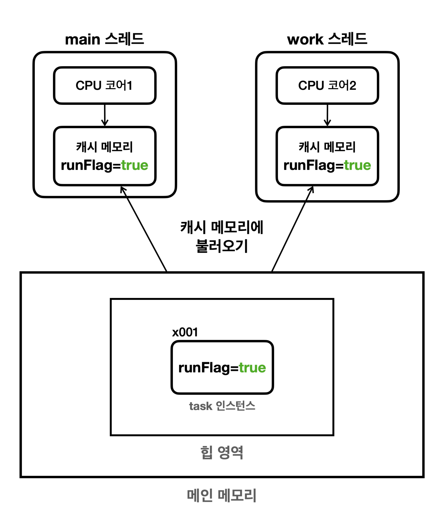
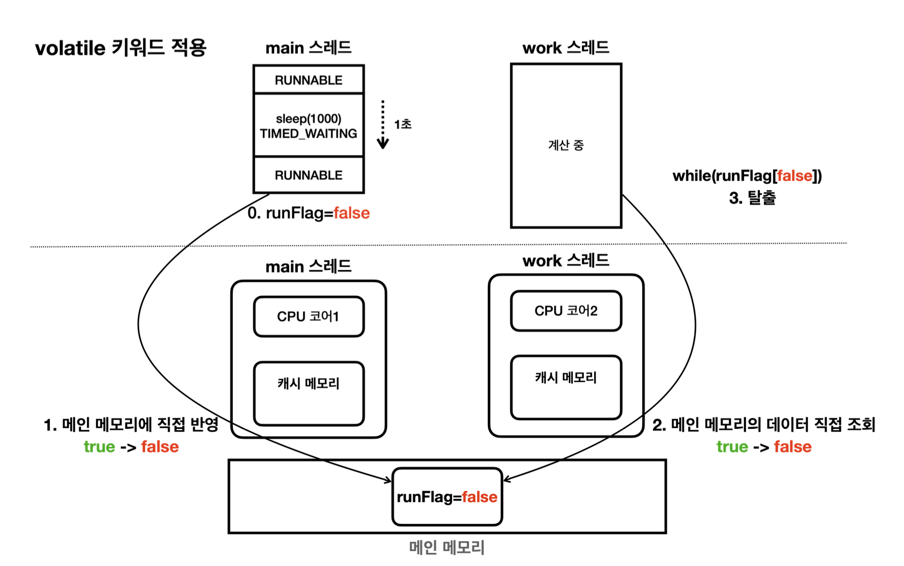

## 메모리 가시성 문제

간단한 예시를 통해 알아보자

예시) `runFlag` 를 통해 특정 스레드의 작업을 종료시키는 코드

```java
public class VolatileFlagMain {
    public static void main(String[] args) {
        MyTask task = new MyTask();
        Thread t = new Thread(task, "work");
        log("runFlag = " + task.runFlag);
        t.start();

        sleep(1000);
        log("runFlag 를 false 로 변경 시도");
        task.runFlag = flase;
        log("runFlag = " task.runFlag);
        log("main 종료");
    }

    static class MyTask implements Runnable {
        boolean runFlag = true;

        @Override
        public void run() {
            log("task 시작");
            while (runFlag) {
                // runFlag 가 false 로 변하면 탈출
            }
            log("task 종료");
        }
    }
}
```

위 코드를 통해 우리가 일반적으로 생각하는 메모리 접근 방식을 생각해보자

**일반적으로 생각하는 메모리 접근 방식**


- `main` 스레드와 `work` 스레드는 각각의 CPU 코어에 할당되어 실행된다
- 애플리케이션은 실행 후 `main` 스레드와 `work` 스레드 모두 메인 메모리의 `runFlag` 의 값을 읽는다
- 프로그램 시작 시점에는 `runFlag = true` 이므로 모든 스레드에서 `true` 의 값을 읽는다
- 이후 `runFlag = false` 가 변경되며 `work` 스레드에서 해당 사실을 메인 메모리에서 확인 후 반복문을 탈출한다

**일반적으로 이런 시나리오로 생각하지만 실제로는 이런 방식으로 동작하지 않는다!**

</br>

**실제 메모리 접근 방식**



CPU 는 처리 성능을 개선하기 위해 중간에 캐시 메모리를 사용한다

현대 CPU 대부분은 코어 단위로 캐시 메모리를 각각 보유하고 있다

- 각 스레드가 `runFlag` 의 값을 사용하면 CPU 는 이 값을 효율적으로 처리하기 위해 먼저 `runFlag` 를 캐시 메모리에 불러온다
- 그리고 이후에는 캐시 메모리에 있는 `runFlag` 를 사용하게 된다
- **이후 `runFlag = false` 를 변경하지만 핵심은 캐시 메모리의 `runFlag` 값만 변한다는 것 이다, 메인 메모리는 즉시 반영되지 않는다!**
- 결국 `work` 스레드가 사용하는 CPU 코어의 캐시 메모리는 여전히 `true` 이므로 반복문을 계속 수행하게 된다

그럼 캐시 메모리에 있는 `runFlag` 의 값은 언제 메인 메모리에 반영될까?

이 부분에 대한 답변은 "알 수 없다" 이다

CPU 설계 방식과 종류의 따라 다르며 극단적으로 보면 평생 반영되지 않을 수도 있다

그렇다면 캐시 메모리를 메인 메모리에 반영하거나, 메인 메모리의 변경 내역을 캐시 메모리에 다시 불러오는 것은 언제 발생할까?

이 부분은 CPU 설계 방식과 실행 환경에 따라 다를 수 있다. 즉시 반영될 수도 있고 몇 밀리초 후에 될 수도 있고 평생 반영되지 않을 수도 있다

주로 컨텍스트 스위칭이 될 때, 캐시 메모리도 함께 갱신되는데 이 부분도 환경에 따라 달라질 수 있다

</br>
</br>

## 메모리 가시성 (memory visibility)

이처럼 멀티 스레드 환경에서 한 스레드가 변경한 값이 다른 스레드에서 언제 보이는지에 대한 문제를 메모리 가시성 문제라고 한다

말그대로 메모리에 변경한 값이 보이는가, 보이지 않는가의 문제이다

**그렇다면 한 스레드에서 변경한 값이 다른 스레드에서 즉시 보이게 하려면 어떻게 해야할까?**

**해결방안은 성능을 약간 포기하는 대신에, 값을 읽을때와 값을 쓸때 모두 메인 메모리에 직접 접근하면 된다**

- **자바에서는 `volatile` 이라는 키워드로 이런 기능을 제공한다**

```java
public class VolatileFlagMain {
    public static void main(String[] args) {
        MyTask task = new MyTask();
        Thread t = new Thread(task, "work");
        log("runFlag = " + task.runFlag);
        t.start();

        sleep(1000);
        log("runFlag 를 false 로 변경 시도");
        task.runFlag = flase;
        log("runFlag = " task.runFlag);
        log("main 종료");
    }

    static class MyTask implements Runnable {
        volatile boolean runFlag = true;

        @Override
        public void run() {
            log("task 시작");
            while (runFlag) {
                // runFlag 가 false 로 변하면 탈출
            }
            log("task 종료");
        }
    }
}
```

- 위 예시에서 `volatile boolean runFlag` 를 추가했다 (`volatile` 키워드 추가)
- 이렇게하면 `runFlag` 에 대해서 캐시 메모리를 사용하지 않고 값을 읽거나 쓸때 항상 메인 메모리에 직접 접근한다



- 여러 스레드가 `runFlag` 값에 대해 메인 메모리에 직접 접근해서 읽고 쓴다

여러 스레드에서 같은 값을 읽고 써야 한다면 `volatile` 키워드 사용을 권장한다

그러나 캐시 메모리를 사용할 때보다 성능이 더 느려지는 단점이 있기 때문에 꼭 필요한 곳에서만 사용하는 것이 좋다

</br>

### `volatile` 사용 후

- `main` 스레드가 `runFlag` 를 변경하는 시점에 `work` 스레드도 `runFlag` 의 변경값을 정확하게 확인할 수 있다
- `volatile` 을 적용하면 캐시 메모리가 아니라 메인 메모리에 항상 직접 접근하기 때문에 성능이 상대적으로 떨어진다
