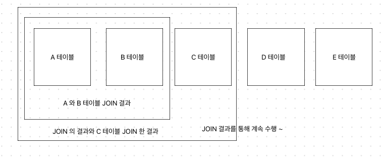
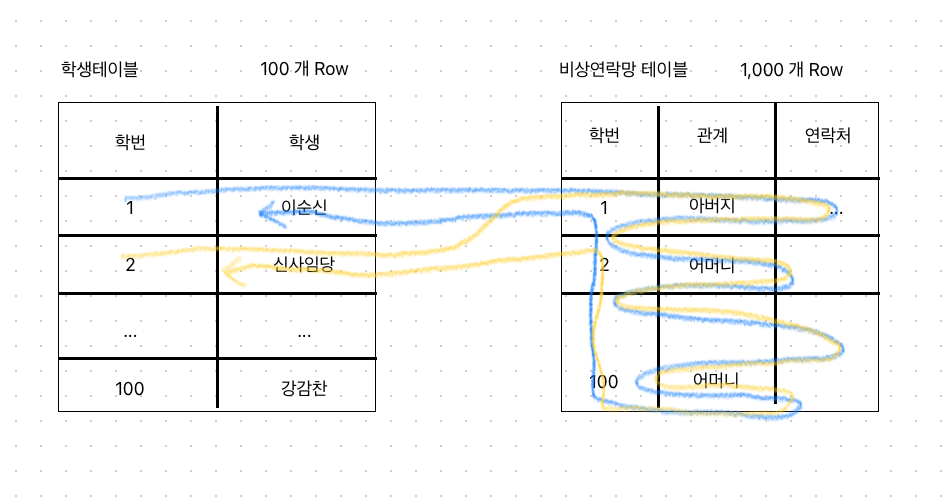
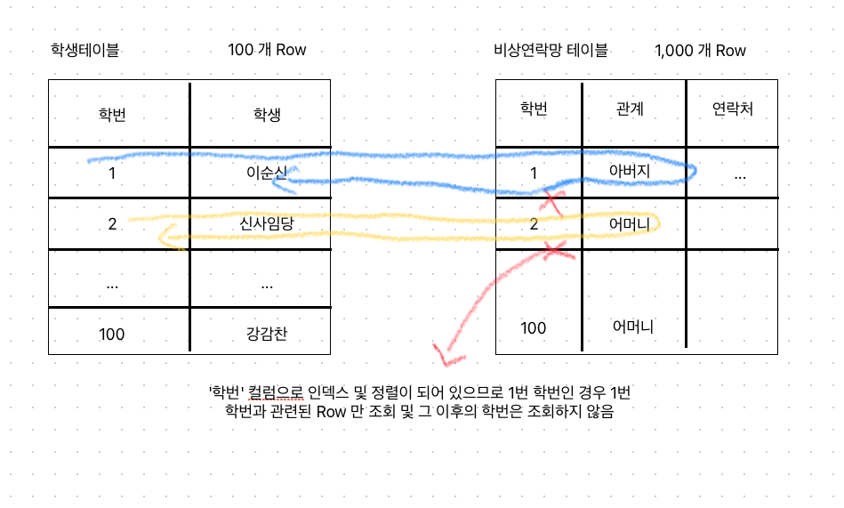
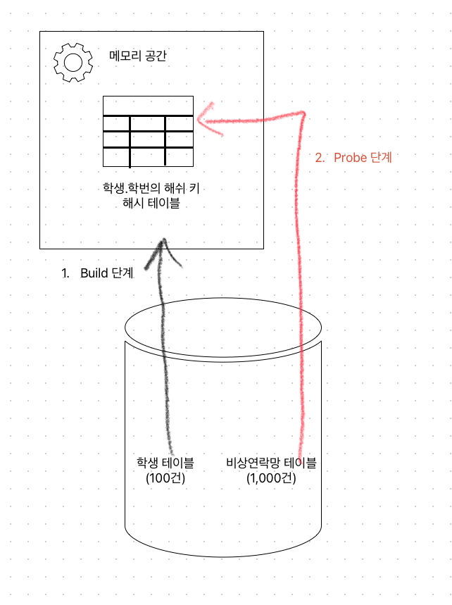

# 조인의 특징

Q) 만약 N 개 테이블을 동시에 조인할 수 있을까 ?

A) 동시에 병렬적으로 N개의 테이블에 대한 조인연산은 불가능하다

- 동시에 조인할 수는 없고, 항상 최적화된 방법으로 두 개의 테이블을 선별한뒤 조인한다
- 그 이후 결과를 다시 다른 테이블과 조인하는 형태로 처리하게 된다



</br>

# 조인 알고리즘

- 조인에 대한 여러가지 알고리즘이 있다
- Nested Loop Join (NL 조인방식)
- Hash Join
- Sort Join (오라클)

</br>
</br>

## Nested Loop Join

위 조인에 대해 극단적인 Join 동작방식과 일반적인 Join 동작방식으로 설명해보자

가정

- 학생 테이블 (학번, 이름) → 100개 Row
- 비상연락망 테이블 (학번, 관계, 연락처) → 1,000 개 Row
- "학번" 으로 Join 을 할 경우

Q) 1 과 100 번의 학생에 대해서 모든 비상연락망 목록을 출력하세요

```sql
WHERE 학생.학번 = 비상연락망.학번
  AND 학생.학번 IN (1, 100)
```

</br>

### 극단적인 NL Join



1번 학생을 처리한다면 일단 1번 학생을 찾기 위해 학생 테이블을 조회 (100 회)

이후 1번 학생의 학번으로 비상연락망을 찾으려고 조회 → 1번 학번이 나올때까지 (1,000 회)

</br>

### 일반적인 NL Join



'학번' 컬럼으로 인덱스를 생성한 경우

'학번' 컬럼의 값으로 정렬되어 있으므로 1번 학번에 대한 비상연락망 찾기는 인덱스로 정렬된 1번 학번을 찾은 다음 1번 학번이 아니면 그대로 다음 학번을 처리한다

(논-클러스터링 인덱스 이므로 실제 테이블 데이터는 뒤죽박죽이다, 단지 인덱스 테이블이 정렬되어 있을 뿐)

데이터가 많은경우

- 논-클러스터링 인덱스 조회이므로 많은 랜덤 엑세스가 발생하게 되며
- 성능에 안좋은 영향이 생긴다

</br>
</br>

## Hash Join



1. 먼저 디스크에 가장 데이터 범위가 좁은 학생 테이블을 가지고 메모리에 해시 함수를 통해 해시 테이블을 구성한다 (Build 단계)
2. 그 다음 비상연락망 테이블을 가지고 해시 테이블에 해당 학번이 존재하는지 조회하게 된다 (Probe 단계)

만약 학생 테이블이 데이터가 많다면 메모리의 공간 리소스가 부족할 수 있다

Nested Loop Join 의 경우 인덱스를 통해 디스크에 접근하므로 랜덤 액세스가 발생하지만

Hash Join 같은 경우 아예 디스크의 테이블과 메모리에 올라간 해시 테이블 간의 비교를 하고 디스크에 읽을 때 순차적으로 읽기 때문에 순차 액세스를 하게 된다

</br>
</br>

# 드라이빙 테이블 과 드리븐 테이블

2개 이상의 테이블을 조회할 때 DB 엔진에서는 어떻게 처리될까

조인을 수행할 때는 동시에 여러개의 테이블에 접근할 수 없다

그러므로 먼저 접근하려는 테이블을 선택하여 처리하는 것이 중요하며 내부적으로 순번을 정하고 차례때로 조인을 수행한다

테이블을 접근하는 순서에 대한 용어

- Driving Table
- Driven Table

예시

```sql
SELECT emp.ID, emp.NAME, grade.NAME
  FROM grade -- 직급 테이블
  JOIN emp   -- 사원 테이블
    ON grade.EMP_ID = emp.ID
  WHERE emp.NAME = 'Suri'
```

`grade` 와 `emp` 테이블 중 어떤 것을 먼저 접근하게 될까 ?

DB 엔진에서는 기본적으로 가장 빠르게 데이터를 찾을 수 있는 방법을 찾게된다

위의 경우 데이터를 접근할 수 있는 범위를 좁히는 방향으로 먼저 접근하려는 테이블을 선택하게 된다

`WHERE` 절을 보면 "Suri" 라는 값으로 데이터 범위를 좁힐 수 있다

그러므로 `emp` 테이블을 먼저 접근한다

`emp` 테이블에서 `NAME` 이 "Suri"인 값들을 찾고 나서 결과를 가지고 `grade` 테이블에서 `EMP_ID` 와 같은 것을 찾게된다

즉 `emp` 테이블이 먼저 접근하게 되며 `Driving Table` 이라 부른다 (`Outer` 테이블이라고도 부름)

반대로 `grade` 테이블은 나중에 접근하므로 `Driven Table` 이라 부른다 (`Inner` 테이블이라고도 부름)

드라이빙 테이블에서 많은 건수가 나온다면 그 결과를 통해서 드리븐 테이블에 접근하므로 드라이빙 테이블의 추출된 결과가 작으면 작을수록 성능에 유리하다

즉, 드라이빙 테이블로 어떤 테이블을 선택할지가 굉장히 중요하다

드리븐 테이블에 빨리 접근하기 위해 인덱스를 통해 조인하는 방식이 중요하다. 즉, 드리븐 테이블에는 인덱스가 반드시 있어야 성능상 더 유리하다

테이블에 접근하는 횟수를 줄이는 것이 가장 중요하다 !

테이블의 규모가 작은 테이블을 선택하는게 일반적으로 성능에 더 유리하다

드리븐 테이블에 접근을 최소화할 수 있게 즉, 인덱스 테이블만 봐도 처리가능하게 하는게 성능에 유리하다
