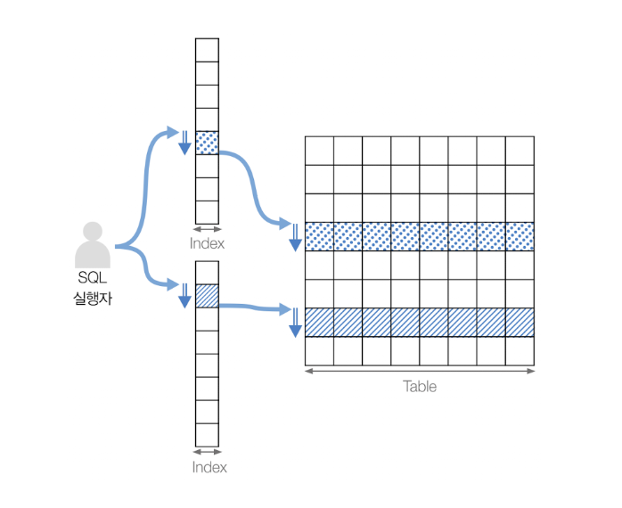
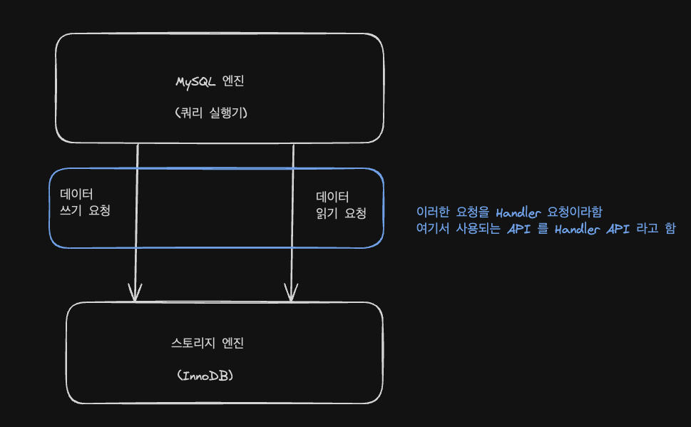
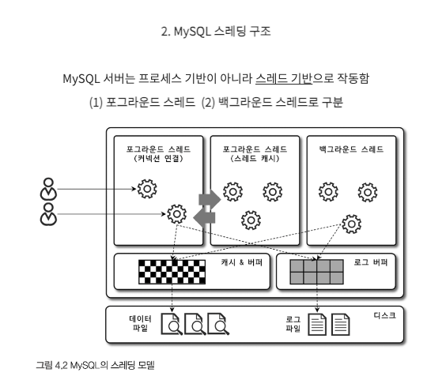

## MySQL 엔진과 스토리지 엔진

- MySQL 서버는 사람의 머리 역할을 담당하는 "MySQL 엔진"
- 손발 역할을 담당하는 "스토리지 엔진" 으로 구분할 수 있다
- 그리고 손과 발의 역할을 담당하는 스토리지 엔진은 핸들러 API 를 만족하면 누구든지 스토리지 엔진을 구현해서 MySQL 서버에 추가해서 사용할 수 있다

 
 

## MySQL 엔진과 스토리지 엔진의 차이점

- MySQL 에서 MyISAM 이나 InnoDB 와 같이 다른 스토리지 엔진을 사용하는 테이블에 대해 쿼리를 실행하더라도 MySQL 의 처리 내용은 대부분 동일하며
- 단순히 "데이터 읽기/쓰기" 영역의 처리만 차이가 있을 뿐이다
- 실질적인 `GROUP BY` 나 `ORDER BY` 등 복잡한 처리는 스토리지 엔진 영역이 아니라 "MySQL 엔진의 처리 영역인 쿼리 실행기에서 처리된다"
- 여기서 중요한 내용은 하나의 쿼리 작업은 여러 하위 작업으로 나뉜다
  - 각 하위 작업이 MySQL 엔진 영역에서 처리되는지 아니면 스토리지 엔진 영역에서 처리되는지 구분할 줄 알아야 한다

 
 

## MySQL 전체 구조

- MySQL 엔진은 요청된 SQL 문장을 분석하거나 최적화하는 등 DBMS 의 두뇌에 해당하는 처리를 수행한다
- 실제 데이터를 디스크 스토리지에 저장, 디스크 스토리지로부터 데이터를 읽어오는 부분은 스토리지 엔진이 전담한다
- MySQL 서버에서는 MySQL 엔진 하나이지만 스토리지 엔진은 여러 개를 동시에 사용할 수 있다

 
 

## 핸들러 API

- MySQL 엔진의 쿼리 실행기에서 "데이터를 쓰거나 읽어야 할 때" 는 각 스토리지 엔진에 쓰기 또는 읽기 요청을 하는데 이러한 요청을 핸들러(`Handler`) 요청이라고 한다
- 여기서 사용되는 API 를 핸들러 API 라고 한다

 
 

## MySQL 스레딩 구조

- MySQL 서버는 프로세스 기반이 아닌 스레드 기반으로 작동한다
- 크게 포그라운드(Foreground) 스레드와 백그라운드(Background) 스레드로 구분할 수 있다
  - `performance_schema` 데이터 베이스 안에 `threads` 테이블을 통해 확인할 수 있다
  - `thread/sql/one_connection` 스레드가 실제 사용자의 요청을 처리하는 포그라운드 스레드이다

 
 

## MySQL 커뮤니티 버전과 엔터프라이즈 버전의 스레드 모델 차이점

- MySQL 커뮤니티 에디션에서 사용하는 것은 MySQL 서버가 전통적으로 가지고 있던 스레드 모델이다
- MySQL 엔터프라이즈 에디션과 Percona MySQL 서버 (플러그인으로 설치) 에서는 전통적인 스레드 모델 + 스레드 풀 모델을 사용할 수 있다

 

### 전통적인 스레드 모델

- 스레드 풀과 전통적인 스레드 모델의 가장 큰 차이점은 포그라운드 스레드와 커넥션의 관계이다
- 전통적인 스레드 모델에서는 커넥션별로 포그라운드 스레드가 하나씩 생성되고 할당된다
- 하지만 스레드 풀에서는 커넥션과 포그라운드 스레드는 1:1 관계가 아니라 하나의 스레드가 여러 개의 커넥션 요청을 전담한다

 

### SpringBoot + MySQL 에서는?

- SpringBoot + MySQL 의 활용사례를 보면 MySQL 스레드에 대한 다른 관점이 존재한다
- SpringBoot 는 내장 톰캣을 통해 사용자 요청에 대한 스레드 풀을 관리하며 이를 설정 파일 등으로 수정할 수 있다
- 그러나 해당 스레드 풀은 MySQL 에서의 스레드 풀과 다르다
- 또한 MySQL 커뮤니티 에디션에서는 스레드 풀을 지원하지 않는다
- 이를 "JDBC 커넥션 풀 (HikariCP, C3P0 등)" 을 통해 스레드 생성에 대한 관리를 처리한다
- **커넥션과 포그라운드 스레드가 1:1 관계이므로 커넥션 풀을 통해 스레드를 미리 생성하는 작업을 수행하며 스레드 생성 비용을 줄일 수 있다**
  - **하지만 커넥션 1개당 1개의 스레드를 생성하므로 톰캣의 스레드 풀과 상관없이 DB 에서는 여전히 1:1 매핑을 유지한다**
  - **예를들어 `HikariCP maximumPoolSize=20` 으로 설정 / 동시에 20개 커넥션을 빌리면 → MySQL 서버는 20개 스레드를 만들어서 처리한다**

 

### 포그라운드 스레드 (= 클라이언트 스레드)

- 포그라운드 스레드는 최소한 MySQL 서버에 접속된 클라이언트의 수만큼 존재하며, 주로 각 클라이언트 사용자가 요청하는 쿼리 문장을 처리한다
- 클라이언트 사용자가 작업을 마치고 커넥션을 종료하면 해당 커넥션을 담당하던 스레드는 다시 "스레드 캐시(Thread Cache)" 로 돌아간다
- 이때 이미 스레드 캐시에 일정 개수 이상의 대기 중인 스레드가 있으면 스레드 캐시에 넣지 않고 스레드를 종료시켜 일정 개수의 스레드만 스레드 캐시에 존재하게 한다
  - 이때 스레드 캐시에 유지할 수 있는 최대 스레드 개수는 `thread_cache_size` 시스템 변수로 설정한다

 

### 스레드 캐시 vs 커넥션 풀 vs 스레드 풀

- 각각의 활용방식을 보면 모두 비슷한 개념인듯해 보인다
  - 개인적으로 스레드 풀을 사용할 수 없으니 커넥션 풀 혹은 스레드 캐시 등의 대처방안이 나온건가 싶었다
- 그러나 스레드 풀과 비슷한 일부 효과를 얻을 수 있지만, 스레드 풀의 주요 기능을 완전히 대체할 수는 없다
- 즉, 스레드 캐시와 커넥션 풀은 단순히 스레드 생성 비용을 줄이는 방식이고
- 스레드 풀은 스레드를 미리 만들어 여러 커넥션을 공유할 수 있는 구조적인 개선 기능이다
- 스레드 캐시 (Thread Cache)
  - 종료된 스레드를 캐시에 저장해서 재사용
  - 스레드 생성 방식 → 새로운 연결이 필요할 때마다 생성 (단, 캐시된 스레드는 재사용)
  - 성능 최적화 방식 → 스레드 생성/삭제 비용 절감
  - 동작 방식 → 커넥션이 종료될 때 스레드를 캐시에 저장 후 재사용
  - 한계점 → 활성화해도 스레드 수는 커넥션 수와 동일 (1:1 매핑)
- 스레드 풀 (Thread Pool)
  - 스레드를 미리 만들어 두고 여러 커넥션을 공유
  - 스레드 생성 방식 → 일정 개수의 스레드를 유지하면서 공유
  - 성능 최적화 방식 → 동시 연결 처리 성능 최적화 (컨텍스트 스위칭 감소, 부하 균형)
  - 동작 방식 → 미리 정해진 개수의 스레드가 여러 클라이언트를 처리
  - 한계점 → 스레드 수를 제한하면서 여러 커넥션을 효율적으로 관리 가능

 
 

## InnoDB 와 MyISAM 의 포그라운드 스레드 처리

- 포그라운드 스레드는 데이터를 MySQL 의 데이터 버퍼나 캐시로부터 가져오며, 버퍼나 캐시에 없는 경우에는 직접 디스크의 데이터나 인덱스 파일로부터 데이터를 읽어와서 작업을 처리한다
- MyISAM 테이블은 디스크 쓰기 작업까지 포그라운드 스레드가 처리하지만
- InnoDB 테이블은 데이터 버퍼나 캐시까지만 포그라운드 스레드가 처리하고, 나머지 버퍼로부터 디스크까지 기록하는 작업은 백그라운드 스레드가 처리한다

 
 

## 백그라운드 스레드

- 여러가지 작업이 백그라운드로 처리된다
  - Insert Buffer 를 병합하는 스레드
  - 로그를 디스크로 기록하는 스레드
  - InnoDB 버퍼 풀의 데이터를 디스크에 기록하는 스레드
  - 데이터를 버퍼로 읽어 오는 스레드
  - 잠금이나 데드락을 모니터링하는 스레드
- 그 중에서도 가장 중요한 것은 로그 스레드와 버퍼의 데이터를 디스크로 내려쓰는 작업을 처리하는 쓰기 쓰레드일 것 이다
- InnoDB 에서도 데이터를 읽는 작업은 주로 클라이언트 스레드(포그라운드 스레드) 에서 처리되기 때문에 읽기 쓰레드는 많이 설정할 필요가 없지만
- 쓰기 쓰레드는 아주 많은 작업을 백그라운드로 처리하기 때문에 일반적인 내장 디스크를 사용할 때는 2개 ~ 4개 정도 혹은 디스크를 최적으로 사용할 수 있을 만큼 충분히 설정하는 것이 좋다
- 사용자의 요청을 처리하는 도중 데이터의 쓰기 작업은 지연(버퍼링) 되어 처리될 수 있지만 데이터의 읽기 작업은 절대 지연될 수 없으면 되어서도 안된다
- 그래서 일반적인 상용 DBMS 에는 대부분 쓰기 작업을 버퍼링해서 일괄 처리하는 기능이 탑재되어 있으며 InnoDB 또한 이러한 방식으로 처리한다
