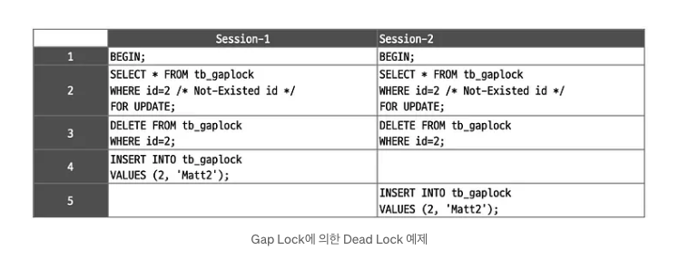

READ-COMMITED 를 사용하는 이유를 알아보기 전에 먼저 MySQL 의 Gap Lock 에 대해 알아보자

## Gap Lock

인덱스 레코드 사이 간격에 대한 잠금을 말한다

```sql
SELECT * FROM WEHER 10 BETWEEN 20 FOR UPDATE;
```

위 쿼리를 실행할 경우 다른 트랜잭션에서 해당 테이블의 15의 값을 삽입할 수 없다

즉, insert 될 수 있는 곳에 insert 를 하지 못하도록 잠굴 수 있고 이를 Gap Lock 이라고 한다

Gap Lock 을 사용하는 이유는 READ-COMMITED 의 phantom read 문제 때문이다

[phantom read](https://postgresql.kr/blog/pg_phantom_read.html)

</br>

## Gap Lock 이 발생하지 않는 조건

- Primary Key 와 Unique Index 인데 **결과가 존재하는 경우**

위 경우 Gap Lock 이 걸리지 않는다

위 인덱스의 경우에는 결과가 1개임을 보장하는 경우다.

따라서 **Record Lock** 만 걸리고 **Gap Lock**은 걸리지 않는다

</br>

## Gap Lock 이 발생하는 조건

- 위 식별자를 통한 조건 조회 중 결과가 없는 것
- Non-unique index
- 쿼리가 1개의 결과를 보장하지 않는 경우

unique 하지 않은 경우는 그 결과의 개수와 관련없이 항상 Record Lock + Gap Lock 이 사용된다

예를 들어 복합 인덱스 중, 일부 컬럼만 WHERE 절로 사용하거나, BETWEEN 과 같은 연산자를 사용하는 경우
→ Record Lock + Gap Lock

</br>

## Gap S Lock / Gap X Lock

Gap S Lock 과 Gap X Lock 은 본질적으로 차이가 없습니다. InnoDB의 Gap Lock 은 다른 트랜잭션이 Gap 에 Insert를 막는 것이 목적입니다

즉, UPDATE/DELETE/SELECT ... FOR UPDATE 를 통해 Gap Lock 을 획득한다고 하여도 이는 shared gap lock 과 다르지 않고, 잠금 경합이 발생하지 않습니다

</br>

## Gap Lock 에서의 Dead Lock

Gap Lock 이 트랜잭션간 영향도는 데이터가 많은 경우 크지 않을 수 있습니다

하지만, 동시성은 높고 데이터가 적을수록, 문제가 발생할 가능성이 높습니다

이유는 레코드가 적을 수록 전체 레코드 수 대비 상대적으로 Gap 이 넓어질 수 있기 때문입니다

예를 들어 "빈 테이블" 에 ID 가 100 인 레코드를 업데이트하는 트랜잭션이 존재할때,

레코드가 존재하지 않기 때문에 Gap Lock이 걸리게 됩니다

즉 ID 가 100 까지의 Gap이 모두 잠기게 됩니다
(데이터가 적을 수록 상대적으로 Gap이 넓게 보일 수 있다)

### Insert Intention Lock

Insert 연산시 설정되는 Gap Lock 입니다

만약 여러 트랜잭션이 Insert 를 하는데, 일반 Gap Lock 을 걸면 서로 다른 곳에 Insert를 함에도 불구하고 Gap Lock 때문에 기다려야 하는 현상이 생길 수 있습니다

즉, 겹치지 않는 곳에 Insert를 함에도 불구하고 동시성 처리가 떨어지는 현상을 겪을 수 있습니다

그렇기 때문에 Insert Intention Lock 이라는 별도의 Gap Lock을 걸고, 서로 충돌하지 않는다면 같은 Gap 에 데이터를 Insert 할 수 있게 해주는 것 입니다

일반적인 Insert 연산시

1. Insert Intention Lock 을 걸고
2. X Lock 잠금을 얻게 된다

Insert Intention Lock 도 Gap Lock 의 일종으로 해당 Lock 끼리는 충돌하지 않습니다

하지만, 이 Insert Intention Lock 은 Gap Lock 과는 충돌합니다

빈 테이블에 아래의 트랜잭션이 실행된다고 가정해봅시다

빈 테이블이기 때문에 **SELECT** 와 **DELETE** 모두 Gap Lock 을 걸게 됩니다

X Lock 이 아니라 Gap Lock 이기 때문에, 동시 수행되는데 문제가 없습니다



그런데 4번 행 에서 1번 세션이 Insert 를 거는 순간 Insert Intention Lock 을 걸어야 합니다

하지만 2번 세션에서 Gap Lock을 걸고 있기 때문에 세션 1은 2번 세션의 Gap Lock이 풀릴 때까지 기다려야 합니다

5번 행 차례가 되는 경우 세션 2번도 Insert를 하려고 할 때 1번 세션의 Gap Lock을 기다리기 때문에 데드락이 발생합니다

이를 인지하고 인덱스를 잘 설계하거나, transaction을 짧게만 가져가면 문제가 덜 발생할 수 있으나, 두 가지 모두 지키는 것이 쉽지 않기 때문에 `READ-COMMITED` 를 사용한다고 합니다

</br>
</br>

참고

- https://pius712.tistory.com/5
- https://medium.com/daangn/mysql-gap-lock-%EB%8B%A4%EC%8B%9C%EB%B3%B4%EA%B8%B0-7f47ea3f68bc
- https://postgresql.kr/blog/pg_phantom_read.html
