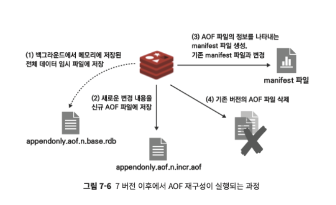
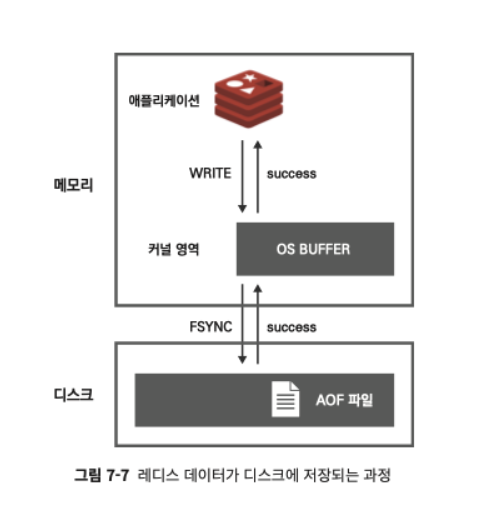

레디스는 RDB 와 AOF 두 가지의 백업 방식을 지원한다

- AOF (Append Only File)
  - 레디스 인스턴스가 처리한 모든 쓰기 작업을 차례대로 기록
  - 복원 시에는 파일을 다시 읽어가며 데이터 세트 재구성
- RDB (Redis DataBase)
  - 일정 시점에 메모리에 저장된 데이터 전체를 저장
  - snapshot 방식

 

실제로 RDB 파일은 바이너리 형태로 저장되어 우리가 읽고 해석할 수 없는 형태이며 AOF 파일은 레디스 프로토콜 (RESP) 형태로 저장된다

 
 

## 그렇다면 어떤 백업 방법을 사용하는 것이 좋을까?

각 방식은 모두 장단점을 갖고 있다.

RDB 파일의 경우, 시점 단위로 여러 백업본을 저장할 수 있고 AOF 파일보다 복원이 빠르다는 장점이 있지만 특정 시점으로의 복구는 불가능하다

AOF 는 RDB 파일보다 크기가 크고 주기적으로 압축해 재작성해야 하지만, 원하는 시점으로 복수할 수 있다는 장점이 있다

하나의 인스턴스에서 RDB 와 AOF 옵션을 동시에 사용하는 것도 가능하며, 일반적인 RDB 만큼의 데이터 안정성을 원하는 경우 두 가지 백업 방식을 동시에 사용하기를 권장한다고 한다

2 개의 파일 (RDB 와 AOF 파일) 모두 존재할 때에는 AOF 의 데이터를 로드한다

 
 

## RDB 방식의 데이터 백업

- RDB 파일을 생성할 수 있는 방법은 크게 3 가지
  - 설정 파일(redis.conf) 에서 특정 조건에 파일이 자동으로 저장되도록 지정하는 방법
  - 사용자가 원하는 시점에 커맨드를 이용해 수동으로 파일을 생성할 수도 있다
  - 복제 기능을 원한다면 레디스는 자동으로 RDB 파일을 생성한다

 

**수동으로 RDB 파일 생성**

SAVE, BGSAVE 명령을 이용하면 원하는 시점에 직접 RDB 파일을 생성할 수 있다

SAVE 는 동기 방식으로 파일을 저장한다. 메모리 전체를 스캔해 파일이 저장되기까지 1분이 걸린다면 그 1분 동안 레디스 인스턴스에 연결된 다른 클라이언트는 아무런 명령도 수행할 수 없다

따라서 일반적인 운영환경에서는 SAVE 명령을 사용하지 않도록 주의하자

BGSAVE 는 fork 를 호출해 자식 프로세스를 생성하며 생성된 자식 프로세스가 백그라운드에서 RDB 파일을 생성한 뒤 종료한다.
만약 이미 백그라운드로 데이터가 저장되고 있을 때 이 명령을 수행하면 에러를 반환한다

BGSAVE + SCHEDULE 옵션을 활용하면 위와 같은 상황에서는 먼저 OK 를 반환한뒤 기존 백업이 완료되었을 때 수행한다

 

**복제를 사용할 경우 자동으로 RDB 파일 생성**

복제본에서 REPLICAOF 명령을 이용해 복제를 요청하면 마스터 노드에서는 RDB 파일을 새로 생성해 복제본에 전달한다

복제 연결을 처음 시작했을 때뿐만 아니라 이미 복제 연결이 되어 있는 상태에서도 상황에 따라 마스터에서는 언제든지 RDB 파일을 재생성할 수 있다

 
 

## AOF 방식의 데이터 백업

수행한 모든 명령어가 aof 파일로 저장되기 때문에 특정 시점에 백업이 가능하다

설정 파일(redis.conf)에서 appendonly 옵션을 yes 로 지정하면 AOF 파일에 주기적으로 데이터가 저장된다

지정한 경로와 설정한 이름으로 생성된다

AOF 파일에는 실제로 메모리상의 데이터가 변경되는 커맨드만 기록되기 때문에 작업이 기록되지 않을 수 있다

(예시: `DEL non_existing_key` 명령 수행시 존재하지 않는 키를 삭제할 경우 메모리가 수정되는 작업이 아니기 때문에 기록되지 않음)

 

**AOF 파일을 재구성하는 방법**

AOF 파일을 이용한 백업 기능을 안정적으로 사용하려면 점점 커지는 파일을 주기적으로 압축시키는 재구성(rewrite) 작업이 필요하다

RDB 에서와 마찬가지로 특정조건에 자동으로 재구성되도록 설정할 수도 있으며, 사용자가 원하는 시점에 명령을 이용해 재구성시킬 수 있다

RDB 파일을 저장할 때와 마찬가지로 AOF 파일을 재구성할 때에도 fork 를 이용해 자식 프로세스를 생성하며, 이 자식 프로세스가 AOF 파일을 재구성해 저장한다

버전 7 이전까지는 AOF 파일의 재구성시 데이터가 변경된 동일한 로그가 AOF 파일과 인메모리 버퍼에 이중으로 저장되었다

이후 버전에서는 현재 레디스가 바라보고 있는 파일이 어떤 것인지 나타내는 매니페스트 파일을 추가적으로 도입했으며 해당 파일은 RDB 와 AOF 파일이 어떤 것인지 알려주는 역할을 한다

그러므로 AOF 재구성시 fork 와 함께 임시 파일을 만들어 해당 파일에 이전 값을 기록 및 새로운 변경 내용을 신규 AOF 파일에 저장한다

이후 AOF 재구성 과정이 끝나면 임시 매니페스트 파일을 생성한 뒤, 변경된 버전으로 매니페스트 파일 내용을 업데이트한다

 
 

## 왜 RDB 방식보다 명령어 단위로 로그를 저장하는 AOF 방식이 더 안전하다고 할까?

우선 운영체제에서 시스템 콜을 이용해 데이터를 파일에 저장하는 방법을 알아보자

운영체제에서 애플리케이션이 파일에 데이터를 저장하고자 할 때, 곧바로 디스크에 데이터가 저장되진 않는다

WRITE 라는 시스템 콜을 이용해 애플리케이션에서 파일에 데이터를 저장하겠다 하면 데이터는 커널 영역의 OS 버퍼에 임시로 저장한다

운영체제가 판단하기에 커널이 여유 있거나, 최대 지연 시간인 30초에 도달하면 커널 버퍼의 데이터를 실제로 디스크에 내려 쓴다

FSYNC 는 커널의 OS 버퍼에 저장된 내용을 실제로 디스크에 내리도록 강제하는 시스템 콜이다.

OS에 부하가 있더라도 FSYNC 가 호출되면 데이터는 무조건 디스크에 플러시된다

레디스에서 AOF 파일을 저장할 때 APPENDFSYNC 옵션을 이용하면 FSYNC 호출을 제어할 수 있으며 즉 파일 저장의 내구성을 제어할 수 있다.

다음과 같이 세가지 옵션이 있다

- APPENDFSYNC no : AOF 데이터를 저장할 때 WRITE 시스템 콜을 호출한다. 데이터는 커널 영역에 데이터가 잘 저장되는지만 확인하기 때문에 쓰기 성능이 가장 빠르다.
- APPENDFSYNC always : AOF 데이터를 저장할 때 항상 WRITE 와 FSYNC 시스템 콜을 함께 호출한다. 즉 매번 쓰고자 하는 데이터가 파일에 정확하게 저장되는 것을 기다리기 때문에 쓰기 성능은 가장 느리다
- APPENDFSYNC everysec : 데이터를 저장할 때 WRITE 시스템 콜을 호출하며, 1초에 한 번씩 FSYNC 시스템 콜을 호출한다. 성능은 no 옵션을 사용할 때와 거의 비슷하다

일반적인 경우 everysec 옵션을 사용하는 것을 권장한다고 한다

 
 

## 백업을 사용할 때 주의할 점

RDB 와 AOF 파일을 사용하는 경우 인스턴스의 maxmemory 값은 실제 서버 메모리 보다 여유를 갖고 설정하는 것이 좋다

BGSAVE 명령으로 RDB 파일을 저장하거나 AOF 재구성을 진행할 때 레디스는 fork() 를 이용해 자식 프로세스를 생성한다

생성된 자식 프로세스는 레디스의 메모리를 그대로 파일에 저장해야 하며, 기존의 부모 프로세스는 다른 메모리의 데이터를 이용해 다른 클라이언트의 연결을 처리해야 한다

이때 레디스는 Copy-On-Write (COW) 방식을 이용해 메모리상의 데이터를 하나 더 복사하는 방법을 이용해 백업을 진행하면서도 클라이언트의 요청 사항을 받아 메모리의 데이터를 읽고 수정하는 작업을 진행할 수 있다

하지만 위에서 처럼 물리적 메모리에 있는 실제 메모리 페이지가 그대로 복제되기 때문에 최악의 경우 레디스는 기존 메모리 용량의 2배를 사용하게 될 수도 있다.

레디스의 maxmemory 값을 너무 크게 설정한 경우, 레디스의 copy-on-write 동작으로 인해 OS 메모리가 가득 차는 상황이 발생할 수 있으며 이로 인해 OOM 문제로 서버가 다운될 수 있다
