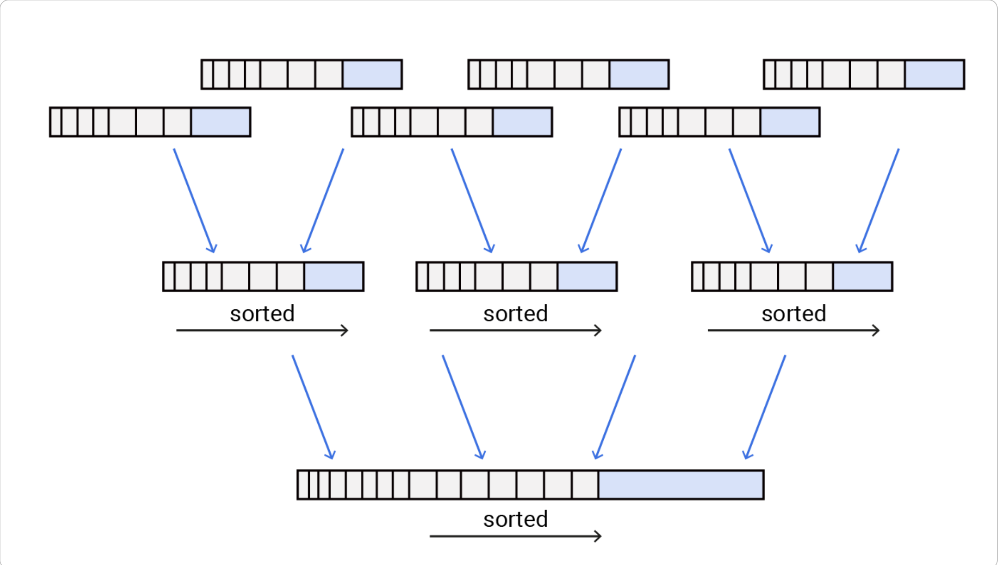
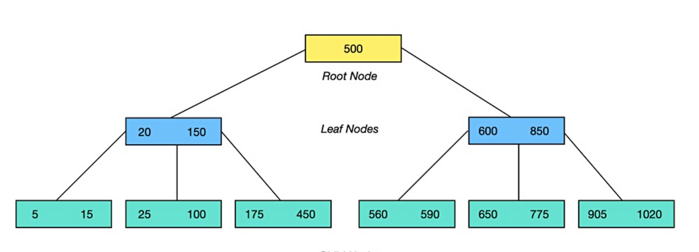

## 로그

- 로그는 일반적인 애플리케이션 로그가 아닌 연속된 추가 전용(`append-only`) 레코드를 의미한다
  - 추가만 가능한 데이터 기록 방식
  - 사람이 읽을 수 없는 바이너리 형태
- 즉 기존 데이터를 수정하지 않고, 항상 파일 끝에 새로운 레코드를 추가하는 형태이다

```text
key1=value1
key2=value2
key1=value3 // 항상 최신값을 사용
```

- 쓰기는 단순하다, 항상 끝에 추가되므로 빠르다
- 읽기는 처음부터 끝까지 스캔 O(n) 하므로 데이터가 늘어날수록 오래걸린다

</br>

### 그럼에도 로그를 사용하는 이유 (장점)

- `append-only` 는 디스크에 순차 쓰기라서 빠르다
  - 특히 HDD 에서
- 파일이 불변인 구간이 생기면 동시성 제어가 쉬워지고 고장 복구도 쉬워진다
  - 덮어쓰기 등의 걱정이 줆어든다
  - 장애 발생시 뒤에서부터 순차적으로 읽으므로 복구가 쉬움

**단점**

- 그러나 같은 key 가 여러번 쌓일 수 있다
  - 계속 추가하는 방식이므로
- 파일이 계속 커지게 되는 구조이다
- 읽을 때의 성능이 안좋음
  - 최신값을 찾기 위해 여러 위치를 확인해야 함

</br>

### 로그 기반에서 조회 성능을 빠르게 하려면 → 인덱스가 필요하다

- 로그는 쓰기에는 좋지만 검색이 느려서 결국 인덱스가 필요해진다
- 인덱스는 기본 데이터에서 파생된 부가 데이터를 가지는 구조 (메타데이터)
- 읽기는 빨라지지만 쓰기 때마다 해당 인덱스를 갱신해야하는 쓰기 오버헤드가 발생한다
- **그래서 인덱스 선택은 항상 트레이드 오프이며 보통 자동으로 모든 색인을 하지 않는다**
  - 애플리케이션 개발자나 데이터베이스 관리자가 애플리케이션의 전형적인 질의 패턴에 대한 지식을 활용하여 수동으로 색인을 선택

</br>

## 로그 + 해시 인덱스

- Bitcask 스타일
- 핵심 방식은 로그 파일에 계속 append only 하되 키를 바이트 오프셋 (byte offset) 으로 인메모리 해시맵 구조로 들고있는 방식
  - 쓰기: 로그 append + 해시 맵 갱신
  - 읽기: 해시맵에서 offset 을 먼저 찾고 그 위치로 한 번에 점프해서 읽기
- 단건 키를 통한 조회에는 엄청 강하다
- 그러나 단점은
  - 키가 많아지면 해시맵을 메모리에 다 올릴 수 없다
  - range query 즉 범위 질의에 약하다
  - 세그먼트(segment)가 늘어나면 여러 해시맵을 뒤져야 한다
    - 세그먼트 (segment) : 하나의 큰 로그 (append-only 데이터 파일)을 크기 단위로 잘라 놓은 조각 파일
  - 계속 append 하게되면 디스크가 버티지 못함 → 결국 세그먼트를 컴팩션하고 병합하는 과정이 필수요소

**삭제**

- 삭제하는 과정도 덮어쓰기 없이 append 방식을 수행한다
- tombstone 을 append 하고 병합 과정에서 이 값을 무시한다
  - Tombstone(툼스톤): 이 키는 삭제되었다는 사실을 나타내는 특수한 레코드
  - 값을 지우는게 아닌 삭제 이벤트 자체를 append 하는 방식 → 삭제 마커같은 개념
  - 실제 값이 있는 레코드보다 tombstone 레코드가 더 최신이라면 → 삭제된 것으로 판단

</br>

### 컴팩션 (Compaction) 과 병합

- 컴팩션 : 로그를 정리해서 오래된 값, 중복된 값은 버리고 각 키의 최신 값만 남기는 작업
- 더욱이 컴팩션은 보통 세그먼트를 더 작게 만들기 때문에 컴팩션을 수행할 때 동시에 여러 세그먼트들을 병합할 수 있다



- 하지만 이 과정은 비용이 크며 백그라운드 스레드가 별도의 작업을 필요로 한다

**로그 구조의 읽기 취약점**

- 데이터는 시간 순서대로만 쌓이며 key 기준으로 정렬되어 있지 않는다
- 특정 범위 조회 (range query) 에 취약하다
  - 매우 비효율적으로 동작
- 그러므로 다른 접근 방식이 필요해졌다

</br>

## SSTable → LSM 트리

- 해시 인덱스가 range query 에 약하고 메모리 의존이 크므로 다른 방안을 고려해야했다
- 결국 디스크 파일 자체를 키 기준으로 먼저 정렬하는 방식을 고안했다
- 그것이 SSTable (정렬된 문자열 테이블, Sorted String Table) 이며 SSTable 을 기반으로 한 구조가 LSM 트리 (로그 구조화 병합 트리, Log-Structured Merge-Tree)

**핵심 이점**

- 세그먼트들이 정렬되어 있으므로 병합이 merge sort 알고리즘처럼 효율적으로 동작한다
- 모든 키를 메모리에 다 들고 있을 필요 없이 경계값 정도의 sparse index 만 존재하면 된다
- 블록 단위 압축도 적용하여 I/O를 줄일 수 있다
- 동작
  - 먼저 입력 파일을 함께 읽고 각 파일의 첫 번째 키를 본다 그리고 가장 낮은 키를 출력 파일로 복사 → 이 과정을 반복
  - 다중 세그먼트가 동일한 키를 포함하는 경우 가장 최근 세그먼트의 값은 유지하고 오래된 세그먼트의 값은 버린다
  - 경계값 키의 오프셋만을 가지고 정렬이 되어있으므로 어디 구간을 봐야할지 알 수 있다
  - 읽기 요청은 요청 범위 내에서 여러 키-값 쌍을 스캔해야 하므로 해당 레코드들을 블록으로 그룹화, 디스크에 쓰기전에 압축 → 경계값 인메모리 색인의 각 항목은 압축된 블록의 시작점을 가리키게 된다

**LSM 트리 구현 흐름**

- 쓰기가 발생하면 인메모리 균현 트리(balanced tree) 데이터 구조에 추가한다, 인메모리 트리는 멤테이블(memtable)이라고도 불린다
- memtable 이 임계값보다 커지면 SSTable 로 디스크에 기록 (flush)
- 읽기 요청시 먼저 memtable → 최신 SSTable → 더 오래된 SSTable 순으로 조회하게 된다
- 백그라운드 스레드가 compaction&merge 를 계속 돌린다
- 장애 대비 : memtable 은 날아갈 수 있으므로 복구용 append-only 로그를 따로 둔다
  - 해당 로그 파일은 정렬될 필요가 없음 → 복구 전용

중요한 건

- LSM 도 결국 로그 구조의 철학 (append-only + 나중에 정리)을 유지하며 파일을 정렬된 형태(SSTable) 로 만들어서 범위 질의와 압축 효율을 끌어올림

**LSM 성능 최적화 포인트**

- 없는 키 조회가 느릴 수 있으므로 → 끝까지 조회해야 함
  - Bloom filter 를 통해 없음을 빠르게 판별함 → 디스크 읽기를 줄임
- compaction 정책
  - size-tiered vs leveled compaction

</br>

## 페이지 지향 (page-oriented) 저장소가 나온 이유 → B 트리

- B-트리의 출발점은 정렬된 키-값을 유지하는 점에서 SSTable 과 비슷하지만 동작 방식이 달랐다

**B-트리의 핵심: 페이지**

- 디스크를 고정 크기 페이지 (예: 4KB)로 나눔
- 읽기/쓰기는 페이지 단위로 동작한다
- 페이지는 주소로 식별되며 페이지가 다른 페이지를 참조 한다
- 루트 → 내부 노드 → 리프 페이지로 내려가서 조회하는 구조이다
- 분기 계수 (branching factor) 가 커서 트리 깊이가 얕다



**업데이트/삽입은 제자리 갱신**

- 값 업데이트 시 리프 페이지를 찾아서 페이지 내용을 수정하고 다시 기록
- 값 삽입 시 해당 페이지에 데이터를 넣고 공간이 없다면 정렬 기준으로 **페이지 분할(split) → 상위 갱신**
- LSM 트리와 다른 점은 LSM 은 새 파일을 만들고 나중에 compact&merge 하지만 B-트리는 정해진 페이지를 먼저 찾아간 뒤 그 페이지를 수정

</br>

### 신뢰되는 B-트리 → WAL (Write-Ahead Log)

- B-트리는 기본적으로 페이지를 덮어쓴다 (update-in-place)
- 그렇다면 DB 가 장애가 발생한 경우
  - 페이지 여러개를 갱신할 때 일부 페이지만 디스크에 기록될 경우가 존재 → 트리 훼손
- 그래서 B-트리는 신뢰할 수 있는 구조를 만들기 위해 **WAL** 구조를 도입했다

**WAL 의 역할**

- B-트리 변경 사항을 기록하는 append-only 로그 파일
- 장애 발생 이후 복구 시 WAL 을 기반으로 일관성 있게 트리를 복원한다
- 다른 말로는 **redo log** 라고도 불린다
- 즉 안정성을 위해 로그(WAL)을 붙여서 사용한다

</br>

### B-트리 최적화 포인트

**WAL 대신 Copy-on-Write**

- 페이지를 제자리 갱신하지 않고, 변경된 페이지를 새로운 위치에 추가
- 상위 페이지도 새로운 버전으로 만들어서 새 위치를 가리키는 방식
- 동시성 제어에 유리하다

**키 축약**

- 페이지에 전체 키를 다 저장하지 않고 축약하여 저장
- 한 페이지에 더 많은 엔트리를 담을 수 있음

**리프 페이지를 연속 배치하려고 처리**

- 특히 range query 성능에 중요하다 다만 트리가 커지면 유지가 쉽지 않다

**형제 페이지 포인터**

- range scan/순차 접근 최적화에 도움 → B+Tree

</br>

## B-트리 vs LSM 트리 비교

**읽기/쓰기 성향**

- LSM : 쓰기 처리량이 높다 (순차 쓰기 + 배치 병합)
- B-트리 : 읽기 성능이 예측 가능하고 빠른 편에 속한다

**쓰기 증폭**

- B-트리
  - WAL에 한 번, 페이지에 한 번 (상황에 따라 split 시 한번 더)
  - 페이지 일부만 바뀌어도 페이지 전체를 다시 기록하는 오버헤드 발생
- LSM
  - compaction/merge 로 여러 번 다시 쓰는 구조라서 쓰기 증폭이 발생할 수 있음
  - 하지만 순차 쓰기를 잘 활용하고 특정 조건에선 B-트리 보다 효율적일 수 있음

**LSM의 단점**

- compaction 이 읽기/쓰기 지연에 영향을 준다
- 평균 처리량은 좋더라도 P95, P99 가 튈 수 있다
- compaction 이 유입 속도를 못 따라가면 문제가 발생한다 → 모니터링 필요
- 여러 세그먼트에 같은 키의 복사본이 존재할 수 있으므로 강한 트랜잭션이 필요한 경우 B-트리가 더 매력적일 수 있다

**B-트리의 강점**

- 오랫동안 테스트를 거쳐서 검증됨
- 성능이 비교적 예측 가능함
- 범위 질의에 강하며 트랜잭션/동시성 모델에 안정적인 데이터 일관성을 보여줌
