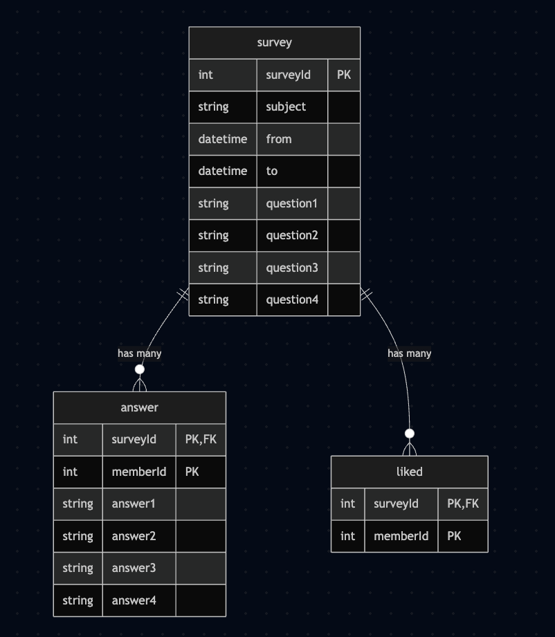
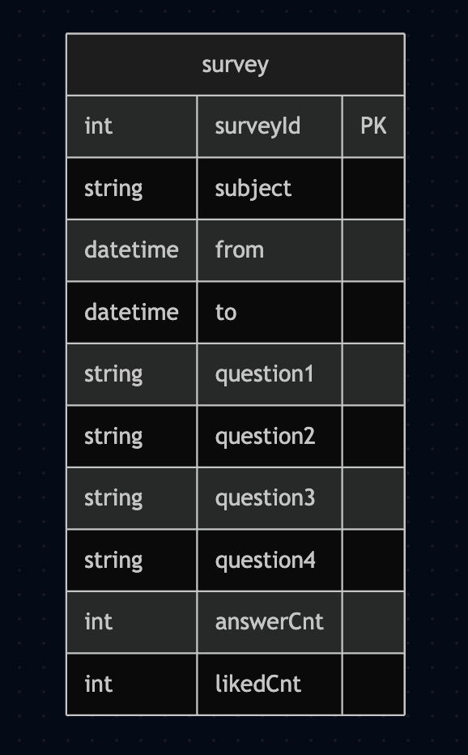

예시 ERD [설문 목록 조회]



설문 목록을 표시할 때 설문에 답변한 회원 수와 좋아요를 한 회원수를 표시한다는 요건이 있다면 아래 `SELECT` 쿼리와 서브 쿼리를 사용할 수 있다

```sql
SELECT s.id, s.subject,
    (SELECT COUNT(*) FROM answer a WHERE a.surveyId = s.id) as answerCnt,
    (SELECT COUNT(*) FROM liked l WHERE l.surveyId = s.id) as likeCnt
FROM survey s
ORDER BY id DESC
limit 30;
```

이 쿼리는 해당 문제를 해결하지만 성능에는 문제가 발생할 수 있다

(30개의 설문이 있을때, 설문마다 평균 답변자 수가 10만 명, 좋아요를 한 회원 수가 1만 명이라고 가정)

- 목록 조회 1번
- 답변자 수를 세는 쿼리 30번
  - `SELECT` 쿼리가 30개의 설문 데이터를 조회하므로 각 설문마다 답변자 수를 구하기 위한 서브 쿼리가 30번 실행된다
  - 각 쿼리는 10만 개를 센다
- 좋아요 수를 세는 쿼리 30번
  - 각 설문마다 좋아요를 한 회원 수를 구하기 위한 서브쿼리가 30번 실행된다
  - 각 쿼리는 1만개를 센다

합치면 61번의 쿼리가 실행된다

`COUNT` 나 `SUM` 같은 집계 쿼리를 조회 시점에 실행하면서 발생하는 성능 문제를 제거하는 방법은 간단하다

집계 데이터를 미리 계산해서 별도 컬럼에 저장하면 된다.



위와 같이 답변자 수와 좋아요 수를 보관할 컬럼을 추가한 뒤 설문에 답변할 때나 좋아요를 누를 때마다 해당 컬럼 값을 증가시키는 방법으로 미리 집계할 수 있다

> 비정규화해도 괜찮을까?
>
> 정규화의 정의에 따르면 `survey` 테이블에 `answerCnt` 컬럼을 추가하는 것은 데이터를 중복 저장하는 것 이다.
> `answer` 테이블로 개수를 구할 수 있기 때문이다. 또한 `answerCnt` 컬럼이 가지는 값과 `answer` 테이블의 개수가 불일치하는, 무결성이 깨지는 문제가 발생할 수도 있다
>
> 하지만 실무에서는 약간의 불일치를 감수하더라도 실시간 집계용 컬럼을 추가하는 것이 맞다고 생각한다.
> 실제로 특정 설문에 대한 `answer` 테이블의 데이터 개수가 10,150개 인데 `answerCnt` 컬럼의 값이 10,149개 라고 해도 심각한 문제는 아니다. 목록을 보는 회원에게는 중요한 문제가 아니기 때문이다
>
> 게다가 정확한 값은 언제든지 구할 수 있다. 관리툴에서 최종 보고서를 생성할 때는 `answerCnt`, `likedCnt` 컬럼을 사용하는 대신 `answer` 테이블과 `liked` 테이블을 사용해서 실제 개수를 구하면 된다

</br>

> 동시성 문제는 없는건가?
>
> 원자적으로 증가/감소 연산을 처리하지 않으면 `answerCnt` 값이 어떻게 될지 예측할 수 없다.
> 트랜잭션 격리 수준에 따라 그리고 사용하는 DBMS 에 따라 이 쿼리는 원자적으로 실행되기도 하고 그렇지 않기도 하다.
> 따라서 증가/감소 쿼리를 사용할 때는 DBMS 가 지정한 트랜잭션 격리 수준에서 원자적으로 처리하는 지를 검증해야 한다
