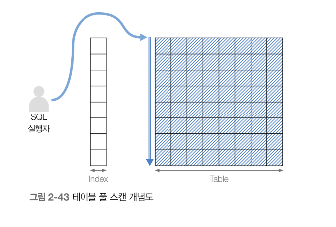
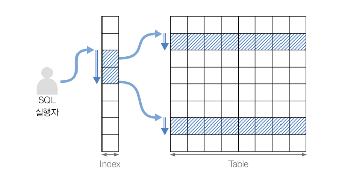
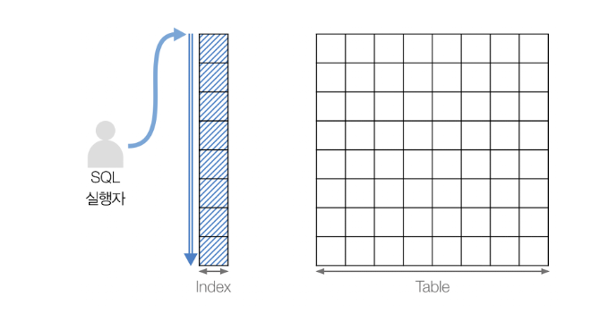
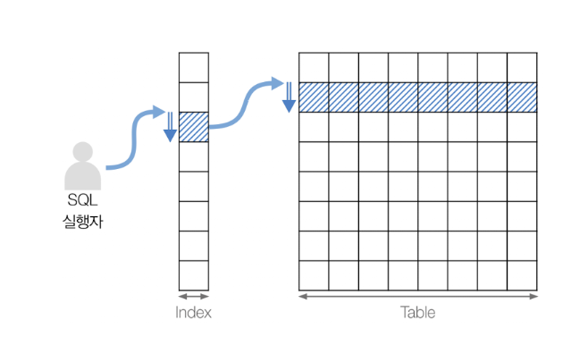
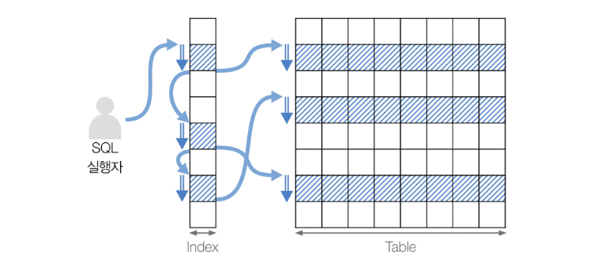
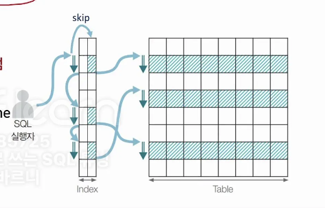
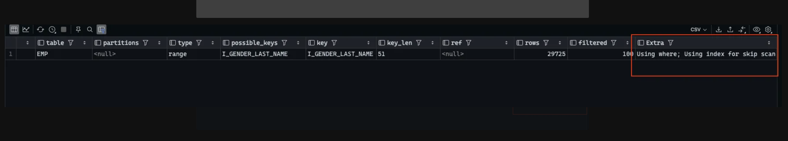

# 오브젝트 스캔

- 원하는 데이터를 찾기위한 스캔(접근) 유형
- 그런 유형에는 무엇이 있을까?

</br>

**오브젝트 스캔 유형**

1. 테이블 스캔
2. 인덱스 스캔

</br>

**테이블 스캔**

- Table Full Scan (테이블 전체 스캔)

</br>

**인덱스 스캔**

- Index Range Scan (인덱스 범위 스캔)
- Index Full Scan (인덱스 전체 접근)
- Index Unique Scan (인덱스 고유 접근)
- Index Loose Scan (인덱스의 느슨한 접근)
- Index Merge Scan (인덱스 병합 접근)

</br>
</br>

---

</br>

## 테이블 스캔

**Table Full Scan**



- **인덱스를 거치치 않고** 테이블로 접근하여, 처음부터 끝까지 데이터를 접근하는 방식
- 테이블의 처음 ~ 끝까지 모두 접근
- **Sequential Scan**

</br>

```sql
SELECT *
  FROM emp
WHERE gender IS NOT NULL
```

- WHERE 조건절에 사용할 수 있는 인덱스가 없거나
- 데이터 대비 많은 범위, 많은 양의 데이터를 읽어야 할때
- 인덱스가 오히려 비효율적이다 라고 판단될때 옵티마이저에 의해서 실행하게 된다
- 성능 측면에서는 부정적으로 해석되긴 하나 대용량 데이터를 무조건 읽어야 하는 상황인 경우 긍정적이다
- `IS NOT NULL` 조건은 인덱스를 탈 수 없는 조건이다
  - 동등 조건이나 범위 조건의 경우에 인덱스를 탈 수 있다
  - 인덱스는 "많은 데이터 중 소수의 값만 필터링할 때" 가장 효과적이다
  - `IS NOT NULL` 은 대부분의 경우, **대부분의 레코드를 조회합니다**
    → 즉, **선택도가 낮다(많이 걸린다) → 인덱스를 타더라도 **성능이 별로이다\*\*

</br>

> 참고
>
> 그럼 `IS NULL` 과 `IS NOT NULL` 은 인덱스 사용 여부가 어떻게 되는 것 인가
>
> | 조건          | 인덱스 사용 가능성 | 이유                                                                                 |
> | ------------- | ------------------ | ------------------------------------------------------------------------------------ |
> | `IS NULL`     | 높음               | **NULL만 찾으면 됨** (선택도 높음)                                                   |
> | `IS NOT NULL` | 낮음               | **NULL을 제외한 거의 모든 값** → **인덱스를 전부 순회해야 함** → **풀스캔과 유사함** |
>
> 즉 `IS NOT NULL` 조건은 인덱스를 전부 순회해야 할 수도 있다
> 옵티마이저가 **차라리 테이블 풀 스캔 하는게 낫겠다** 고 판단하는 경우가 많다

</br>
</br>

---

</br>

## 인덱스 스캔

**Index Range Scan**



- **인덱스를 특정한 범위까지 스캔**한 뒤, 스캔 결과를 토대로 테이블의 데이터를 접근하는 방식
- `BETWEEN ~ AND`, `<`, `>`, `<=`, `>=`, `LIKE`

</br>

```sql
SELECT *
  FROM emp
WHERE emp_id BETWEEN 20000 AND 30000
```

- 인덱스는 정렬이 되어있으므로 특정 범위만 조회하게 된다

</br>

**Index Full Scan**



</br>

- **인덱스만 처음부터 끝까지** 스캔하는 방식
- 테이블은 접근하지 않음
- 인덱스 구성 컬럼만 요구하는 SQL 문

</br>

```sql
SELECT last_name
  FROM emp
WHERE gender <> 'F'
```

- 인덱스로 구성된 컬럼만 조회되는 경우에 굳이 테이블을 조회하지 않아도 되므로 인덱스 풀 스캔 처리
- 인덱스의 크기는 테이블 보다 상대적으로 적고 테이블 풀 스캔 보다 상대적으로 성능에 유리하다
- 그러나 검색범위를 줄일 수 있는지 고민이 필요하다

</br>

**Index Unique Scan**



</br>

- **기본 키(PK) 나 유니크 인덱스**를 통해 테이블을 스캔하는 방식
- WHERE 절에 `= 조건` 인 경우
- 조인 컬럼 또는 조건절의 컬럼이 PK 또는 Unique Index 의 선두 컬럼으로 사용되는 경우

</br>

```sql
SELECT *
  FROM emp
WHERE emp_id = 20000
```

</br>

**Index Loose Scan**



</br>

- **인덱스의 필요한 부분만 골라**스캔하는 방식
- WHERE 절 조건문 기준으로 필요한 부분과 그렇지 않은 부분을 구분하여 선택적으로 스캔
- `GROUP BY`, `MAX`, `MIN`

</br>

```sql
SELECT *
  FROM emp
WHERE gender = 'F'
GROUP BY gender
```

</br>

**Index Skip Scan**

Index Loose Scan 과 매우 비슷하다



</br>

- **조건절에 인덱스에 선두 컬럼이 없어도 선두컬럼을 뛰어넘어** 스캔을 수행하는 방식
- (예시) 인덱스 구성 컬럼 : (gender + last_name)
- → WHERE 절에 last_name 조건문 작성

</br>

```sql
SELECT MAX(emp_id) max_emp_id
  FROM emp
WHERE last_name = 'Peha'
```

- 예를 들어 복합키로 인덱스를 구성한 경우 선두 컬럼을 사용하지 않을 것 같지만 last_name 을 통해 조건 조회를 하므로 인덱스를 탄다



</br>

**Index Merge Scan**

인덱스 두 컬럼을 모두 조건에 포함되어 두 인덱스 테이블을 결합하여 처리한다


- 생성된 2개의 인덱스를 통합한 후, 테이블을 스캔하는 방식
- WHERE 절 조건문에 서로 다른 인덱스를 구성하는 컬럼들로 구성되어 있는 경우
- 인덱스의 결합(union) 또는 교차(intersection)

</br>

```sql
SELECT emp_id, last_name, first_name
  FROM emp
WHERE (hire_date BETWEEN '1980-01-01' AND '1989-06-30')
  OR emp_id > 600000
```

- `hire_date` 는 인덱스로 구성된 컬럼
- `emp_id` 는 emp 테이블의 PK
