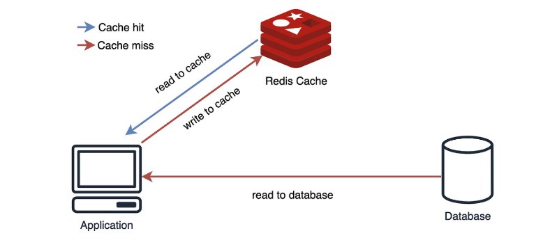
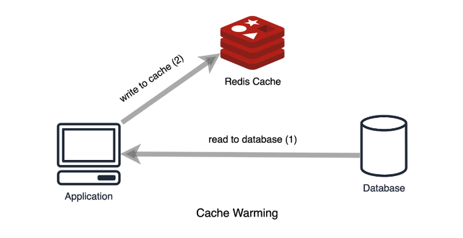
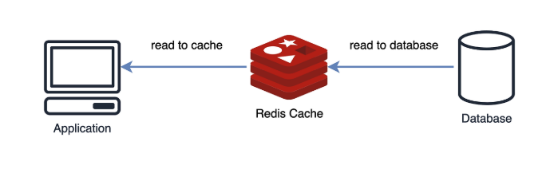
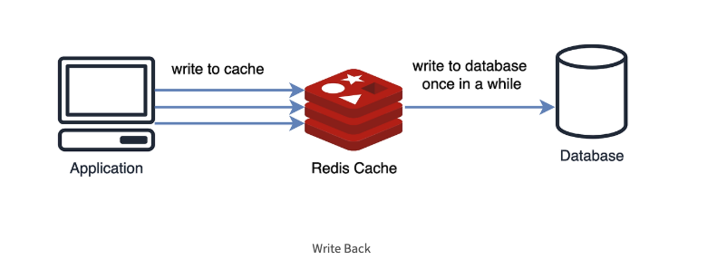
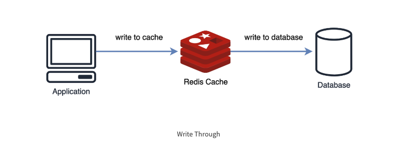
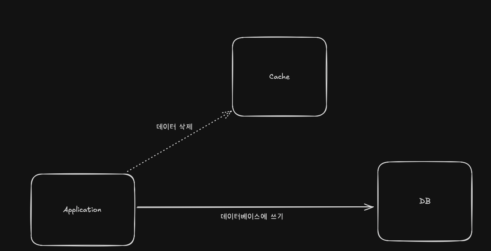
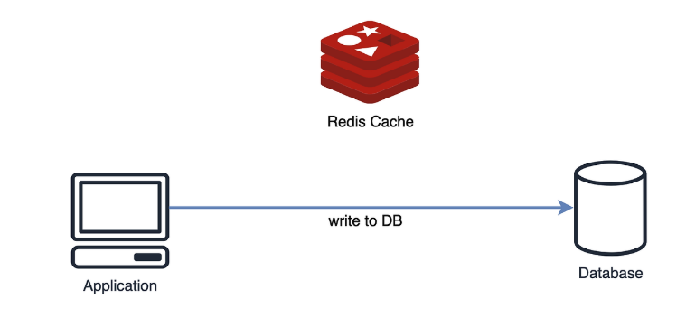

캐시를 사용하게 되면 **데이터 정합성** 의 문제가 발생하게 된다

따라서 적절한 **캐시 읽기 전략(Read Cache Strategy)** 과 **캐시 쓰기 전략(Write Cache Strategy)** 을 통해, 캐시와 DB 간의 데이터 불일치 문제를 극복하면서 빠른 성능을 잃지 않도록 고려할 필요가 있다

---

</br>

# 캐시 읽기 전략 (Read Cache Strategy)

</br>

### Look Aside 패턴

- Cache Aside 패턴이라고도 불림
- 데이터를 찾을 때 우선 캐시에 저장된 데이터가 있는지 우선적으로 확인하는 전략
  - 만약 캐시에 데이터가 없으면 DB에서 조회
- **반복적인 읽기가 많은 호출에 적합**
- 캐시와 DB가 분리되어 가용되기 때문에 **원하는 데이터만 별도로 구성하여 캐시에 저장**
- 캐시와 DB가 분리되어 가용되므로 **캐시 장애 대비 구성**이 이미 구축되어있다
  - 만일 redis 가 다운 되더라도 DB 에서 데이터를 가져올 수 있으므로 서비스 자체는 문제가 없음
- 대신에 캐시에 붙어있던 connection 이 많았다면 redis 가 **다운된 순간 갑자기 DB에 부하가 몰려올 수 있음**
- 찾고자 하는 데이터가 캐시에 없을 때에만 캐시에 데이터가 저장되기 때문에 이와 같은 구조를 lazy loading 이라고도 부른다
  - 캐시로부터 데이터가 없다는 응답을 받은 애플리케이션은 직접 데이터베이스에 접근해 찾고자 하는 데이터를 가져온다
  - 그 뒤 애플리케이션은 이를 다시 캐시에 저장하는 과정을 거친다

```kotlin
fun getUser(id: Long): User {
  var user = cache.get(id)
  if (user == null) {
    user = db.get(id)
    setCache(user)
  }
  return user
}
```

</br>



- 만약 redis 가 다운되거나 DB에만 새로운 데이터가 있다면 Cache Miss 로 인해 많은 connection이 DB에 접근하게 되는 문제 발생 → DB에 많은 부하가 생김
- 이런 경우 DB에서 캐시로 데이터를 미리 넣어주는 작업을 하기도 하는데 이를 `Cache Warming` 이라고 한다

> Cache Warming
>
> 미리 Cache 로 DB의 데이터를 밀어 넣어두는 작업
> 이 작업을 수행하지 않으면 서비스 초기에 트래픽 급증시 대량의 cache miss 가 발생하여 데이터베이스 부하가 급증할 수 있다 (`Thundering Herd`)
>
> 다만, 캐시 자체는 용량이 작아 무한정으로 데이터를 들고 있을 수는 없어 일정시간이 지나면 expire 되는데,
> 그러면 다시 Thundering Herd 가 발생될 수 있기 때문에 캐시의 TTL을 잘 조정할 필요가 있다



- 이 방식은 캐시에 장애가 발생하더라도 DB에 요청을 전달함으로써 캐시 장애로 인한 서비스 문제는 대비할 수 있다
- 그러나, Cache Store 와 Data Store(DB)간 정합성 유지 문제가 발생할 수 있으며, 초기 조회시 무조건 Data Store를 호출해야 한다
- 그러므로 **단건 호출 빈도가 높은 서비스에 적합하지 않다** 대신 **반복적으로 동일 쿼리를 수행하는 서비스에 적합**한 아키텍처이다

즉, 유저 ID 를 통해 조회하는 건 조건이 통일되지 않으므로 적합하지 않는다, 대신 반복적인 동일 쿼리를 수행하는 조건 및 서비스에 적합하다

</br>
</br>

### Read Through 패턴

- 캐시에서만 데이터를 읽어오는 전략 (inline cache)
- Look Aside 와 비슷하지만 **데이터 동기화를 라이브러리 또는 캐시 제공자에게 위임**하는 방식이라는 차이가 있음
- 따라서 데이터를 조회하는데 있어 **전체적으로 속도가 느림**
- 또한 데이터 조회를 전적으로 캐시에만 의지함, redis가 다운될 경우 **서비스 이용**에 문제가 생길 수 있음
- 대신에 캐시와 DB간의 **데이터 동기화**가 항상 이루어져 데이터 정합성 문제에서 벗어날 수 있음

즉, Cache miss 가 발생한다면 캐시는 DB에서 데이터를 검색하고 캐시에 자체 업데이트한 뒤 앱에 데이터를 보내준다.



</br>

```plaintext
Client → Cache (Miss)
             ↓
         DB에서 조회
             ↓
        Cache에 저장
             ↓
         응답 반환
```

</br>

```kotlin
@Service
class ProductService(
    private val productRepository: ProductRepository
) {

    @Cacheable(value = ["product"], key = "#id", unless = "#result == null")
    fun getProductById(id: Long): Product? {
        log.info("== Product 조회 id : {} ==", id)
        return productRepository.findById(id)
    }
}
```

- `@Cacheable` 어노테이션으로 처리
- Redis 캐시에 먼저 조회
- 없다면 `productRepository.findById()` 실행
- 결과를 캐시에 저장 (자동)
- 다음 호출부턴 Redis 에서 응답

Read Through 방식은 Cache Aside 방식과 비슷하지만, **Cache Store에 저장하는 행위를 하는 주체가 Application 이냐 또는 Data Store(DB) 자체** 이냐에서 차이점이 있다

이 방식은 직접적인 데이터베이스 접근을 최소화하고 Read에 대한 소모되는 자원을 최소화할 수 있다

하지만 캐시에 문제가 발생하였을 경우 이는 바로 서비스 전체 중단으로 빠질 수 있다. 그렇기 때문에 Redis 와 같은 구성 요소를 **Replication 또는 Cluster**로 구성하여 가용성을 높여야 한다

> 이 방식 또한 서비스 운영 초반에 cahce warming을 수행하는 것이 좋다

</br>

---

</br>

# 캐시 쓰기 전략 (Write Cache Strategy)

</br>

### Write Back 패턴

- Write Behind 패턴 이라고도 불림
- **캐시와 DB 동기화를 비동기로 하기 때문에 동기화 과정이 생략**
- 데이터를 저장할 때 DB에 바로 쿼리하지 않고, 캐시에 모아서 일정 주기 배치 작업을 통해 DB에 반영
- 캐시에 모아놨다가 DB에 쓰기 때문에 **쓰기 쿼리 회수 비용과 부하를 줄일 수 있음**
- **Write가 빈번하면서 Read를 하는데 많은 양의 Resource가 소모되는 서비스에 적합**
  - 쓰기가 빈번하게 발생하는 서비스라면 고려해볼만 하다 → 데이터베이스에 대량의 쓰기 작업이 발생하면 이는 많은 디스크 I/O를 유발해 성능저하가 발생할 수 있다
  - 저장되는 데이터가 실시간으로 정확한 데이터가 아니어도 되는 경우 유용하다
    - 유튜브같은 스트리밍 사이트의 동영상 좋아요 수
  - 물론 캐시에 문제가 생겨 데이터가 날아갈 경우, 최대 지정한 업데이트 간격 동안의 데이터가 날아갈 수 있다는 위험성이 있음을 감수해야 한다
- **자주 사용되지 않는 불필요한 리소스 저장**
- **캐시에서 오류가 발생하면 데이터를 영구 소실함**

즉, 캐시에 데이터를 모았다가 한 번에 DB에 저장하기 때문에 DB 쓰기 비용을 절약할 수 있지만 데이터를 옭기기 전에 캐시 장애가 발생하면 데이터 유실이 발생할 수 있습니다



```plaintext
1. 클라이언트 → 캐시에 저장 (빠름)
2. 캐시 시스템 → 일정 주기마다 DB에 반영 (비동기)
```

| 항목   | 장점                    | 단점                           |
| ------ | ----------------------- | ------------------------------ |
| 성능   | 쓰기 응답 빠름          | DB와 비동기라 정합성 위험      |
| 트래픽 | DB 부하 분산 가능       | 캐시 손실 시 데이터 유실 가능  |
| 처리량 | Burst(폭주) 처리에 유리 | 장애 복구, 중복 저장 방지 필요 |

> 쓰기 성능 극대화가 필요하고, 약간의 정합성 허용 가능할 때만 사용하기를 권장

```plaintext
Client
  ↓
Write Cache (예: Redis, EhCache, Caffeine)
  ↓          ↘
  (바로 응답)   Async Flush Queue (Kafka, Redis Stream, DelayQueue 등)
                       ↓
                    Batch DB Writer
```

Write Back 방식은 데이터를 저장할 때 DB가 아닌 먼저 캐시에 저장하여 모아놓았다가 특정 시점마다 DB로 쓰기 방식을 통해 캐시가 일종의 Queue 역할을 겸하게 된다

캐시에 데이터를 모았다가 한 번에 DB에 저장하기 때문에 DB 쓰기 횟수 비용과 부하를 줄일 수 있지만, 데이터를 옮기기전에 캐시 장애가 발생하면 데이터 유실이 발생할 수 있다는 단점이 존재한다.

하지만 오히려 반대로 데이터베이스에 장애가 발생하더라도 지속적인 서비스를 제공할 수 있도록 보장하기도 한다

> 이 전략 또한 캐시에 Replication 이나 Cluster 구조를 적용함으로써 Cache 서비스의 가용성을 높이는 것이 좋다
> 캐시 읽기 전략인 Read-Through 와 결합하면 가장 최근에 업데이트된 데이터를 항상 캐시에서 사용할 수 있는 혼합 워크로드에 적합하다

</br>
</br>

### Write Through 패턴

- 데이터베이스와 Cache에 동시에 데이터를 저장하는 전략
- 데이터를 저장할 때 먼저 캐시에 저장한 다음 바로 DB에 저장 (모아놓았다가 나중에 저장이 아닌 바로 저장)
- Read Through 와 마찬가지로 DB 동기화 작업을 캐시에게 위임
- DB와 캐시가 항상 동기화 되어 있어, **캐시의 데이터는 항상 최신 상태로 유지**
- 캐시와 백업 저장소에 업데이트를 같이 하며 **데이터 일관성을 유지**할 수 있어서 안정적
- **데이터 유실이 발생하면 안 되는 상황에 적합**
- **자주 사용되지 않는 불필요한 리소스 저장**
  - 데이터 재사용이 되지 않을 수도 있는 데이터를 무조건 캐시에 저장하므로 리소스 낭비
  - 이를 방지하기 위해 캐시에 expire time을 설정하기도 함
- **매 요청마다 두번의 Write가 발생하게 됨으로써 빈번한 생성, 수정이 발생하는 서비스에서는 성능 이슈 발생**
- 기억장치 속도가 느릴 경우, 데이터를 기록할 때 CPU가 대기하는 시간이 필요하기 때문에 성능이 감소함



```plaintext
1. 사용자 → 쓰기 요청 (예: 상품 수정)
2. 서버:
   - DB에 저장
   - 캐시에 같은 데이터 저장
3. 캐시 → 최신 상태 유지
```

Write Through 패턴은 Cache Store에도 반영하고 Data Store에도 동시에 반영하는 방식

그래서 항상 동기화가 되어 있어 항상 최신정보를 가지고 있다는 장점이 있다

하지만 결국 저장할때마다 2단계 과정을 거치기 때문에 **상대적으로 느리며** 무조건 일단 Cache Store에 저장하기 때문에 캐시에 넣은 데이터를 저장만 하고 사용하지 않을 가능성이 있어 **리소스 낭비** 가능성이 있다

> Write Through 패턴과 Write Back 패턴 둘 다 모두 자주 사용되지 않는 데이터가 저장되어 리소스 낭비가 발생되는 문제점을 안고 있기 때문에, 이를 해결하기 위해 TTL을 꼭 사용하여 사용되지 않는 데이터를 반드시 삭제해야 한다 (expire 명령어)

> Write Though 패턴과 Read Though 패턴을 함께 사용하면 캐시의 최신 데이터 유지와 더불어 정합성 이점을 얻을 수 있다

</br>
</br>

### Cache Invalidation



- 데이터베이스에 값을 업데이트할 때마다 캐시에서는 데이터를 삭제하는 전략
- 저장소에서 특정 데이터를 삭제하는 것이 새로운 데이터를 저장하는 것보다 훨씬 리소스를 적게 사용하기 때문에 `write through` 의 단점을 보안한 방법이라고 볼 수 있다
  - `write through` 단점 : 다시 사용되지 않을 데이터일 수도 있는데 무조건 캐시에도 저장됨 → 불필요한 데이터 저장 / 리소스 낭비

### Write Around 패턴

- Write Through 보다 훨씬 빠름
- 모든 데이터는 DB에 저장 (캐시를 갱신하지 않음)
- Cache miss 가 발생하는 경우에만 DB와 캐시에도 데이터를 저장
- 따라서 **캐시와 DB 내의 데이터가 다를 수 있음 (데이터 불일치)**



즉, 쓰기 요청이 올때는 DB 에만 저장 (캐시 건드리지 않음) 이후 읽기 요청을 하고 캐시 미스가 발생하면 DB에서 읽고 캐시에 저장한다

```plaintext
쓰기 요청 → DB에만 저장 (캐시는 건드리지 않음)
        ↓
읽기 요청 → 캐시 미스 → DB에서 읽고 → 캐시에 저장
```

**왜 이렇게 사용하는가?**

- 목적 → 캐시 오염 방지 + 자주 읽히는 데이터만 캐싱
  - 쓰기 작업은 많지만,
  - 실제로 자주 읽히는 데이터만 캐시에 남기고 싶을때 유리하다

Write Around 패턴은 속도가 빠르지만, cache miss 가 발생하기 전에 데이터베이스에 저장된 데이터가 수정되었을때 사용자가 조회하는 cache와 데이터베이스 간의 불일치가 발생하게 된다

따라서 데이터베이스에 저장된 데이터가 수정, 삭제될 때 마다, Cache 또한 삭제하거나 변경해야 하며 Cache 의 expire 를 짧게 조정하는 식으로 대처하는 방법도 있다

> Write Around 패턴은 주로 Look Aside, Read Through 와 결합해서 사용된다
> 데이터가 한 번 쓰여지고, 덜 자주 읽히거나 읽지 않는 상황에서 좋은 성능을 제공한다

</br>
</br>

참고

- https://inpa.tistory.com/entry/REDIS-%F0%9F%93%9A-%EC%BA%90%EC%8B%9CCache-%EC%84%A4%EA%B3%84-%EC%A0%84%EB%9E%B5-%EC%A7%80%EC%B9%A8-%EC%B4%9D%EC%A0%95%EB%A6%AC
- https://yoongrammer.tistory.com/101
