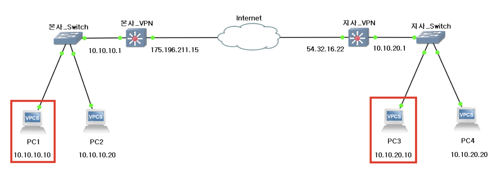

## VPN 과 터널링의 개념이 왜 나왔는가?

- 현실에서는 아래 조건이 네트워크 상에서 만족되어야 한다
- 서울 본사 내부망과 부산 본사 내부망은 각각 사설망(Private) 으로 구성되어 있고 내부 서버(예: DB) 와 내부 PC 가 인터넷에서 직접 접근하면 안된다
  - 공중 인터넷을 그대로 쓰지만 인터넷 위에서 내부망끼리만 통하는 전용 통로처럼 보이게 만드는 방식
  - 실제로 물리 전용회선을 깔아 진짜 전용망을 구축하는 방식
- 전용 회선은 비용과 구축 시간이 매우 크기 때문에 많은 조직이 공중 인터넷 위에서 전용망처럼 보이게 만드는 방식을 선택했고 그 방식의 핵심 기술이 터널링(Tunneling) + 암호화(Encryption)

**터널링**

- 원래의 패킷을 통째로 다른 패킷안에 넣어서 중간 인터넷 구간에서는 Outer 패킷만 보고 라우팅하게 만드는 방식을 의미한다
- 즉 인터넷을 지나가기 위해 필요한 주소(Gateway 공인 IP) 를 겉에 붙이고 실제 사설망 주소(내부 PC <-> 내부 DB) 는 안쪽에 숨기는 방식이 터널링의 핵심 개념

**L3 보안**

- IPSec 은 L3 에서 패킷 단위로 보안을 제공하는 표준
- L3 에서의 보안은
  - 애플리케이션이 HTTP 이든, DB 프로토콜이든 SSH 이든 간에 결국 IP 패킷으로 나가면 IPSec 이 그 IP 패킷에 대해 암호화/무결성/재전송 방지를 적용할 수 있다
  - 그래서 특정 애플리케이션에 TLS 를 억지로 붙이지 않아도 두 네트워크 사이를 오가는 모든 IP 트래픽을 통째로 보호하기에 적합하다

 

### IPSec

- IPSec 은 앱을 바꾸지 않아도 네트워크 구간 전체를 안전하게 만들겠다는 목적에서 가장 많이 선택되는 방식, GtoG (Gateway-to-Gateway) VPN 에서 대표적으로 사용된다

**IPSec 의 구성요소**

- IPSec 에서 데이터 보호를 실제로 수행하는 쪽은 AH 와 ESP 이다
- AH (Authentication Header)
  - 무결성(변조 방지)과 출처 인증을 제공하기 위해 패킷의 특정 부분에 대해 인증값을 붙인다
  - 다만 AH 는 기밀성(암호화)을 제공하지 않으며 NAT 환경과 충돌하기 쉬워서 실무에서는 ESP 가 훨씬 더 많이 사용된다
- ESP (Encapsulation Security Payload)
  - 기밀성(암호화)을 제공하고 설정에 따라 무결성/인증/재전송 방지까지 함께 제공한다

**IKE/ISAKMK**

- AH/ESP 는 암호화/인증을 수행하는 포맷이고 실제 암호화를 수행하려면 정보가 필요하다
  - 어떤 암호 알고리즘을 사용할지
  - 어떤 키로 암호화/복호화를 할지
  - 어떤 키로 무결성 검증을 할지
  - 어떤 트래픽을 VPN 으로 보낼지
- 이 정보를 사람 손으로 매번 맞춰 넣을 수 없다
- 그래서 등장한 것이 IKE (구 ISAKMP/IKE) 이며 IKE 는 두 게이트웨이가 서로 믿을 수 있는 상대인지 확인하고 세션키를 합의, 보안 연결의 규칙(SA)를 만든 다음 주기적으로 키를 교체하는 절차를 제공한다

**SA (Security Association)**

- SA는 이 방향 트래픽을 보호하기 위해 어떤 알고리즘과 어떤 키를 쓸지에 대한 합의된 상태이고 게이트웨이는 이 SA를 기반으로 실제 데이터 패킷에 ESP 를 적용한다

**Transport mode**

- Transport mode 에서 송신자는 원래 IP 헤더(출발지/목적지 IP) 를 그대로 유지한다
- 대신 ESP 가 원래의 페이로드(전송계층 이후 데이터)를 암호화하고 필요하면 무결성 검증 값도 붙인다
- 즉 호스트 <-> 호스트 형태로 양 끝 단말이 직접 IPSec 을 수행할 수 있을때 의미가 있다 → 기업체가 원하는 형태는 사설망 전체 <-> 사설망 전체, 즉 구조적으로 불리함
- 인터넷 중간 구간에서 원래 IP 헤더가 그대로 보이기 때문에 사설 IP 가 그대로 노출되고 라우팅도 성립하지 않는 경우가 많기 때문이다

**Tunnel mode (GtoG 적합)**

- Tunnel mode 는 송신 게이트웨이가 원래 패킷 전체(원래 IP 헤더까지 포함)를 통째로 암호화 영역에 넣는다
- 그리고 바깥에 새로운 IP 헤더 (New IP Header) 를 하나 더 붙인다
- 이때 새 IP 헤더의 출발지/목적지 IP 는 양쪽 VPN 게이트웨이의 공인 IP 가 된다
- 즉 인터넷은 Outer 패킷의 목적지가 상대 게이트웨이인 것을 확인하고 라우팅할 수 있고 인터넷 중간 장비는 내부에서 서울 사설 IP 와 부산 사설 IP 가 들어가있다는 사실을 볼 수 없다 → L3 IP Header 를 또 다른 L3 로 감싼다 (L3 터널링), L3-in-L3 터널링이라고도 불림

**GtoG IPSec VPN (Tunnel mode)**

- PC1 은 초기 패킷을 내보낼때 자신의 Gateway 를 거치며 여기서 정책을 통해 목적지 Gateway 로 보내게 된다
  - 이 정책은 보통 암호화 대상 트래픽 샐렉터를 표한되며 SPD(Security Policy Database) 같은 장비 형태로 관리된다
- 이후 패킷 전체를 암호화 대상으로 잡고 새로운 패킷의 Payload 로 구성한다
- 그 다음 바깥 패킷에 새로운 IP 헤더를 붙이고 목적지와 출발지 IP 를 양쪽 Gateway 공인 IP로 수정한다
  - 이를 통해 1차 패킷 전체가 암호화 영역에 들어가므로 중간에 정보를 볼 수 없다
- 이후 수신했을 때는 패킷을 디캡슐레이션 + 복호화를 통해 라우팅을 수행하게 된다

 

### IPSec 장점과 단점

- 장점
  - 보호 범위가 넓다
  - IPSec이 L3 에서 동작하기 때문에 네트워크 운영자는 특정 애플리케이션만 보호하는 것이 아닌 두 영역 사이의 IP 트래픽 전체를 보호할 수 있다
  - 그래서 TLS 적용이 어려운 트래픽의 경우에도 보호할 수 있다는 장점이 있다
- 단점
  - 오버헤드와 MTU 문제
    - Tunnel mode 의 경우 새로운 IP 헤더 + ESP Header + 암호화 블록 패팅이 붙으므로 원래 패킷보다 커진다
    - 라우팅 중의 MTU 를 초과하게 되면 중간에서 단편화(Fragmentation)가 발생하거나 연결 품질이 나빠질 수 있다 → 실무에서는 MSS 조정이나 MTU 튜닝을 함께 한다
  - 정책과 키 교체를 관리해야하는 운영 복잡도
    - GtoG VPN 은 어떤 트래픽을 터널로 보낼지를 양쪽에서 정확히 합치고 키 교체 주기 등을 관리해야 한다
    - 구성이 틀리다면 연결은 되었지만 특정 대역만 안되는 등의 문제가 나타나기 때문에 운영 관점에서 진입 장벽이 있다
  - NAT 환경과의 충돌, IP/Port 가 중간에서 바뀌는 문제
    - ESP 는 IP 프로토콜 번호 50(전통적인 관점) 을 사용하고 NAT 장비는 포트 기반 매핑이 애매해질 수 있다
    - NAT-T(NAT Traversal) 를 사용해서 IPSec 트래픽을 UDP 4500 으로 감싸는 방식으로 NAT를 통과시키는 구성을 사용하기도 함
