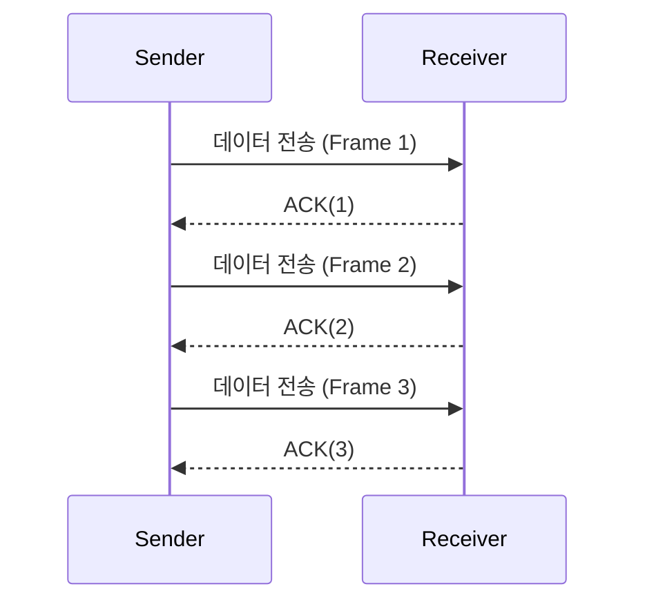
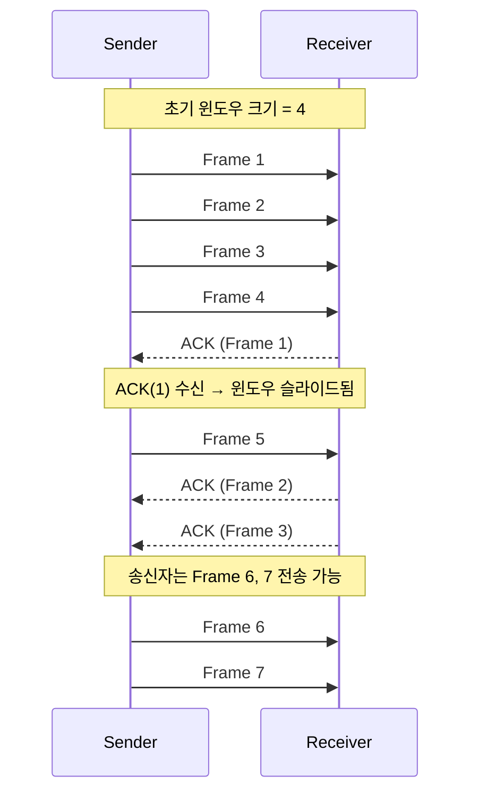
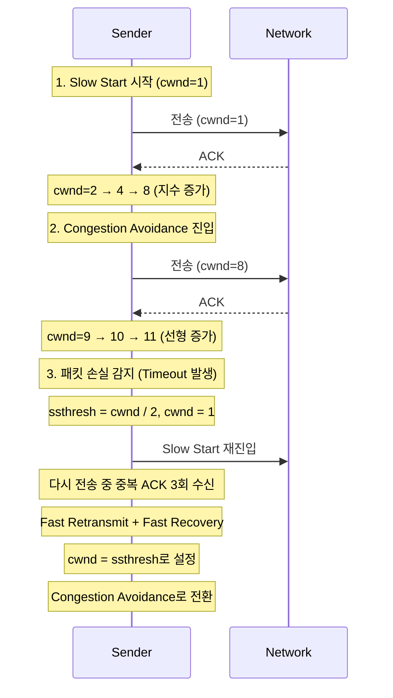
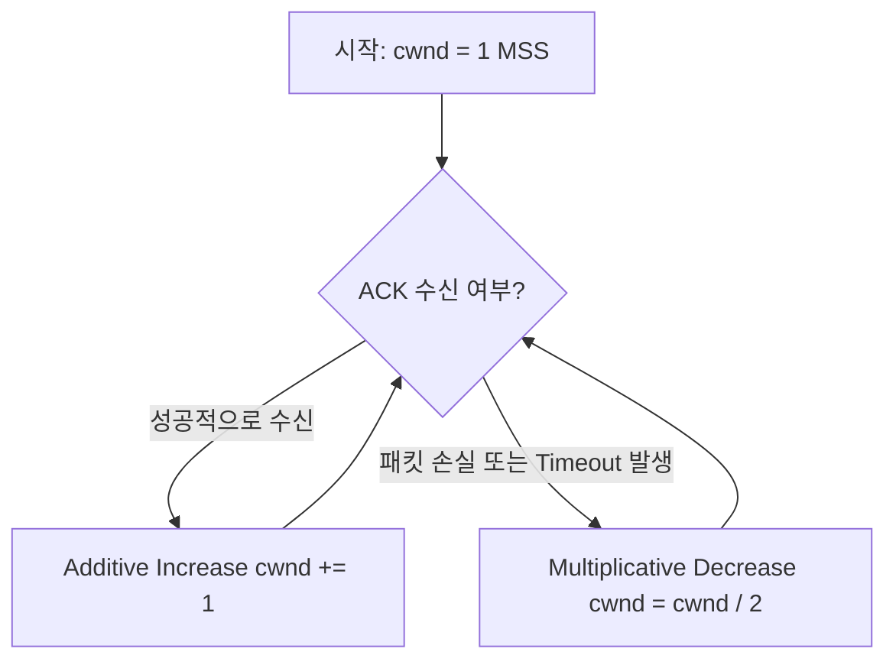
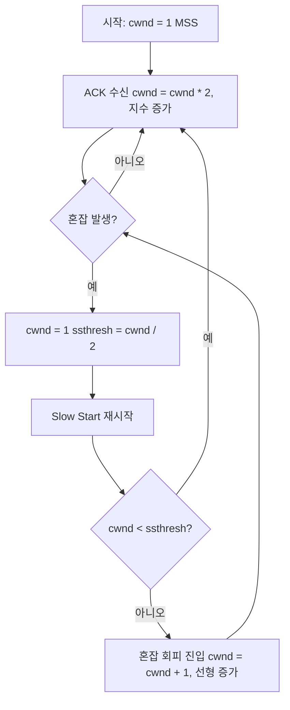
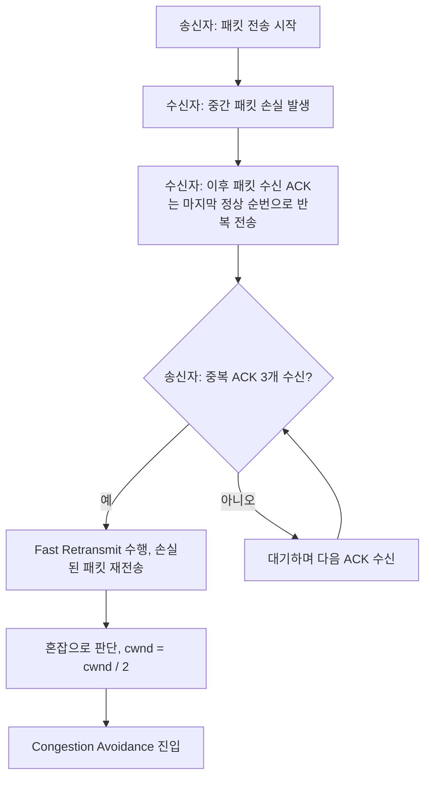

## 흐름제어

TCP 의 흐름제어 (Flow Control) 는 수신 측이 감당할 수 있는 만큼만 데이터를 보내도록 송신 측을 제어하는 매커니즘입니다

이는 송신자와 수신자의 처리 속도가 다를 때, 수신자가 오버플로우(버퍼초과) 되지 않도록 보장합니다

- 송신측과 수신측의 데이터 처리 속도 차이를 해결하기 위한 기법
- Flow Control 은 receiver 가 packet 을 지나치게 많이 받지 않도록 조절하는 것
- 기본 개념은 receiver 가 sender 에게 현재 자신의 상태를 feedback 한다는 점
- application 에서 준비되면 자신의 buffer 를 읽게 되는데 Flow Control 의 핵심은 receiver buffer 가 넘치지 않게 하는 것

문제 상황

- 수신측이 송신측보다 데이터 처리 속도가 빠르면 문제없지만, 송신측의 속도가 빠를 경우 문제가 발생한다

</br>

### 흐름제어의 핵심 개념

**수신 윈도우 (Receiver Window, `rwnd`)**

- 수신 측이 현재 얼마나 많은 데이터를 더 받을 수 있는지를 **윈도우 크기**로 알려준다
- 송신 측은 `rwnd` 를 확인하고 그 크기 이하로만 데이터를 전송하게 된다

</br>

### 해결 방법

**1. Stop-and-Wait 방식**

</br>

개념

- 한 번에 하나의 프레임(혹은 패킷)만 발송한다
- 송신자는 ACK 응답을 받을 때까지 기다린다
- ACK 를 받은 후에야 다음 프레임을 전송하게 된다

</br>

흐름



</br>

장점

- 구현이 간단하며 수신자 데이터 처리 후 ACK 를 보내므로 수신자 오버플로우 위험이 적다

</br>

단점

- 대기 시간이 비효율적이며 RTT(Round Trip Time)가 길면 대역폭 낭비가 심하다

</br>

즉, 한 프레임 전송 후 ACK 신호를 기다린다 단순하지만 비효율적이며 채널과 송신자가 오랫동안 유휴 상태를 유지하게 된다

</br>
</br>

**2. Sliding Window 방식**

</br>

개념

- 한 번에 여러 개의 패킷을 연속 전송 가능하다
- ACK를 받지 않아도 일정 범위(`window size`) 내에서 전송이 가능하다
- ACK 수신 시 윈도우가 앞으로 슬라이드한다

</br>

**구성요소**

- 전송 윈도우 (Sender Window) : 송신 측이 전송 가능한 범위
- 수신 윈도우 (Receiver Window) : 수신 측이 받아들일 수 있는 범위
- ACK : 특정 시퀀스 번호까지 잘 받았다는 응답

</br>

흐름



- 윈도우 크기 4 → 송신자는 4개까지 ACK 없이 전송 가능
- ACK(1) 수신 시 윈도우 슬라이드 → 다음 데이터 전송 가능

</br>

장점

- 대역폭 활용 극대화 및 수신사 처리 속도와 상관없이 일정 범위 내에서 데이터 흐름 유지

단점

- 구현이 복잡하다 (타이머, 재전송 관리 등)

</br>

> 참고) 슬라이딩 윈도우 방식도 결국 윈도우 크기만큼 보내고 대기하는 것 아닌가? 그러면 Stop-and-Wait 과 다른점이 없는건가?
>
> 핵심 차이 → 모든 ACK 를 기다리는가? 일부만 기다리는가?
>
> | 구분      | Stop-and-Wait                  | Sliding Window                                                             |
> | --------- | ------------------------------ | -------------------------------------------------------------------------- |
> | 전송 방식 | 1개 전송 후 ACK 대기           | N개 전송 (윈도우 크기만큼)                                                 |
> | 대기 방식 | 매 전송마다 ACK 올 때까지 대기 | 모든 ACK를 기다리는 게 아니라, **순차적으로 슬라이드** 하며 계속 전송 가능 |
> | 전송 효율 | 매우 낮음 (RTT 동안 Idle)      | 매우 높음 (RTT 중간에도 다음 전송 가능)                                    |

</br>
</br>

**흐름 제어의 다른 방식들**

- Credit-based Flow Control (크레딧 기반 제어)
  - 수신자가 송신자에게 "얼마만큼 더 보낼 수 있는지"를 숫자로 명시
  - 윈도우 사이즈와 유사하나, 더 명확하게 전송 크기를 지정함
- Rate-based Flow Contorl (속도 기반 제어)
  - 일정한 속도로만 데이터 전송 (ex. 1초에 1,000 byte)
  - 수신자가 "최대 속도"를 지정하거나 네트워크 QoS 기반
- Application-level Flow Control
  - HTTP/2, QUIC 같은 상위 계층 프로토콜에서 흐름 제어 수행
  - 예: gRPC 스트리밍 시 수신자가 메시지를 얼마나 받을지 제어

</br>
</br>

## 혼잡제어

앞서 다룬 흐름제어 (flow control)가 수신자 보호를 목적에 두고 있다면 이제 설명할 혼잡제어 (congestion control)는 네트워크 보호를 위한 TCP 핵심 매커니즘입니다

</br>

개념

- 네트워크가 과부하되어 패킷이 손실되거나 지연되지 않도록, **송신자가 전송 속도를 조절하는 기술**

네트워크 중간의 라우터, 스위치 등은 큐를 가지는데, 너무 많은 패킷이 몰리면 **큐가 가득하고, 패킷이 드롭됩니다**

이걸 막기 위해 송신자는 **네트워크 상태에 따라 스스로 속도를 조절**해야 합니다

<br>

**핵심 요소**

- cwnd (Congestion Window) : 혼잡 제어용 송신 윈도우
- ssthresh (Slow Start Threshold) : 느린 시작 (Slow Start) → 혼잡 회피 (congestion avoidance) 전환 기준
- ACK 수진 : 네트워크에 여유가 있다고 판단 → cwnd 증가
- 패킷 손실 (Timeout or 중복 ACK) : 혼잡 발생 판단 → cwnd 감소

</br>

**혼잡 제어의 4단계**

1. Slow Start

- 시작할 땐 네트워크 상태를 모르므로, **작은 윈도우 (cwnd = 1 MSS)** 로 시작한다
- ACK 가 들어오면 cnwd 를 두 배씩 증가시킨다 (지수적으로 증가)

```plantext
cwnd : 1 → 2 → 4 → 8 → ...
```

</br>

2. Congestion Avoidance

- cwnd 가 ssthresh에 도달하면 **선형 증가**로 전환

```plantext
cwnd : 8 → 9 → 10 → 11 → ...
```

</br>

3. Congestion Detection (패킷 손실)

- Timeout: 패킷이 너무 늦게 오면 → 심각한 혼잡
  - `cwnd / 2` , `cwnd = 1` 로 설정하여 다시 Slow Start
- 중복 ACK : 같은 ACK 가 3번 오면 → 일부 손실 추정
  - Fast Retransmit + Fast Recovery
  - `cwnd / 2`, `cwnd = ssthres` 로 줄임

</br>

4. Fast Recovery

- 중복 ACK로 인한 손실은 ssthresh 로 줄이고, slow start 로 돌아가지 않는다
- 빠르게 회복하고 다시 congestion avoidance 진행

</br>

흐름



</br>
</br>

**해결 방법**

- AIMD (Additive Increase / Mutiplicative Decrease)
  - 처음 패킷을 하나씩 보내고 이것이 문제없이 도착하면 window 크기 (단위 시간 내에 보내는 패킷의 수)를 1씩 증가시켜가며 전송하는 방법
  - 패킷 전송에 실패하거나 일정 시간을 넘으면 패킷의 보내는 속도를 절반으로 줄인다
  - 공평한 방식으로, 여러 호스트가 한 네트워크를 공유하고 있으며 나중에 진입하는 쪽이 처음에는 불리하지만, 시간이 흐르면 평형상태로 수렴하게 되는 특징이 있다
  - 문제점은 초기에 네트워크의 높은 대역폭을 사용하지 못하여 오랜 시간이 걸리게 되고, 네트워크가 혼잡해지는 상황을 미리 감지하지 못한다. 즉, 네트워크가 혼잡해지고 나서야 대역폭을 줄이는 방식이다

</br>

흐름



</br>
</br>

- Slow Start (느린 시작)
  - AIMD 방식이 네트워크의 수용량 주변에서는 효율적으로 작동하지만, 처음에 전송 속도를 올리는데 시간이 오래 걸리는 단점이 존재한다
  - Slow Start 방식은 AIMD 와 마찬가지로 패킷을 하나씩 보내면서 시작하고, 패킷이 문제없이 도착하면 각각의 ACK 패킷마다 window size를 1씩 늘려준다. 즉, 한 주기가 지나면 window size가 2배로 된다
  - 전송속도는 AIMD 에 반해 지수 함수 꼴로 증가한다. 대신에 혼잡 현상이 발생하면 window size 를 1로 떨어뜨리게 된다
  - 처음에는 네트워크의 수용량을 예상할 수 있는 정보가 없지만, 한번 혼잡 현상이 발생하고 나면 네트워크의 수용량을 어느 정도 예상할 수 있다
  - 그러므로 혼잡 현상이 발생하였던 window size 의 절반까지는 이전처럼 지수 함수 꼴로 창 크기를 증가시키고 그 이후부터는 완만하게 1씩 증가시킨다

</br>

흐름



</br>
</br>

- Fast Retransmit (빠른 재전송)
  - 빠른 재전송은 TCP 의 혼잡 조절에 추가된 정책이다
  - 패킷을 받는 쪽에서 먼저 도착해야할 패킷이 도착하지 않고 다음 패킷이 도착한 경우에도 ACK 패킷을 보내게된다
  - 단, 순서대로 잘 도착한 마지막 패킷의 순번을 ACK 패킷에 실어서 보내게 되므로 중간에 하나가 손실되게 되면 송신 측에서는 순번이 중복된 ACK 패킷을 받게 된다. 이것을 감지하는 순간 문제가 되는 순번의 패킷을 재전송 해줄 수 있다
  - 중복된 순번의 패킷을 3개 받으면 재전송을 하게 된다. 약간 혼잡한 상황이 일어난 것이므로 혼잡을 감지하고 window size 를 줄이게 된다

</br>

흐름



</br>
</br>

- Fast Recovery (빠른 회복)
  - 혼잡한 상태가 되면 window size 를 1로 줄이지 않고 반으로 줄이고 선형증가시키는 방법이다. 이 정책까지 적용하면 혼잡 상황을 한번 겪고 나서부터는 순수한 AIMD 방식으로 동작하게 된다

</br>
</br>
</br>

출처) https://gyoogle.dev/blog/computer-science/network/%ED%9D%90%EB%A6%84%EC%A0%9C%EC%96%B4%20&%20%ED%98%BC%EC%9E%A1%EC%A0%9C%EC%96%B4.html
