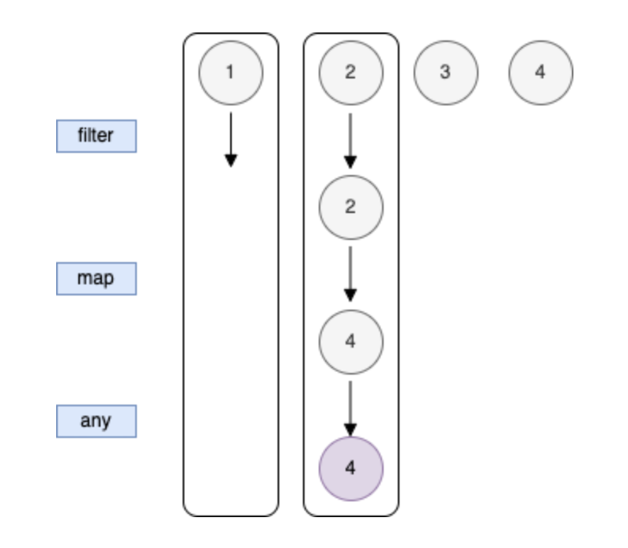

## Sequence

코틀린 Sequence 를 다른 함수형 언어에서는 스트림(stream) 이라고 부른다

코틀린이 다른 이름을 선택한 이유는 자바 8의 Stream 라이브러리와 호환성을 유지하기 위해서이다

List 에 대한 연산은 즉시(eagerly) 계산된다.
이는 함수를 호출하자마자 모든 원소에 대해 바로 계산이 이뤄진다는 뜻 이다

List 연산을 연쇄시키면 첫 번째 연산의 결과가 나온 후에야 다음 연산을 적용할 수 있다

</br>

즉시 계산은 직관적이고 단순하지만 최적의 방법은 아니다

만약 `any()` 함수를 실행한다면 사용자가 제일 만족할 만한 계산 과정은 모든 원소에 대해 평가하지 않고 중간에 적합한 조건에 맞는 원소를 만나면 즉시 계산을 종료하는 것이 더 합리적이다

즉시 계산은 수평적 평가라고도 한다


첫 번째 줄은 최초 리스트 내용을 보여주고 다음에 오는 각 줄은 이전 연산의 결과를 보여준다

다음 줄에 있는 연산을 수행하기 전에 현재 수평적 수준에 있는 모든 원소에 대해 연산이 처리되어야 한다

즉시 계산의 대안은 지연 계산이다

지연 계산은 결과가 필요할 때만 계산을 수행한다

Sequence에 대해 지연 계산을 수행하는 경우를 수직적 평가라고도 한다



List 를 asSequence() 를 사용해 Sequence 로 변경하면 지연 계산이 활성화된다

따라서 보통은 코드에서 한 군데만 바꿔도 지연 계산의 이점을 얻을 수 있다

</br>

아래는 똑같은 연산을 연쇄적으로 하는 코드이다, 한 번은 List (즉시 계산) 을 사용하고 한 번은 Sequence (지연 계산) 을 사용한다

```kotlin
fun Int.isEven(): Boolean {
    println("$this - isEven(): $this%2")
    return this % 2 == 0
}

fun Int.square(): Int {
    println("$this - square(): $this*$this")
    return this * this
}

fun Int.lessThenTen(): Boolean {
    println("$this - lessThenTen(): $this<10")
    return this < 10
}

fun main() {
    val list = listOf(1, 2, 3, 4)

    // List 를 이용하여 filter(), map(), any() 사용
    list.filter(Int::isEven)
        .map(Int::square)
        .any(Int::lessThenTen)

    // Sequence 를 이용하여 filter(), map(), any() 사용
    list.asSequence()
        .filter(Int::isEven)
        .map(Int::square)
        .any(Int::lessThenTen)
}
```

출력 결과

```bash
List 를 이용한 계산 (즉시 계산)

// 1 - isEven(): 1%2
// 2 - isEven(): 2%2
// 3 - isEven(): 3%2
// 4 - isEven(): 4%2
// 2 - square(): 2*2
// 4 - square(): 4*4
// 4 - lessThenTen(): 4<10

=====================

Sequence 를 이용한 계산 (지연 계산)

// 1 - isEven(): 1%2
// 2 - isEven(): 2%2
// 2 - square(): 2*2
// 4 - lessThenTen(): 4<10
```

두 접근 방법의 차이는 asSequence() 를 추가로 호출한 것 뿐이지만 Sequence 보다 List 쪽이 더 많은 원소에 대해 연산을 수행한다

</br>

filter 나 map() 을 Sequence 에 대해 호출하면 다른 Sequence 가 생기며 계산 결과를 요청할 때까지는 아무일도 일어나지 않는다

대신 새로운 Sequence 는 지연된 모든 연산에 대한 정보를 저장해두고 필요할 때만 저장해둔 연산을 실행한다

```kotlin
fun Int.isEven2(): Boolean {
    println("$this - isEven2(): $this%2")
    return this % 2 == 0
}

fun Int.square2(): Int {
    println("$this - square2(): $this*$this")
    return this * this
}

fun main() {
    val r =
        listOf(1, 2, 3, 4)
            .asSequence()
            .filter(Int::isEven2)
            .map(Int::square2)

    // r 을 String 으로 변환해도 최종 결과는 나오지 않음
    // 객체의 식별자만 나옴
    println(r) // kotlin.sequences.TransformingSequence@42110406

    // 객체의 식별자를 제거해서 보기 위해 내부 객체의 메모리 주소를 표현하는 @를 자르고 봄
    println(r.toString().substringBefore("@")) // kotlin.sequences.TransformingSequence
}
```

`TransformingSequence` 는 연산을 저장만할 뿐 수행하지는 않는다

Sequence 연산에는 **중간(intermediate)** 연산 과 **최종(terminal)** 연산 두 가지가 있다

- 중간 연산은 결과로 다른 Sequence 를 내놓는다. filter() 와 map() 은 중간 연산이다
- 최종 연산은 Sequence 가 아닌 값을 내놓는다. 결과값을 얻기 위해 최종 연산은 저장된 모든 계산을 수행한다.
  - 앞의 예에서 any() 는 Sequence 를 받아서 Boolean 을 내놓기 때문에 최종 연산이다

toList() 등도 모두 최종 연산이다

</br>

Sequence 는 (중간) 연산을 저장해두기 때문에 각 연산을 원하는 순서로 호출할 수 있고 그에 따라 지연 계산이 발생한다

</br>

Sequence 는 한번만 이터레이션 할 수 있다

이터레이션을 또 시도하면 예외가 발생하며 Sequence 를 여러 번 처리하고 싶다면 우선 시퀀스를 Collection 타입 중 하나로 변환해야 한다

사용 중인 시퀀스의 종류에 따라서는 반복 이터레이션이 가능한 경우도 존재한다

하지만 반복 이터레이션을 사용하는 시퀀스의 경우 처음부터 모든 연산을 다시 실행할 가능성이 있으므로 반복 계산을 피하기 위해서는 설명한대로 시퀀스를 컬렉션으로 변환해 저장해둬야 한다

참고로 어떤 시퀀스에 대해 constrainOnce() 를 호출하면 단 한 번만 이터레이션을 허용하는 제약이 걸려 있는 시퀀스를 얻을 수 있다
