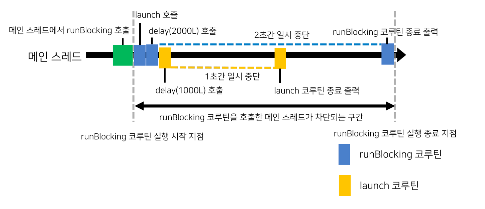

## runBlocking 함수의 동작 방식

`runBlocking` 함수가 호출되면 새로운 코루틴인 `runBlocking` 코루틴이 실행되는데 이 코루틴은 실행이 완료될 때까지 호출부의 스레드를 차단(block) 하고 사용한다

즉, 호출부의 스레드는 `runBlocking` 함수가 생성한 코루틴이 실행 완료될 때까지 다른 작업에 사용될 수 없다

```kotlin
fun main() =
    runBlocking<Unit> {
        delay(5000L)
        println("[${Thread.currentThread().name}] 코루틴 종료")
    }
```


runBlocking 함수가 호출되면 호출 스레드인 메인 스레드를 사용하는 runBlocking 코루틴이 생성된다

이 코루틴은 5초간 대기 후 실행 스레드를 출력하고 실행이 완료된다

runBlocking 코루틴의 생성 시점부터 실행 완료 시점까지 메인 스레드는 runBlocking 코루틴에 의해 베타적으로 사용되며, 이 코루틴의 실행이 완료될 때까지 다른 작업에 사용될 수 없다. runBlocking 코루틴의 실행이 완료되면 메인 스레드가 실행할 코드가 더 이상 없기 때문에 프로세스가 종료된다

</br>

해당 코드는 runBlocking 코루틴이 실행하는 동안 메인 스레드를 점유하고 사용한다

하지만 runBlocking 코루틴은 작업 실행 시 호출부의 스레드를 사용하지 않고 차단만 할 수도 있다

```kotlin
fun main() =
    runBlocking<Unit>(Dispatchers.IO) {
        delay(5000L)
        println("[${Thread.currentThread().name}] 코루틴 종료")
    }
```

runBlocking 함수를 호출한 스레드는 메인 스레드이지만 runBlocking 코루틴은 Dispatchers.IO 를 사용해 백그라운드 스레드(Default Dispatcher-worker-1) 에서 실행된다


**runBlocking 함수가 호출된 스레드와 다른 스레드에서 runBlocking 코루틴이 실행되더라도 해당 코루틴이 실행되는 동안 runBlocking 함수를 호출한 스레드는 차단된다**

</br>

차단이 풀리는 시점은 runBlocking 코루틴이 실행 완료될 때다

이처럼 runBlocking 함수를 호출한 스레드는 그로부터 생성되는 runBlocking 코루틴이 실행 완료될 때까지 runBlocking 코루틴에 의해 베타적으로 사용된다

runBlocking 함수의 차단은 스레드 블로킹(Thread Blocking) 에서의 차단과 다르다

스레드 블로킹은 스레드가 어떤 작업에도 사용할 수 없도록 차단되는 것을 의미한다

runBlocking 함수의 차단은 runBlocking 코루틴과 그 자식 코루틴을 제외한 다른 작업이 해당 스레드를 사용할 수 없음을 의미한다

</br>
</br>

## runBlocking 코루틴의 하위에 생성된 코루틴의 동작

runBlocking 코루틴에 의해 호출부의 스레드가 베타적으로 사용된다는 것은 runBlocking 코루틴 하위에 생성된 코루틴도 그 호출부의 스레드를 사용할 수 있다는 의미이다

```kotlin
fun main() =
    runBlocking<Unit>(Dispatchers.IO) {
        launch {
            delay(1000L)
            println("[${Thread.currentThread().name}] launch 코루틴 종료")
        }
        delay(2000L)
        println("[${Thread.currentThread().name}] runBlocking 코루틴 종료")
    }
```

이 코드에서 launch 코루틴은 runBlocking 코루틴의 하위에 생성된다

따라서 runBlocking 함수를 호출한 메인 스레드를 launch 코루틴도 사용할 수 있으며 아래처럼 동작한다



따라서 launch 코루틴과 runBlocking 코루틴 모두가 메인 스레드(main) 를 사용하는 것을 확인할 수 있다

</br>
</br>

## runBlocking 함수와 launch 함수의 동작 처리

runBlocking 코루틴은 runBlocking 함수 호출부의 스레드를 차단하고 사용하지만 launch 함수를 사용해 생성되는 launch 코루틴은 실행될 때 호출부의 스레드를 차단하지 않는다

</br>

만약 runBlocking 코루틴안에 하위에 runBlocking 코루틴이 존재한다면

하위에 생성되는 runBlocking 코루틴은 바깥쪽 runBlocking 코루틴이 차단한 스레드를 사용할 수 있기 때문에 메인 스레드 상에서 실행되며 위와 비슷하게 실행된다

그러나 하위 생성된 runBlocking 코루틴은 실행되는 동안 메인 스레드를 차단한다

따라서 바깥쪽 runBlocking 코루틴은 하위 runBlocking 코루틴이 모두 실행될 때까지 메인 스레드를 사용할 수 없다

runBlocking 은 블로킹을 일으키는 일반적인 코드와 코루틴 사이의 연결점 역할을 하기 위해 만들어졌기 때문에 코루틴 내부에서 다시 runBlocking 을 호출하는 것은 삼가해야 한다

반면에 launch 코루틴은 코루틴 빌더 함수 호출부의 스레드를 차단하지 않는다

따라서 launch 코루틴이 delay 같은 작업으로 인해 실제로 스레드를 사용하지 않는 동안 스레드는 다른 작업에 사용될 수 있다

launch 코루틴은 스레드를 차단하지 않기 때문에 자신이 사용할 수 있는 스레드(여기서는 메인 스레드) 가 자유로워지고 나서야 실행되며, launch 코루틴이 delay(1000L) 로 인해 1초간 대기하는 동안에 메인 스레드를 다른 작업이 자유롭게 사용할 수 있다
