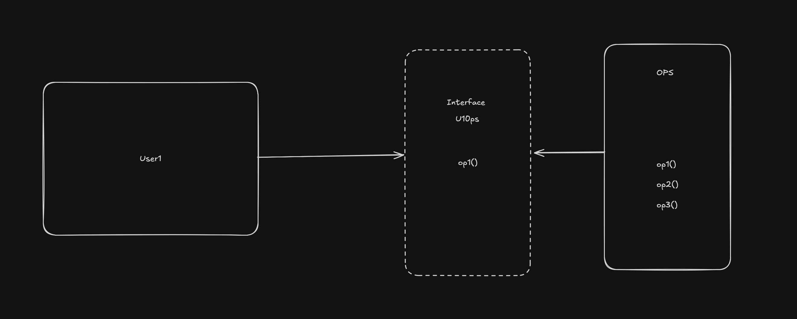

클린코드와 유지보수 쉬운 설계를 위한 5가지 객체지향 설계원칙

**SOLID 원칙을 따르면 어떤점이 좋은가?**

1. 변경에 유연한 구조
   - "변경에 유연하다"는 말은 곧 "결합도는 낮고, 응집도는 높은 구조"를 의미한다
   - A 라는 회사의 시스템이 작은 기능 추가에도 수십 개의 테스트가 깨질만큼 복잡하다면, 기능을 자주 추가하는 것이 어려울 것 이다
   - 즉, 시스템은 항상 결합도가 낮고 응집도가 높은 상태를 유지하는 것이 중요하다
2. 이해하기 쉬운 구조
   - "가독성이 좋다" 로 표현할 수 있다
   - 아무리 좋은 코드라도 본인만 이해할 수 있다면 좋은 설계라 할 수 없다

</br>
</br>

---

### SRP (Single Responsibility Principle)

"클래스는 하나의 책임만 가져야 한다"

각자가 생각하는 책임의 범위는 항상 동일하지 않습니다.

따라서 "책임" 이라는 단어는 매우 주관적인 평가라고 설명할 수 있습니다

그래서 밥 아저씨는 SRP 를 아래와 같이 정의했습니다

> "단일 모듈은 변경의 이유가 오직 하나뿐이어야 한다"

변경의 이유가 하나라고 정의함으로써 객관적으로 파악이 가능해졌습니다

서로 다른 책임을 분리하면 응집도가 높아지는 효과가 생깁니다

예시) 두 모듈에서 공통으로 사용하는 기능이 존재하는 경우


여기서 문제는 만약 "A 기능" 에서 필요에 의해 "공통기능" 의 특정 메서드 하나를 수정한다면?

운영 배포전까지는 아무 문제가 없고 이후 운영 배포를 하게 됩니다

그리고 며칠이 지나 "B 기능" 에서 문제가 발생하게 됩니다

여기서 얻은건 "공유를 잘하자" 가 아닌 처음부터 아래처럼 **책임이 분리되어 있었다면 어땠을까** 입니다


**모듈별로 변경의 이유가 각각 분리되어 있었다면, 서로에 대한 책임도 분리되어 각각의 수정에 대해 영향을 받지 않았을 것 입니다**

</br>
</br>

---

### OCP (Open/Closed Principle)

"코드를 수정하지 않고, 기능을 확장할 수 있어야 한다"

말의 의미는 이해했는데 "어떻게 하면 기존의 코드를 수정하지 않고 기능을 추가할 수 있을까요?"

예시) 위/아래 로 스크롤 하던 것을 가로/세로 스크롤로 기능 명세가 변경


기존의 위/아래 스크롤 을 그대로 유지하면서, 가로/세로 스크롤 을 추가할 수 있도록 설계된 것을 알 수 있습니다

여기에 추가로 고수준 정책 모듈을 보호하기 위해, 이후에 살펴볼 DIP(의존성 역전 원칙) 가 적용되어 있습니다

그러므로 앞으로 새로운 타입의 스크롤이 추가되더라도 수정량을 최소화하게 되며 위 처럼 비즈니스 로직을 묶어서 인터페이스로 정의합니다

그후 의존성 주입(DI, Dependency Injection) 을 통해 타입과 로직을 매핑하고 동적으로 로드하도록 구현할 수 있습니다

또 다른 요구사항이 생긴다면 새로운 타입을 정의하고 비즈니스 로직만 추가하면 되어 기존 코드를 전혀 변경하지 않고도 기능을 확장할 수 있습니다

</br>
</br>

---

### LSP (Liskov Substitution Principle)

"자식 클래스는 부모 클래스를 대체해도 프로그램이 제대로 동작해야 한다"

```bash
1. 타입 T 가 있다
2. 서브 타입 S 가 있다
3. T 타입으로 만든 프로그램 P 가 있다
4. 프로그램 P 에서 T 를 서브타입 S 로 치환한다
5. 프로그램의 행위가 변하지 않고 정상적으로 동작한다면, S 는 T 의 하위타입이다
```

리스코프 치환 원칙에서 가장 중요한 부분은 **치환해도 프로그램 행위가 변하지 않는다는 것** 입니다

하위 타입 구현시 부모 타입의 기능을 무작위로 수정한다면 타입을 치환해서 호출하려 할 때 동작 여부를 확신할 수 없기에 타입을 서로 치환할 수 없게 됩니다

따라서 LSP 원칙은 **하위 타입 구현 시, 부모의 기능을 수정하면 안된다는 원칙**입니다

대표적인 LSP 위반 문제 → "정사각형/직사각형 문제"

```kotlin
open class Rectangle {
    private var height = 0
    private var width = 0

    fun area() = height * width

    open fun setHeight(height: Int) {
        this.height = height
    }

    open fun setWidth(width: Int) {
        this.width = width
    }
}
```

이제 이 클래스를 상속받아 정사각형(Square) 클래스인 `Square` 클래스를 구현해보겠습니다

→ 정사각형은 특성상 너비와 높이가 같아야 합니다

```kotlin
class Square : Rectangle() {
    override fun setHeight(height: Int) {
        this.width = height
        this.height = height
    }

    override fun setWidth(width: Int) {
        this.width = width
        this.height = width
    }
}
```

정사각형 클래스는 너비나 높이를 설정할 때 모두 같은 값이 되도록 부모 클래스의 `setHeight` 와 `setWidth` 메서드를 변경했습니다

이렇게 부모 클래스의 기능을 변경함으로써 LSP 를 위반하게 되고, 이에 따른 문제가 발생합니다

→ 누군가 너비 5, 높이 2 로 설정한 직사각현은 넓이가 10 일 것이라고 판단합니다. 그러나 직사각형이 아닌 내부 구현을 알지 못하는 누군가가 정사각형을 전달한다면 문제가 발생합니다

여기까지 보면 LSP 는 단순히 상속 관계에서의 하위 타입을 설명하는 원칙이라고 생각할 수 있습니다

그러나 이는 잘못된 이해였습니다

현재의 LSP 는 인터페이스의 구현체에도 적용되는 더 광범위한 설계 원칙이 되었습니다

사례 → 자동차 시동


위 사진처럼 자동차의 시동을 걸 수 있는 다양한 인터페이스(키 또는 버큰)가 있다고 가정해 보겠습니다.

이때 어느 방식을 사용하더라도 자동차의 시동이 정상적으로 걸리고 앞으로 나갈 준비가 되어야 합니다

인터페이스가 잘 구현되었다면, 키나 버튼 중 어느 것을 사용하든지 자동차의 시동이 잘 걸릴 것이라고 믿을 수 있습니다

만약 누군가 시동을 걸었을때 자폭하는 기능을 추가했다면 우리는 이 인터페이스를 안심하고 사용할 수 있을까요?

우리가 만든 프로젝트에는 수천, 수만 개의 클래스가 존재하기 때문에 모든 클래스의 구현을 항상 기억할 수는 없습니다

따라서 하위 타입을 안심하고 치환해서 사용하려면, 하위 타입을 구현할 때 부모의 구현을 변경하지 않아야 합니다
또한 인터페이스를 구현할 때는 혼동되지 않도록 정확하게 구현해야 합니다

</br>
</br>

---

### ISP (Interface Segregation Principle)

"큰 인터페이스 하나보다는, 작은 인터페이스 여러개가 낫다"

말의 의미는 이해했는데 "인터페이스를 어떻게 잘 분리할 수 있을까요?"

대부분의 경우 기능에 따라서 인터페이스를 분리해야 한다는 약간 추상적인 생각을 하고 있습니다

밥 아저씨는 다음과 같이 ISP 를 정의했습니다

> "사용하지 않는 것에 의존하지 않아야 한다"

다시말해 기능별로 인터페이스를 나누고 만약 사용하지 않는 함수가 존재한다면, 인터페이스를 분리 해야 한다는 뜻 입니다

예시) User 클래스가 하나의 클래스를 참조


예시에서는 3개의 클래스 `User1`, `User2`, `User3` 이 하나의 `OPS`를 참조하는 것을 볼 수 있습니다

그리고 `User1` 은 `op1()`, `User2` 는 `op2()`, `User3` 은 `op3()` 만을 호출한다고 합니다

이 경우 `User1` 은 사용하지 않는 `op2()`, `op3()` 를 참조하고 있다고 할 수 있습니다

이러한 이유로 사용하지 않는 인터페이스에는 의존하지 말아야 합니다


수정된 예시를 보면 `User1`, `User2`, `User3` 과 `OPS` 사이에 각각의 인터페이스가 생겼습니다.

이제 `User1` 은 `U10ps`, `User2` 는 `U20ps`, `User3` 은 `U30ps` 를 의존하게 되어 더이상 사용하지 않는 것에 의존하지 않습니다

</br>
</br>

---

### DIP (Depedency Inversion Principle)

"구현이 아닌 추상화에 의존하라"

말의 의미는 이해했는데 "왜 의존성을 역전시키는가?"

정의와 방법은 잘 알고 있는데 다만 DIP 를 사용해야 하는 근본적인 이유를 아는 사람은 적은 것 같다
다
밥 아저씨는 다음과 같이 DIP 를 정의했습니다

> "추상화에 의존해야 하며 구체화에 의존하면 안된다"

안정된 추상화를 위해서는 변동성이 낮은 추상화에 의존해야 합니다

추상 인터페이스와 이를 구체화한 구현체가 있을때, 인터페이스가 수정되면 구현체도 함께 수정해야 합니다

반면 구현체가 수정되더라도 인터페이스는 대부분의 경우 변경될 필요가 없습니다

따라서 인터페이스는 구현체보다 변동성이 낮습니다. 즉, 변동성이 큰 구현체보다 안정된 인터페이스를 참조해야 합니다

예시) ISP 에서 봤던 `User`


해당 구현을 DIP 의 정의에 맞게 구현체를 직접 참조하지 않고 인터페이스를 통해 참조하도록 수정하면 아래처럼 변경될 수 있습니다



`User1` 에서 `OPS` 로 되어있던 기존 제어흐름이 이제는 `U10ps` 인터페이스를 의존하게 됩니다

제어흐름 : 프로그램이 실제로 어떻게 동작하는지, 즉 어떤 객체가 어떤 메서드를 호출하는가

- 예시) `User1` 이 `op1()` 을 호출함 → 결국 `OPS` 의 구현이 실행됨

의존성 방향 : 코드 상에서 어떤 클래스가 어떤 클래스를 참조하거나 import 하고 있는가 즉, "누구 누구를 알아야 하는가?" 를 의미

- 예시) `User1` 은 `U10ps` 인터페이스에 의존 → `OPS` 는 `U10ps` 를 구현

지금 그림의 의미

- `User1` → `U10ps` 인터페이스를 통해 `OPS` 구현체의 `op1()` 을 실행합니다
- 하지만 코드 의존은 `User1` → 인터페이스(`U10ps`) / `OPS` 는 인터페이스 (`U10ps`) 로 향합니다

DIP 에서는

> 상위 모듈 (사용자)이 하위 모듈(구현체)에 의존하지 않고, 둘 다 추상(인터페이스)에 의존하도록 만들어라

즉,

- 제어흐름은 → 구현체 방향(`OPS`) 으로 흘러가지만
- 코드 의존성은 ← 인터페이스 방향(`U10ps`) 으로 향합니다

원래

```bash
User1 --> OPS
```

DIP 적용 후엔

```bash
User1 --> U10ps <-- OPS
```


클린 아키텍쳐는 양파 껍질처럼, 가장 안쪽에 변하지 않는 고수준 정책을 배치하고, 바깥쪽으로 갈수록 변동성이 큰 저수준 모듈을 배치합니다

의존성은 바깥쪽에서 안쪽으로 향하고, 이렇게 하면 바깥쪽의 변화가 안쪽에 영향을 주지 않도록 할 수 있습니다

따라서 변동성이 큰 저수준 모듈들은 바깥쪽에 자리 잡고, 이들의 변화가 안쪽으로 전파되지 않는 것이 클린 아키텍쳐의 핵심입니다
