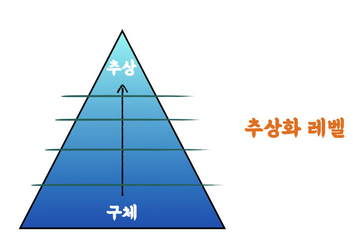
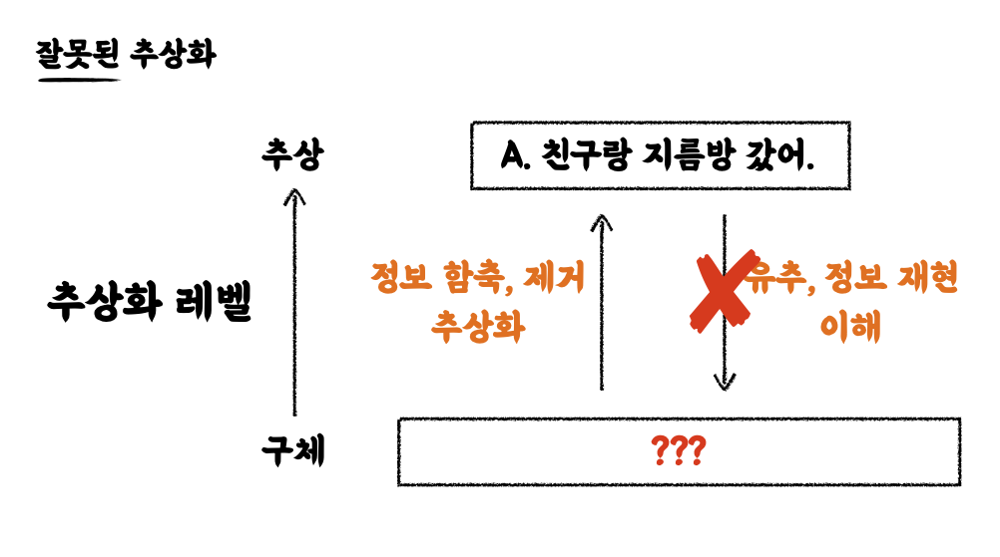

# 추상

- **구체적인 어떤 정보들에서 어떤 이미지를 뽑아낸다** 라는 의미
- by 위키백과
  - "특정한 측면만을 **가려내어** 포작하는 것"
- "가려내어" 포착하는 것 즉, 다른 측면을 **버린다** 는 것 !
  - 중요한 정보는 **<i>가려내어</i>** 남기고, 덜 중요한 정보는 생략하여 **<i>버린다</i>**

추상은 어느날 하늘에서 뚝 떨어지는 것이 아니다 !

**<i>추상은 구체적인 실체에서 시작해서 불필요한 것을 제외하고 가장 중요한 것만을 남겼을 때 추상이 이루어진다!</i>**

 

> 추상은 항상 구체적인 실체에서 시작해야 한다.
>
> Pablo Picasso

 
 

# 추상화 레벨

- 구체적인 것 에서 점점 덜 중요한 것들을 남겨두는 작업
- 점점 레벨을 가려낸다

- 실제 지구에서도 추상화 레벨이라는 개념은 존재하며 너무나 자연스럽게 인식된다
  - _1단계_ → 쿼크, 원자, 분자
  - _2단계_ → 물체
  - _3단계_ → 자연, 우주
- 또한 우리는 상대방과 이야기하는 중에도 추상화에 너무나 자연스럽게 접근한다
  - 예를 들어)
  - "주말에 뭐했니?" → [추상적으로 표현] "나 친구들과 노래방 갔어"
  - "주말에 뭐했니?" → [구체적으로 표현] "너무나도 친한 단짝 친구와 마이크에 입을 대고 내가 좋아하는 노래를 ..."
- **<i>정보를 함축 또는 제거하여 추상화를 하게된다</i>**
- 또한 우리가 이야기한 대화, 문장을 통해 들은 **상대방은 이 대화를 통해 유추하고 정보를 재현하기 시작하며 이해하기 시작한다**
  - → 상대방은 **추상화된 대화를 통해 유추하며 자신만의 세계에서 구체화하기 시작한다**

 
 

# 1 과 0 의 의미 (컴퓨터에서의 구체화, 추상화)

- 컴퓨터는 1과 0으로 대화한다
- 1 과 0 의 진정한 의미는 "존재한다" / "존재하지 않는다" 라고 이야기할 수 있다
- **<i>1 과 0 이라는 아주 구체적이 사실을 통해</i>**
- **<i>우리는 8bit 를 1byte 라고 표현하기 시작한다</i>**
- **<i>이는 bit 덩어리를 추상화해서 byte 라는 표현을 하는 1 단계 추상화 레벨을 도입했다</i>**
- 또한 byte 혹은 데이터의 조합을 통해 AND, OR 등의 연산을 추상화했다
- 더불어 프로그램이란 "데이터 + 코드" 를 통해 구성되며 이 또한 추상화했다 라고 이해할 수 있다
  - 고수준
    - 추상화 레벨이 높다
    - 인간의 언어에 가까울수록 고수준
  - 저수준
    - 추상화 레벨이 낮다
    - 기계어에 가까울수록 저수준

즉, 추상화는 컴퓨터 과학의 본질이다 (네트워크 레이어, 운영체제 등)

 
 

# 읽기 좋은 코드와 추상화의 관계

- 적절한 추상화는 복잡한 데이터와 복잡한 로직을 "단순화하여 이해하기 쉽도록" 돕는다
  - → 읽기가 좋다

 

## 잘못된 추상화

- 노래방을 다른 나라에서는 지름방 이라고 부른다고 가정해보자
- "주말에 어디갔어" → "나 친구들과 지름방에 갔어"
- 이는 상대방이 유추, 정보재현, 이해할 수 없게 추상화 되어졌다

**위 예시에서 추상으로부터 구체를 유추하지 못하는 이유**

1. 추상화 과정에서 중요한 정보를 부각시키지 못했다

   - → 상대적으로 덜 중요한 정보를 남기고 중요한 정보는 제거했다

2. 해석자가 동일하게 공유하는 문맥(Context)이 없다
   - → 중요한 정보의 기준이 다를 수 있다
   - 즉, 도메인 영역 별 추상화 기준이 다를 수 있다

 

- 노래라는 중요한 정보는 제거한 채로 소리를 지른다는 것에 초점을 맞추어 추상화되어졌다
- 또한 같은 개념이라도 도메인 영역이 달라지면 추상화 기준이 달라진다
- "방" 이라는 단어만을 가지고는 이해하기 힘들다
  - 문맥이 있어야지만 사라진 정보를 유추할 수 있다
  - 문맥안에 있는 추상이 다시 구체를 유추하고 생략된 정보를 유추할 수 있게 된다

**<i>즉, 도메인 영역이라는 것은 추상화 개념에서 아주 중요하다</i>**

 
 

## 적절한 추상화

"적절한 추상화는 우리가 가지고 있는 도메인의 문맥 안에서 정말 중요한 핵심 개념만 남겨서 표현하는 것"

 

### 추상화의 가장 대표적인 행위

**<i>이름을 지어주는 행위</i>**

가장 단순하면서도, 아주 중요한 추상적 사고 행위이다

즉, ⭐ 이름을 짓는 것에 대한 무게감을 느껴야 한다 !! ⭐
