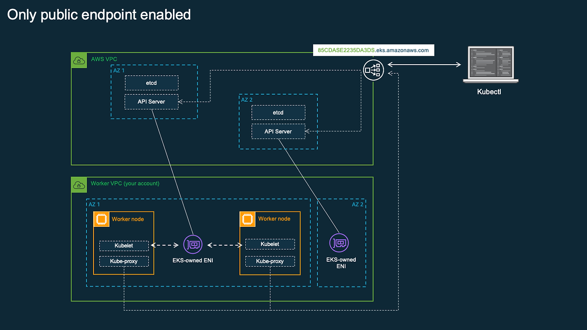
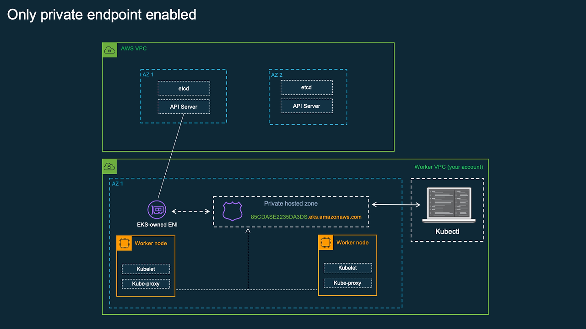
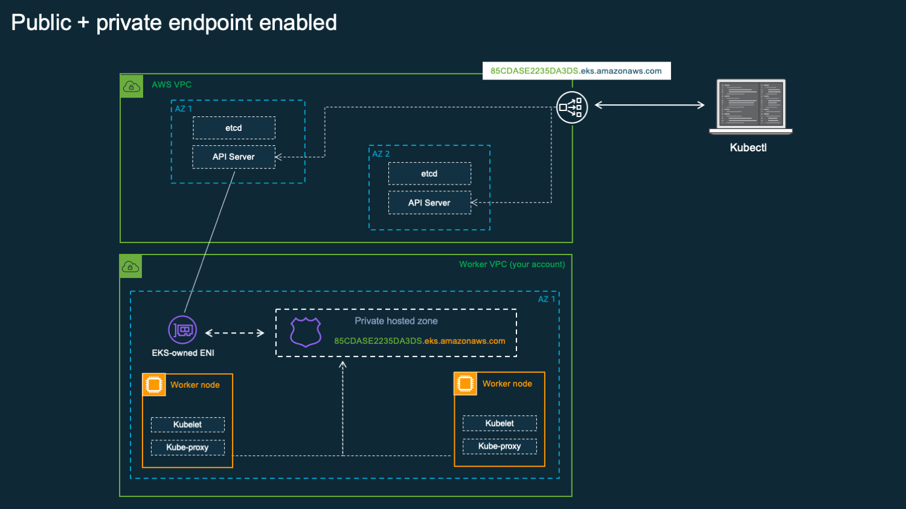

## EKS

- 쿠버네티스 컨트롤 플레인을 사용자가 직접 운영하지 않고 클라우드 서비스내에서 운영하는 매니지드 서비스
    - 즉 API Server / etcd / Controller Manager / Scheduler 를 사용자가 EC2 로 띄워서 관리하지 않고 보안, 업그레이드, 가용성을 AWS 가 대신 운영하는 모델
- EKS 는 다음과 같은 강한 구조적 제약을 가지게 된다
    - 컨트롤 플레인은 사용자가 만들 VPC 가 아닌 AWS 관리용 VPC 에 존재한다
    - 워커 노드는 반드시 사용자가 만들 VPC 안에 있어야 한다
    - 두 네트워크 사이를 보안적으로 통제된 L3/L4 경로로 연결해야 한다

**EKS 클러스터의 IAM Role**

- EKS 클러스터를 생성할 때 요구되는 `AmazonEKSClusterPolicy` 가 붙은 IAM Role 은 사용자를 대신해서 EKS 서비스가 AWS API 를 호출할 수 있는 권한 위임 객체이다
- 해당 Role 은 워커 노드용 IAM Role 이 아니며 해당 Role 은 EKS 컨트롤 플레인이 AWS 리소스를 생성 및 관리하기 위한 권한을 의미한다
- EKS 컨트롤 플레인은 해당 Role 을 사용하여 다음 작업을 수행한다
    - 사용자 VPC 안에 EKS-owned ENI 를 생성
    - 클러스터 보안 그룹을 생성하고 ENI 에 연결
    - 퍼블릭 엔드포인트 사용 시 NLB 를 자동 생성
    - Route53 프라이빗 호스트 존을 생성 및 관리한다 (프라이빗 엔드포인트 설정 시)

**사용자 VPC 구성시 서브넷 조건은 멀티 AZ가 필수**

- EKS 는 컨트롤 플레인을 멀티 AZ 로 고가용성 구성을 한다
- 이때 컨트롤 플레인에서 사용자 VPC 로 내려오는 ENI 역시 다중 AZ 에 분산되어야 한다
- EKS 는 다음 조건을 강제한다
    - 서브넷은 반드시 서로 다른 AZ 에 2개 이상 존재해야 한다
    - 이 서브넷들은 컨트롤 플레인 ENI 를 생성할 위치로 사용된다
- 결과적으로 한 AZ 가 장애가 나더라도 다른 AZ 의 컨트롤 플레인 인스턴스, 다른 AZ 의 ENI 를 통해 API Server 접근이 지속된다
- 필수 조건

**클러스터 보안 그룹**

- EKS 클러스터를 생성하면 AWS 는 사용자가 지정한 VPC 안에 클러스터 보안 그룹을 생성한다
- 해당 보안그룹의 역할은 AWS 관리 VPC 에 있는 EKS 컨트롤 플레인 <-> 사용자 VPC 에 생성된 ENI 간의 트래픽을 제어
- 해당 보안그룹은 워커 노드 보안 그룹이 아니며 인그레스/서비스 용 보안 그룹도 아니다 → 컨트롤 플레인 통신 전용 방화벽 역할
- 추가로 사용자가 최대 5개의 보안그룹을 더 지정할 수 있으며 해당 보안 그룹 또한 컨트롤 플레인 ENI 에 부착되어 API 접근 정책을 세분화한다

**EKS 엔드포인트**

- EKS 에서 말하는 엔드포인트는 쿠버네티스 API Server 의 접근 경로 전체를 의미한다
- Route53 이 제공하는 `xxxxxx.eks.amazonaws.com` 도메인 구성
- 해당 IP 로 연결되는 NLB 또는 ENI 및 그 뒤에 있는 API Server 등 전체 묶음을 EKS API 엔드포인트라고 부른다
- 모든 `kubectl`, `client-go`, `controller`, `kubelet` 은 반드시 이 엔드포인트 도메인으로만 API Server 에 접근한다
- 엔드포인트는 `public`, `private`, `public&private` 로 구성할 수 있다

 

### Public 엔드포인트 구성, 동작 방식

퍼블릭 엔드포인트를 활성화하면 아래 동작으로 수행된다

1. AWS 는 EKS 관리 VPC 쪽에 퍼블릭 Network Load Balancer (NLB) 를 생성한다
2. 해당 NLB 는 퍼블릭 IP 를 가지며 인터넷에서 접근 가능하다
3. Route53 의 EKS 엔드포인트 도메인은 이 NLB 의 퍼블릭 IP 를 가리킨다
4. 외부 사용자의 `kubectl` 요청은 인터넷을 통해 NLB 로 도달한다
5. NLB 는 요청을 EKS 컨트롤 플레인의 API Server 로 전달한다

중요한 점은 워커 노드는 퍼블릭 인터넷에 노출되지 않고 API Server 접근 경로만 퍼블릭으로 노출된다

 

### Private 엔드포인트 구성, 동작 방식

1. EKS 는 Route53 Private Hosted Zone 을 생성한다
2. 해당 Hosted Zone 안에 EKS API 도메인을 등록한다
3. 해당 도메인은 퍼블릭 IP 가 아니라 사용자 VPC 안의 ENI IP 를 가리킨다
4. 해당 ENI 는 앞서 말한 EKS-owned ENI 이다

필수 조건

- VPC 의 `enableDnsSupport = true` , `enableDnsHostnames = true`
- DNS 요청이 AmazonProvidedDNS 로 향해야 함 → 외부 DNS 서버로 구성하면 내부 Private IP 를 해석할 수 없음

 

### Public + Private 엔드포인트 구성

- 외부 클라이언트는 퍼블릭 NLB 경로로 접근한다
- VPC 내부 리소스 (워커 노드, Bastion, 내부 툴)는 프라이빗 ENI 경로로 접근한다
- kubectl exec / logs / attach 같은 API 요청은 항상 ENI 경로를 사용한다
- 즉 퍼블릭 + 프라이빗을 활성화해도 워커 노드 <-> API Server 통신은 절대 인터넷을 타지 않는다
- 그러므로 허용 CIDR 를 따로 구성할 경우, 보안그룹을 잘 못 구성할 경우 클러스터 네트워크 통신이 되지 않는 문제가 존재한다

 

### 워커 노드 생성 이후 흐름

- 워커 노드는 생성 이후 관리형 노드 그룹, 자체 관리형 노드 그룹 형태로 구성된다
- 결국 사용자 VPC 안의 EC2 로 구성된다
- 해당 노드들은
    - kubelet 이 API Server 에 등록
    - CNI 플러그인으로 Pod 네트워크를 구성
    - 이후 Ingress 설정 시 ALB Controller 가 사용자 VPC 에 ELB 를 생성한다 → 사용자 VPC 내부에 ELB 생성
- EKS 는 애플리케이션 트래픽 용 ELB 를 자동으로 만들어주지 않는다 → 따로 서비스, Ingress 구성을 통해 생성

 

### 노드 그룹 (Node Group)

- 쿠버네티스가 실제로 Pod를 올려서 실행하는 워커 노드들의 운영 관리 단위
- 보통 Auto Scaling Group 을 통해 생성/확장/축소되며 각각 EC2 노드가 `kubelet` 을 실행하여 EKS 컨트롤 플레인의 API Server 에 붙어 클러스터 Node 로 등록됨
- 트래픽이 늘어나면 노드를 줄이고 줄어들면 노드를 늘리는 작업은 보통 ASG(Auto Scaling Group) 을 통해 수행된다
    - 각 노드 그룹은 하나 이상의 노드를 ASG 로 배포한다

**관리형 노드 그룹(Managed Node Group)**

- ASG 기반의 EC2 노드 클러스터를 만들고 운영하는 과정을 AWS가 정해진 범위안에서 대신 관리해주는 방식
- 사용자가 메타데이터 정의(노드 개수, 인스턴스 타입, label 등)시 EKS 가 그에 맞는 노드 그룹 리소스를 만들고 내부적으로 ASG 와 연결하여 노드를 운영
    - 노드 그룹 업데이트시 EKS 는 업데이트 전략에 따라 노드를 롤링 업데이트(순차적으로 교체)하며 Pod 드레인을 수행
    - 업데이트 전략으로는 Rolling update, Force update 를 선택할 수 있다
    - 클러스터 Join에 필요한 정보를 자동으로 추가, EKS 최적화 AMI 기반 노드 업데이트 관리, ASG, Launch Template을 EKS 가 생성

**자체 관리형 노드 그룹(Unmanaged Node Group)**

- 노드 그룹의 생성/유지/업데이트를 AWS 가 대신 운영해주지 않고 사용자가 ASG/Launch Template/AMI/업데이트 전략 등을 직접 책임지는 방식
- 관리형 노드 그룹에서는 EKS 가 업데이트/드레인/교체 절차를 제품화하는 방식으로 제공하지만 자체 관리형 노드 그룹은 사용자가 Launch Template 버전/AMI 교체/ASG 롤링/드레인 절차를 설계하고 직접 관리 및 수행해야 한다
- 노드가 사용할 노드 IAM Role 이 필요하고 클러스터 조인 실패 시 트러블슈팅까지 책임져야 함

> 사용자 지정 Launch Template 이 있는 관리형 노드 생성시 주의사항
>
> - Launch Template 에 지정 안되는 설정
>     - 서브넷에 별도의 네트워크 인터페이스 추가 대신 노드 그룹의 서브넷 설정 → 반드시 노드 그룹 생성시 서브넷을 지정하는 방식을 사용
>     - IAM 인스턴스 프로파일 지정 대신 노드 그룹의 노드 Role 설정 → 노드 그룹 생성시 노드 IAM Role 지정
>     - 종료 동작 설정 금지, EKS 가 인스턴스를 관리함 → EKS 가 노드에 대한 라이프사이클을 직접 관리하므로 종료 동작 설정 금지
> - 노드 그룹 생성 시 지정 안되는 설정
>     - Launch Template 에 AMI가 설정되어 있을 경우 노드 그룹 생성 시 AMI 유형(OS) 선택 불가능 → AMI 설정시 EKS 가 생성하는 Launch Template 에 user-data 부분에 cluster 워커 노드가 join 하기 위해 필요한 부트스트랩 스크립트를 자동으로 추가해주지 않음
>     - Launch Template 에 디스크 크기가 설정되어 있을 경우 노드 그룹 생성 시 디스크 크기 선택이 불가능
>     - Launch Template 에 인스턴스 유형 1개가 지정되어 있을 경우 노드 그룹 생성 시 인스턴스 유형 여러 개 선택이 불가능 → 인스턴스 유형을 한개만 지정할 수 있는데 노드 그룹은 인스턴스 유형을 최대 20개 까지 지정할 수 있음 Scaling 이 자주 수행되는 경우 가용영역에 최대 개수 제한때문에 만들어지지 않는 문제 발생
>     - Launch Template을 지정할 경우 노드 그룹 생성시 ssh 키 설정이 불가능
>     - Launch Template을 지정한 경우 노드그룹 생성 시 원격 액세스(ssh)를 위한 보안 그룹 설정이 불가능 → Launch Template 의 네트워크 보안그룹 또는 네트워크 인터페이스 추가에서 보안그룹을 지정해야 함
