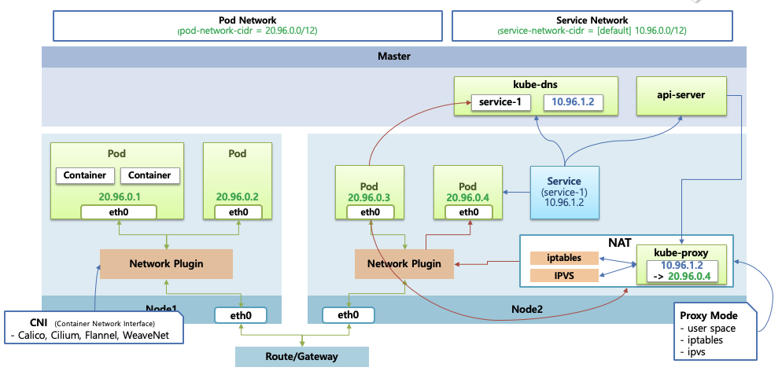
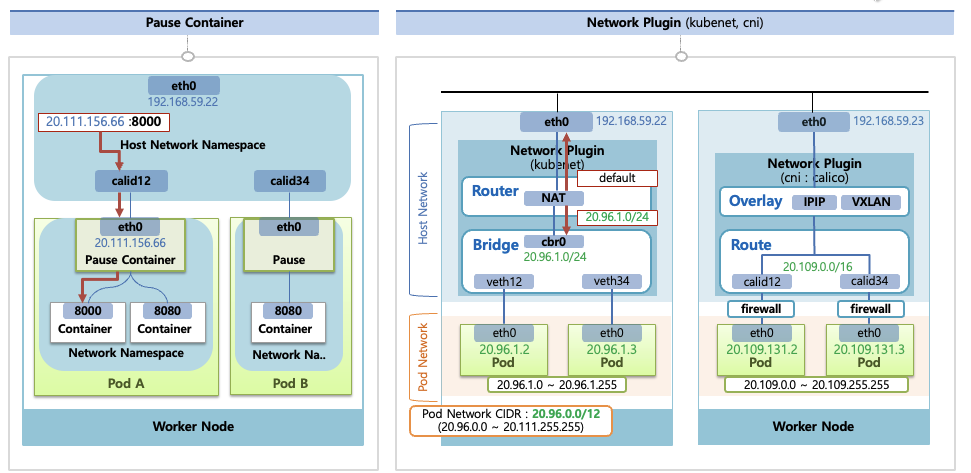
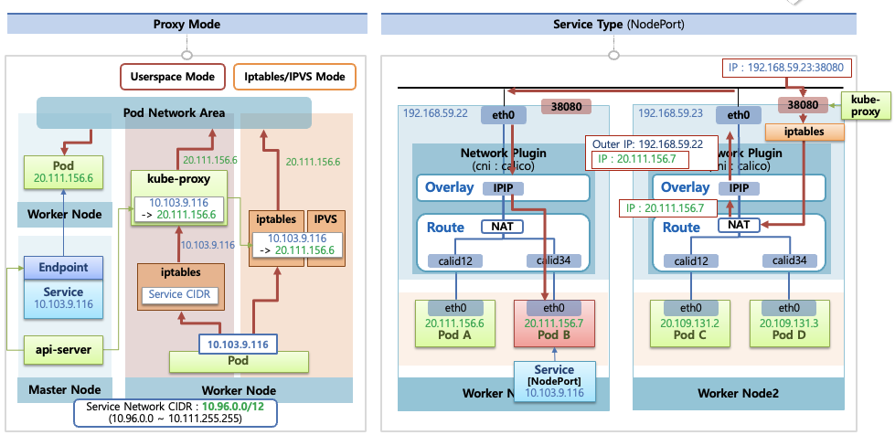

## 네트워크 전체 그림



- 쿠버네티스 네트워크는 두 개의 다른 책임 영역을 나눈다
- Pod 네트워크
  - CNI Plugin (Calico 등)
  - 담당 범위는 Pod <-> Pod 간 통신
- Service 네트워크
  - kube-proxy + iptables/IPVS
  - 담당 범위는 Service IP <-> Pod IP 변환
- 그리고 이 둘은 Pause Container 와 NAT 규칙을 경계로 분리된다

> CNI
>
> - Pod 생성 시 kubelet 이 호출하는 네트워크 플러그인 규약을 의미한다
> - 주체는 kubelet 이며 호출 시점은 Pod 생성 혹은 삭제시 호출된다
> - CNI 는 트래픽을 처리하지 않고 인터페이스, IP, 라우팅을 설정만 한다

</br>

### Pause Container 의 역할

- Pod 생성 시 실제로 생기는 것은 Pause Container 와 사용자가 정의한 Application Container 들이다
- Pause Container 가 하는 일
  - Pod 전용 Network Namespace 를 생성한다 → 정확히 이야기하자면 kubelet 이 Pod 전용 네임스페이스를 만들고 그 안에서 먼저 실행되는 컨테이너가 Pause Container
  - 해당 네임스페이스에 veth(eth0) 를 만들고 해당 eth0 에 Pod IP 를 할당한다 → 해당 IP 는 Pod Network CIDR 범위의 IP를 생성한다
- 이후 모든 컨테이너는 해당 네임스페이스를 공유하며 IP 는 하나의 노드를 구분, Port 는 노드내의 Pod 를 구분하는 용도로 사용한다

</br>

### Pod Network 동작 방식 (with calico)



- Pod 영역의 네트워크가 존재하고 Pause Container 는 Host Network Namespace 가 존재한다
- Host Network Namespace 안에는 Host IP 인터페이스가 존재하며 가상 인터페이스가 생긴다
- 만들어진 가상 인터페이스는 각각의 Pod 내의 Pause Container 와 연결된다
- Pod 를 만들때마다 가상 인터페이스가 생기는 구조이며 1:1 로 매핑되는 구조이다

**인터페이스 구조**

- Pod 하나 당 veth pair 가 생김 (virtual)
- 한쪽은 `Pod Network Namespace (eth0)`
- 반대쪽은 `Host Network Namespace 의 가상 네트워크`

```text
[Pod eth0] ↔ veth ↔ [Host caliXXXX]
```

**kubenet 과 Calico (CNI) 의 차이점**

- CNI 플러그인을 따로 설치하지 않는다면 kubenet 을 사용하게 된다

kubenet

- kubenet 은 호스트 영역의 가상 네트워크에 `cbr0` 라는 브릿지를 만들어 사용하게 된다
- 그리고 IP 대역은 설정된 Pod 네트워크 대역을 참고한 뒤 그 보다 낮은 단계의 대역으로 처리한다
  - 20.96.0.0/12 → 20.96.0.0/24
- Bridge (cbr0) 위에 Router 가 존재하며 해당 Route 는 NAT 기능이 존재한다
- 실무에서는 자주 사용하지 않는다

calico

- Bridge 를 따로 만들어 사용하지 않고 바로 Route 를 생성한다
- 그리고 Route 에서 가상 네트워크 인터페이스를 각 Pod 별로 생성한다
- Route 는 호스트 네트워크에서 생성된 가상 인터페이스가 Route 에 바로 연결되어 있는 구조이다
- 그러므로 두 Pod 통신은 Route 가 담당하고 CIDR 는 kubenet 보다 더 큰 범위를 가진다
- 기본적으로 firewall 기능을 제공한다

**Overlay**

- 다른 노드 Pod 간의 네트워크는 Route 내의 가상 인터페이스로는 부족하다
  - Route 내의 가상 인터페이스간 네트워크 통신은 같은 노드내의 Pod 통신
- 트래픽이 해당 Pod 내의 IP 대역이 아니라면 Route 는 Overlay 네트워크로 트래픽을 올려줌
  - Overlay 의 네트워크 종류에는 IPIP 방식, VXLAN 방식이 존재함
- 해당 IP 대역이 어느 노드에 있는지 이미 알고있기 때문에 IP 를 해당 노드의 IP 로 변경한다
  - 실제 Pod IP 는 숨겨져 있다
- 이렇게 트래픽은 캡슐레이션되며 이후 수신은 해당 트래픽을 디캡슐레이션하여 원래 Pod IP 로 변환되며 해당 대역의 Route 로 트래픽 이동 후 가상 인터페이스를 지나 최종적으로 수신할 Pod 까지 도착하게 된다

**다른 노드간 Pod 통신 흐름**

1. PodA → Pod B IP 로 패킷 전송
2. Node1 Host 는 라우팅 테이블 확인 후 해당 Pod IP가 다른 노드에 있는것을 판단
3. Calico 는 Pod IP 를 그대로 유지한 채 Outer IP를 Node2 의 Host IP로 캡슐화
4. 네트워크 전송
5. Node2 는 수신받은 트래픽을 디캡슐레이션
6. Host Router 는 Pod B 의 cali 인터페이스로 전달
7. Pod B 수신

</br>

### Service Network 동작 방식 (with calico)



**먼저 Service 생성시**

- Service 가 생성되면 kube-apiserver 가 이를 감지하여 Service IP를 할당한다 (Service Network CIDR 범위)
- 이후 kube-dns 에 `service-name.namepsace → Cluster IP` 등록을 수행한다
- 그리고 `Endpoint` 라는 오브젝트를 생성하여 실제 Pod IP 목록을 보유하도록 설정한다
  - 실제 연결상태를 담당한다
- kube-apiserver 는 각 노드위의 데몬셋으로 띄워진 kube-proxy 에게 해당 서비스의 IP 는 해당 Pod IP 로 포워딩된다는 정보를 준다

**서비스 네트워크의 Proxy Mode (Userspace Mode, Iptables, IPVS Mode)**

- Proxy Mode는 Userspace Mode, Iptables, IPVS Mode 3가지가 존재한다
- Userspace Mode
  - 리눅스 워커 노드에 기본적으로 설치된 Iptables 에 Service CIDR 대역으로 들어오는 트래픽은 모두 kube-proxy 로 트래픽을 전송한다
  - kube-proxy 는 자신이 가지고 있는 매핑정보를 기반으로 해당 트래픽을 Pod IP 로 변경하여 Pod 네트워크 통신을 수행한다
  - 단점은 모든 트래픽이 kube-proxy 를 지나야 하며 모든 트래픽을 감당하기에는 kube-proxy 의 성능이나 안정성이 좋지 않으며 실제로는 별로 사용하지 않는 모드이다
- iptables Mode (기본 설정)
  - kube-proxy 가 해당 IP 매핑 정보를 iptables 에 직접 등록한다
  - Pod 의 서비스 IP 는 iptables 에서 직접 Pod IP 로 변경되어 처리된다
  - 상대적으로 성능이나 안정성이 좋다
- IPVS Mode
  - 리눅스에서는 IPVS 라고 하는 L4 LoadBalancer 를 제공한다
  - iptables 와 같은 역할을 수행하는데 낮은 부하상태에서는 둘의 네트워크 성능은 비슷하다 그러나 부하가 커질수록 IPVS 성능이 더 우수하다

**서비스 네트워크 트래픽 흐름**

- 서비스를 만들 때 Cluster IP, Node Port 타입에 따라 트래픽 흐름이 다르다
- Cluster IP
  - Calico 의 Pod Network 는 Route 부분에서 Service IP 를 Pod IP 로 변경해주는 NAT 기능이 존재한다
  - 외부 다른 노드의 Pod 트래픽 요청은 먼저 Pod 의 Service 를 연결한 뒤 다른 노드의 Pod에서 해당 Service IP 로 트래픽이 날라가면 NAT 에서 해당 Service IP 와 매핑되는 Pod IP 로 변경된다
  - 이 다음부터는 위에서의 Pod Network 동작방식과 마찬가지로 Overlay 인캡슐레이션과 디캡슐레이션 과정을 거친다
- Node Port
  - `30000~32767` 포트를 오픈한다
  - 모든 노드의 kube-proxy 가 자신의 노드에 위 포트 범위를 연다
  - 외부에서 해당 Host IP 의 트래픽이 들어오면 iptables 에서 해당 트래픽을 Calico 플러그인으로 보내준다
  - 이후 과정은 Cluster IP 와 같이 NAT 기능을 통해 해당 IP 로 변환되고 Pod Network 영역으로 넘어가게 된다
