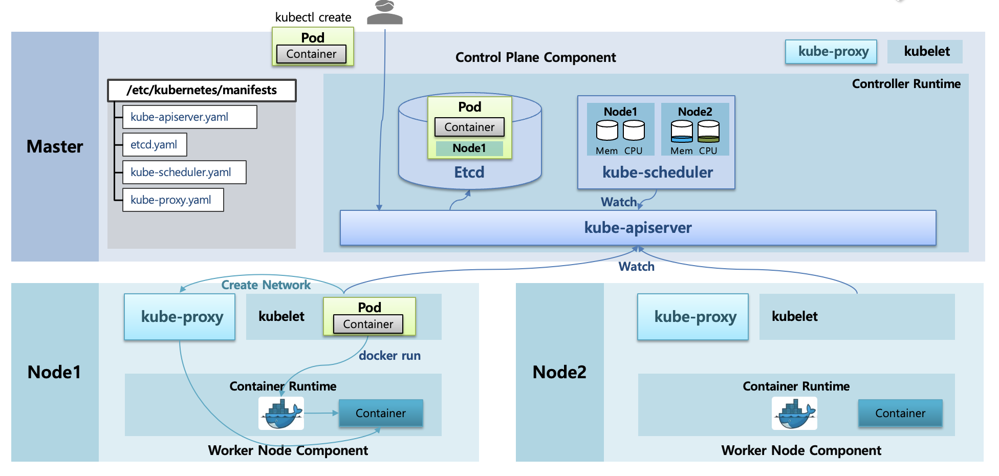
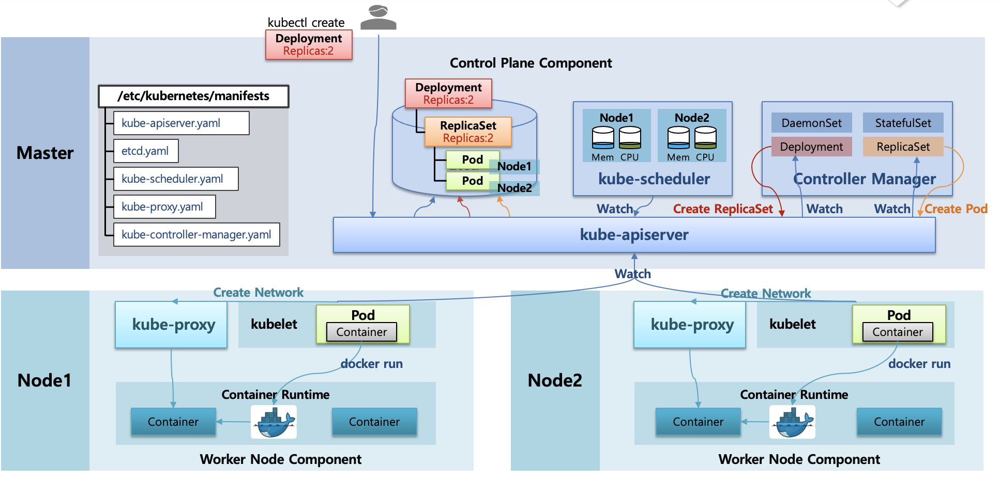

## 쿠버네티스 전체 아키텍쳐 개요

- 쿠버네티스는 크게 두 영역을 나뉜다

**Control Plan (Master Node)**

- 클러스터의 두뇌역할을 수행한다
- 종류
  - `kube-apiserver`
  - `etcd`
  - `kube-scheduler`
  - `kube-controller-manager`

**Worker Node**

- 실제 일을 하는 노드 역할을 수행한다
- 종류
  - `kubelet`
  - `Container Runtime (Docker, containerd 등)`
  - `kube-proxy`
  - `CNI Plugin (Calico, Cilium 등)`

**manifests 를 통해 각 Pod 를 생성**

- 위 각 노드의 존재하는 Pod (`kube-apiserver`, `etcd`, `kube-proxy` 등) 는 `/etc/kubernetes/manifests` 안의 있는 yaml 파일을 통해 Pod 를 만든다

```text
/etc/kubernetes/manifests/
 ├── etcd.yaml
 ├── kube-apiserver.yaml
 ├── kube-scheduler.yaml
 ├── kube-controller-manager.yaml
```

쿠버네티스 부팅시 동작방식

1. kubelet 이 부팅됨
2. `etc/kubernetes/manifests` 디렉터리 감시
3. yaml 파일 발견
4. 해당 yaml 을 Pod 로 실행
5. 해당 Pod 는 Static Pod
6. kube-apiserver 에 미러 Pod 로만 등록됨 (읽기 전용)

정확히 이야기하자면 쿠버네티스가 기동 시 해당 파일을 읽는다기 보단 kubelet 이 직접 읽어서 실행한다

> Static Pod
>
> - kube-apiserver 를 거치지 않고 kubelet 이 로컬 파일을 직접 읽어 생성하는 Pod
>
> 왜 사용하는가?
>
> - kube-apiserver 가 죽으면 일반 Pod 는 생성 불가능
> - 하지만 Control Plane 은 살아있어야 일반적인 Pod 는 복구 가능

</br>

### Pod 생성 흐름



1. 사용자 요청 → `kubectl create pod`

   - kubectl 요청시 해당 요청은 `kube-apiserver` 의 REST 요청으로 처리됨

2. kube-apiserver

   - 요청 유효성 검증, 인증/인가 검증 수행
   - Pod 객체를 etcd 에 저장하며 Pod 생성됨 이벤트 발생 → etcd 는 쿠버네티스의 여러 데이터를 저장하는 DB 역할을 수행

3. kube-scheduler

   - 각 워커 노드의 자원들을 수시로 체크한다
   - kube-apiserver 에 watch 수행 → etcd 에 Pod 생성 요청이 들어왔는지 감시
   - etcd 에 Pod 생성 요청을 확인하면 지금 노드 자원에서 해당 Pod 가 어느 노드로 가면 좋을지를 판단
   - 노드를 선택한 뒤 Pod 에 노드 정보를 붙여준 뒤 etcd 에 저장한다

4. kubelet

   - 각 노드들의 kubelet 은 Pod 에 자신의 정보가 붙어있는지를 감시한다 → kube-apiserver 에게 watch 를 붙임
   - Pod 에 자신의 노드정보가 붙어있는지 감지하면 해당 Pod 정보를 노드로 가져온다
   - kubelet 은 Pod 생성시 크게 두 가지 일을 수행한다 → Container 생성 요청 / 네트워크 연결 요청
   - 먼저 Container Runtime (Docker) 에게 Container 를 만들어달라고 요청한다 → Container Runtime(Docker) 는 Container 를 생성
   - 이후 kubelet 은 CNI Plugin 을 호출한다 → Service 네트워크의 경우 kube-proxy 가 만들어진 Continer 와 네트워크 연결을 수행한다

</br>

### Deployment 생성 흐름



> 먼저 Controller 의 개념에 대해서 정리
>
> - 원하는 상태와 실제 상태를 계속 맞추는 루프
>   - desired state == current state

> Controller Manager
>
> - `/etc/kubernetes/manifests` 의 kube-controller-manager.yaml 파일이 존재하며 해당 정보를 통해 Controller Manager 라는 하나의 Pod 를 마스터 노드에 띄움
> - 내부에 여러 Controller 가 Thread 혹은 Goroutine 형태로 띄워져 있음
>   - Deployment Controller
>   - ReplicaSet Controller
>   - Node Controller
>   - Job Controller
>   - ...

1. 사용자가 Deployment 생성 요청을 수행

   - 해당 명령은 kube-apiserver 에 전달되며 etcd 에 저장한다

2. Deployment Controller

   - Controller Manager 의 Deployment Controller 는 kube-apiserver 에게 Deploy 에 대한 정보가 들어오면 알려달라는 watch 를 걸어놓는다
   - 이후 Deployment Controller 는 Deploy 생성 요청을 감지하면 해당 Deployment 에 대응하는 ReplicaSet 이 없다고 판단한다
   - kube-apiserver 에게 ReplicaSet 을 만들어달라고 요청을 한다

3. ReplicaSet Controller

   - Controller Manager 의 ReplicaSet Controller 는 Replica Object 가 있는지를 알려달라는 watch 를 kube-apiserver 에 걸어놓는다
   - 해당 Replica 를 감지하고 Replicas 가 몇 개인지 확인한다 → 2개 요청
   - 해당 개수를 확인 후 그 만큼 Pod 를 만들어달라고 kube-apiserver 에게 요청한다

4. 이후 Pod 생성 과정을 수행

   - kube-scheduler 가 Node 자원 파악 및 Pod 에 적절한 Node 매핑 후 etcd 에 저장
   - 각 노드의 kubelet 은 자신이 할당된 노드가 있는지 판단 후 Pod 정보를 노드로 가져옴
   - kubelet 은 Container 생성, 네트워크 생성 요청

> ReplicaSet / Deployment / DaemonSet 개념
>
> ReplicaSet
>
> - Pod 개수를 유지하며 Pod 가 죽으면 다시 생성
>
> Deployment
>
> - ReplicaSet 의 상위 개념, Rolling Update, Rollback, 버전 관리 추가
>
> DaemonSet
>
> - 모든 노드에 하나씩 Pod 를 추가하는 작업을 수행
