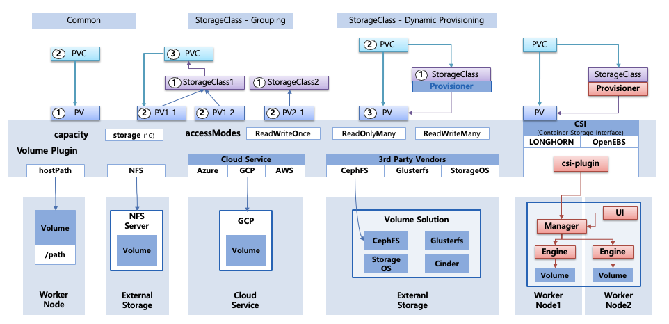

## 쿠버네티스의 스토리지

- 쿠버네티스의 스토리지는 사용자가 볼륨을 직접 만드는 구조가 아닌 Pod 가 요구하는 저장공간 요구사항을 선언하면 클러스터가 해당 요구사항을 만족시키는 실제 볼륨을 준비해서 Pod 에 붙여주는 구조로 설계되어 있다
- 해당 구조의 핵심은 PVC, PV, StorageClass 이다
  - 사용자가 보통 PVC (Persistent Volume Claim) 를 생성하여 어떤 요구사항의 스토리지가 필요하다고 요구한다
  - 클러스터는 해당 요구사항을 만족시키는 PV (Persistent Volume) 을 실제 볼륨 단위로 Provision 하여 PVC 에 Binding 한다
  - StorageClass 는 어떤 스토리지 백엔드 (NFS, EBS, GCE PD, Ceph 등) 를 어떤 정책으로 만들 것 인지 분류 및 정의하는 단위로 사용

 

### PVC, PV 동작 방식

- kube-apiserver 는 PVC 오브젝트를 etcd 에 저장
- 이 시점에 PVC 의 상태는 보통 `Pending` 으로 시작한다
- 컨트롤 플레인에 있는 컨트롤러들이 PVC/PV 를 watch 하면서 동작
  - PVC 를 만족시키는 PV 가 이미 존재하는가 / 새로 만들어야 하는가
- 만족하는 PV 가 있다면 컨트롤러는 PVC 와 PV 를 바인딩한다
- 만족하는 PV 가 없고 PVC 에 StorageClass 가 지정되어 있다면 동적 프로비저닝 (Dynamic Provisioning) 으로 동작

 

### PV 의 의미

- PV 는 쿠버네티스의 리소스를 의미하지만 PV 자체가 디스크를 가지고 있는 것은 아니며 실제 디스크/스토리지에 대한 연결 정보와 스펙을 담은 객체를 의미한다
- PV 에는 다음 정보가 들어간다
  - `capacity`
    - 쿠버네티스가 PV 를 PVC 에 매칭할 때 사용하는 스케줄링/바인딩 기준, 컨트롤러는 PVC 가 1GB 를 요구한다면 `capacity.storage` 가 그 이상인 PV 만 후보로 본다
  - `accessModes`
    - 해당 볼륨을 어떤 방식으로 여러 Pod/노드 에서 사용할 수 있는가를 쿠버네티스에 알려주는 제약 조건, 컨트롤러는 PVC 의 accessModes 요구를 만족하는 PV만 바인딩 대상으로 선택
  - `volume plugin` (혹은 CSI driver 정보)
    - PV 는 백엔드가 hostPath 인지 NFS 인지 특정 클라우드 디스크인지에 따라 볼륨 타입 정보가 달라진다, 해당 정보는 Pod 를 스케줄링한 노드에서 kubelet 이 볼륨을 실제로 attach/mount 할 때 어떤 드라이버를 호출해야 하는지를 결정

 

### StorageClass 의 두 가지 역할 (Grouping, Dynamic Provisioning)

**Grouping (분류/정책 단위로 PV 를 묶는 의미)**

- 해당 클래스를 선택한 PVC 는 어떤 스토리지 특성 (성능, 복제, 암호화 등)을 가진 PV 와 매칭되어야 한다 라는 분류 기준을 가지고 동작한다
- PV 가 미리 만들어두는 (정적 프로비저닝) 환경에서도 PVC 가 특정 StorageClass 를 지정하면 컨트롤러는 그 StorageClass 조건을 만족하는 PV 만 후보로 삼아 바인딩한다
- 즉 사용자는 NFS 가 필요하다, 고성능 SSD 가 필요하다 라고 직접적으로 특정 PV 를 요구하지 않고 StorageClass 이름 하나로 정책을 선택한다

**Dynamic Provisioning**

- PVC 에 StorageClass 가 지정되어 있고 기존 PV 가 없다면 동작
- 컨트롤러 (혹은 CSI external-provisioner) 가 PVC 를 감지
- 해당 컨트롤러는 StorageClass 의 `provisioner` 값을 보고 어떤 드라이버로 실제 볼륨을 만들지를 결정
- 실제 드라이버 (AWS EBS, GCE PD CSI driver) 는 실제 백엔드에 볼륨 생성 API 를 호출
- 볼륨 생성이 성공하면 컨트롤러는 쿠버네티스에 새로운 PV 오브젝트를 생성하고 해당 PV 를 PVC 에 바인딩한다
- 즉 실제 볼륨 생성 작업을 트리거하고 생성 파라미터를 제공하는 정책 객체로 동작한다

 

### PV 종류 및 동작 방식

**hostPath PV**

- 쿠버네티스 노드(워커 노드) 의 로컬 파일시스템 경로를 Pod 에 마운트하는 방식
- `kubelet` 은 Pod 를 실행할 때 PV 에 들어있는 hostPath 경로(예시: `/data`) 를 Pod 의 컨테이너 파일시스템 경로 (`/mnt`) 에 bind mount 로 연결한다
- 스토리지가 노드 로컬에 고정되기 때문에 Pod 가 다른 노드로 이동하면 같은 데이터를 보장할 수 없다
- 실무에서 테스트, 단일 노드로 사용하고 그 외에는 위험하다

**NFS 기반 (외부 스토리지)**

- 외부 NFS 서버가 export 한 디렉토리를 Pod 가 올라간 노드에서 NFS mount 로 붙이고 그 마운트 지점을 컨테이너에 제공하는 방식
- kubelet 은 Pod 가 스케줄링된 노드에서 NFS 클라이언트 마운트 작업을 수행
- 마운트가 완료되면 kubelet 은 그 마운트 지점을 컨테이너 경로에 연결
- NFS 는 여러 노드에 같은 export 를 동시에 mount 할 수 있으므로 보통 RWX(ReadWriteMany) 를 제공할 수 있다

**Cloud Service 연결**

- 클라우드 블록 스토리지 (EBS, GCE PD) 계열은 볼륨이 특정 노드에 attach 되어야만 그 노드에서 파일 시스템 mount 가 가능한 방식
- 스케줄러가 Pod 를 특정 노드에 배치
- 컨트롤 플레인/CSI 컨트롤러가 그 볼륨을 해당 노드에 attach 하도록 클라우드 API 를 호출
- 노드 쪽 CSI node plugin (또는 kubelet + 플러그인) 이 attach 된 디바이스를 포맷/마운트 한다
- kubelet 이 마운트 지점을 컨테이너로 전달한다

**3rd party (CephFS, Longhorn 등)**

- 공유 파일 시스템을 제공하기도 하고 분산 블록 스토리지를 제공하기도 한다
- 중요한 건 쿠버네티스 입장에서 이들은 대부분 CSI 드라이버 형태로 통합되며 볼륨 생성/attach/mount 는 CSI 컨트롤러와 노드 플러그인이 담당한다

> CSI (Container Storage Interface)
>
> - 과거에는 쿠버네티스 내부 볼륨 플러그인이 많았고 쿠버네티스 버전 업데이트와 스토리지 기능 업데이트가 강하게 결합되는 문제가 있었다
> - CSI 는 아래 방식으로 해결한다
>   - 스토리지 벤더/솔루션이 드라이버를 컨테이너 형태로 배포
>   - 쿠버네티스는 표준 RPC 인터페이스 (CSI) 로만 호출
>   - 드라이버는 쿠버네티스 릴리즈와 분리되어 독립적으로 업데이트
> - 즉 스토리지 제어 로직을 쿠버네티스 밖으로 빼서 컨테이너를 운영하도록 하게 만든 표준

 

### Storage Type (File/Block/Object)

**File Storage**

- 노드가 스토리지를 디렉토리/파일 단위로 다루도록 해주는 방식이며 노드는 보통 NFS/SMB 같은 프로토콜로 원격 파일시스템을 mount 하는 구조
- 여러 노드가 같은 파일시스템을 동시에 mount 할 수 있으므로 RWX 가 가능한 경우가 많다
- 애플리케이션은 파일 경로 기반으로 읽고 쓰며 공유 파일을 여러 Pod 가 동시에 접근할 수 있다

**Block Storage**

- 노드가 스토리지를 디바이스로 인식하도록 해주는 방식, 노드는 해당 볼륨을 `/dev/xvd/...` 같은 블록 디바이스로 attach 받은 뒤 파일시스템을 올리고 mount 한다
- 일반적으로 클라우드 블록 스토리지는 한 시점에 한 노드에만 붙는 제약이 많아서 결과적으로 RWO 가 기본이 되어야 한다
- 다른 노드로 옮기려면 기존 노드에서 detach 를 먼저 수행하고 새로운 노드에 attch 를 수행한 다음에야 mount 가 가능하다

**Object Storage**

- 파일시스템 마운트가 아닌 애플리케이션이 HTTP API (S3 API 등) 로 객체를 업로드/다운로드 하는 방식
- Pod 가 디스크를 mount 해서 쓰는 구조가 아닌 네트워크 API 로 데이터에 접근하는 구조
- 여러 Pod/노드가 동시에 접근해도 스토리지 자체가 객체 단위로 처리하므로 공유에 유리하다
- 다만 `append`, `file lock` 을 동일하게 제공하지 않는 경우도 존재하며 파일시스템처럼 사용하려면 별도 구성이 필요하다

 

### accessModes (RWO/ROX/RWX)

**RWO (ReadWriteOnce)**

- 동일한 PV 가 동시에 여러 노드에 mount 될 수 없다는 제약을 의미한다
- 보통 attach 가능한 노드가 1개인 블록 스토리지 특성과 결합된다

**RWX (ReadWriteMany)**

- 여러 노드에서 동시에 mount 되더라도 스토리지 자체가 동시 접근을 처리할 수 있어야 한다
- NFS/CephFS 같은 파일 스토리지가 RWX 를 제공하기 쉽다

**ROX (ReadOnlyMany)**

- 여러 노드에서 동시에 mount 되더라도 쓰기 동작을 금지해서 일관성 문제를 줄이는 모드이다
- 동일한 데이터 셋을 여러 Pod 에서 참조만 하는 경우에 유용하다

> Deployment 가 공유 스토리지와 잘 맞는 이유
>
> - Deployment 는 ReplicaSet 을 통해 Pod 를 수평 확장하면서 Pod 가 어느 노드로든 자유롭게 스케줄링될 수 있다
> - 여러 Pod 가 동시에 접근 가능한 RWX 계열 (File Storage 혹은 Object Storage API 접근)이 있으면 확장과 재배치에 유리하다
>
> StatefulSet 과 블록 스토리지
>
> - StatefulSet 은 Pod 에 고정된 아이덴티티 (예시: `db-0`, `db-1`) 를 부여하고 일반적으로 각 Pod 가 자신만의 영속 볼륨을 가져야 한다
> - 이때 흔히 사용하는 방식이 `volumeClaimTemplates` 로 Pod 인스턴스마다 PVC를 하나씩 자동 생성하게 만드는 것
> - 즉 Pod 를 만들때마다 PVC 를 새로 만든다는 건 StatefulSet 이 `volumeClaimTemplates` 를 통해 Pod 인스턴스별로 고유 PVC/PV 를 갖도록 설계하는 패턴을 의미한다
> - 이 구조가 블록 스토리지의 RWO 제약과도 잘 맞는데 각 Pod 는 자기 볼륨을 자기 노드에 attach 해서 쓰는 방식으로 운영되기 때문이다
