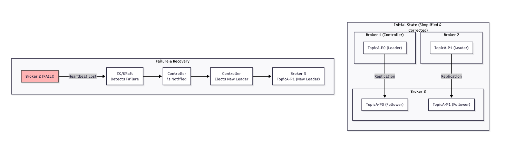

## 카프카의 분산 시스템에 대해서

- 카프카는 기본적으로 클러스터 형태로 구성된다
  - 서버 한대가 고장나도 멈추지 않는다
- 수많은 서버들이 인식하고 작업을 나눈다
- 브로커는 메시지를 저장하는 역할을 수행하지만 클러스터 내의 수많은 브로커 중 단 하나의 브로커는 특별한 브로커 역할을 수행한다
  - 이를 컨트롤러 브로커라고 부른다
  - 카프카 클러스터의 총 사령관 같은 역할을 수행한다
  - 클러스터 환경에서는 모든 상태의 변경과 결정을 수행하게 된다
  - Zookeeper 에 대해 의존적이다
- 컨트롤러 브로커 → 리더 선출이라는 과정을 통해 특정 파티션에 리더 브로커 장애가 발생할 경우 살아있는 다른 브로커 중에서 새로운 리더 선출 및 전파 작업을 수행, 클러스터에 있는 멤버 관리, 새로운 브로커가 참여 및 기존 브로커 장애시 감지 및 클러스터의 메타 데이터를 갱신하는 역할을 수행한다
  - 토픽 관리를 하면서 새로운 토픽 생성 및 파티션 추가, 토픽 삭제 등 토픽 변경시 필요한 작업을 조율하는 역할을 수행
  - 컨트롤러 브로커가 장애 발생 시 리더 선출이라는 과정을 통해서 자동으로 새로운 컨트롤러 브로커를 선별하게 된다

 
 

## 클러스터 구조에서 장애 발생시 메커니즘

- 이 과정에서 필수적으로 ISR 이라는 개념이 도입하게 된다 
    - ISR : 동기화된 복제본 그룹을 의미, 특정 파티션의 리더와 완벽하게 동기화된 상태를 유지하고 있는 팔로워들의 집합을 의미한다 
        - 팔로워는 리더 브로커가 아닌 브로커들을 의미함 
        - 즉 컨트롤러 브로커와 완벽하게 복제된 다른 브로커들을 의미함 
        - 리더의 정보를 꾸준히 복제, ISR 그룹에 포함되어 있음, 뒤쳐진다면 ISR 그룹에 제외되어 동작 
            - 정상적으로 잘 동작하며 복제를 잘 수행하는 팔로워 브로커의 집합 
- 브로커가 다운되었을 때
    - 장애 탐지는 Zookeeper 에서 헬스 체크를 통해 장애를 탐지한다 
    - Zookeeper 가 컨트롤러 브로커에게 알려준다 
    - 컨트롤러 브로커는 재선출 과정을 진행하게 된다 
    - 컨트롤러는 장애가 발생한 브로커가 리더였던 모든 파티션의 목록을 확인 
    - 해당 파티션의 ISR 목록에서 가장 적합한 팔로워를 새로운 리더로 선출 
    - 메타 데이터 업그레이드 과정도 필요함, 새로운 리더가 선출되었다고 다른 브로커에게도 전파 
    - 프로듀서와 컨슈머도 해당 정보가 전파되며 새로운 메시지는 새로 선출된 브로커에게 전달됨 
    - 모든 과정은 자동으로 수행된다 
- Zookeeper 의 역할 
    - 모든 과정을 조정해주는 역할 
    - 어떤 브로커가 살아있는지, 리더는 누구인지 관리 
    - KRaft 라는 Zookeeper 없이 동작하는 프로토콜도 존재한다 → 최근에 나온 개념
