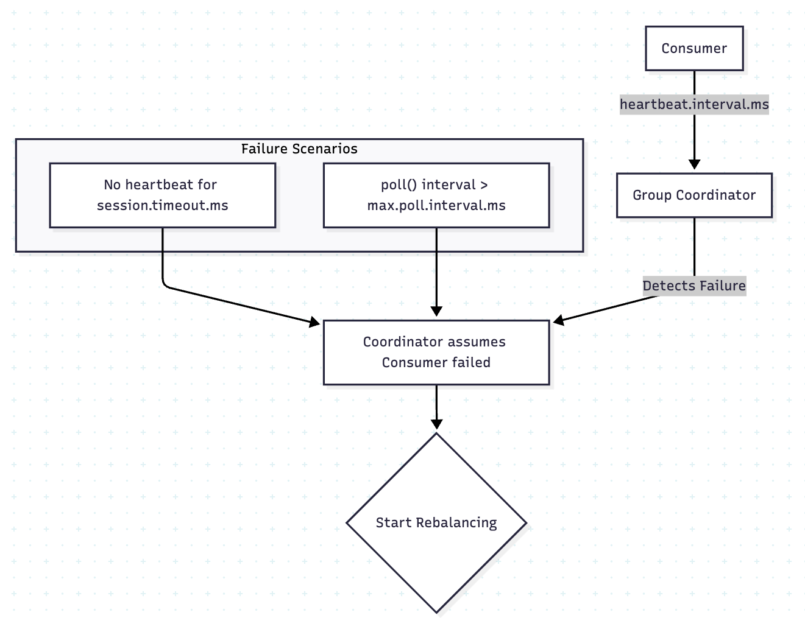
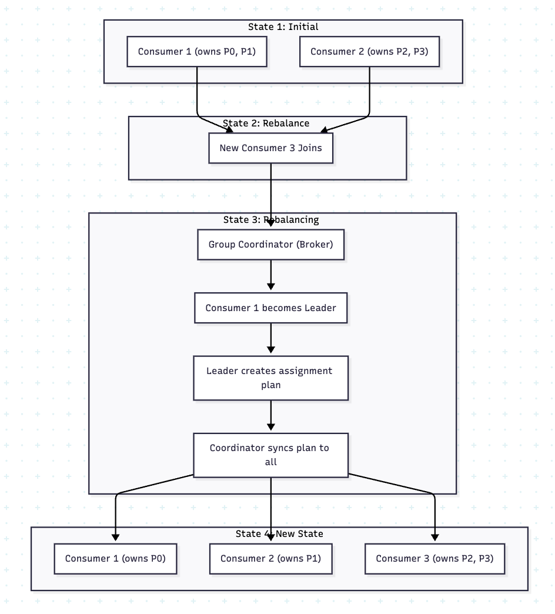

## 컨슈머의 리밸런싱, 오프셋 커밋

컨슈머는 메시지를 받아서 핸들링하는 역할을 수행 → 클라이언트 관점

내부 동작 과정

컨슈머 그룹처럼 일종의 그룹이 존재함

- 그룹을 기준으로 하나의 토픽을 병렬로 처리하는 형태로 동작하게 됨

구독하는 토픽의 파티션이 변경하게 된다면 각 컨슈머가 어떤 파티션을 담당할지 재조정하는 과정도 존재함

- 리밸런싱

 
 

### 리밸런싱

- 리밸런싱이 발생하는 조건
  - 새로운 컨슈머가 그룹에 참여할 때
  - 기존 컨슈머가 그룹을 떠날때
  - 구독하는 토픽의 파티션의 개수가 변경될 때
- Group Coordinator
  - 브로커 중 하나가 각 컨슈머 그룹에 Coordinator 역할을 수행하는 방식
  - 리밸런싱이 필요하다면 Coordinator 는 해당 그룹에 모든 컨슈머에게 작업을 멈추고 파티션 소유권을 포기하라는 명령을 요청하게 됨
  - 이후 리더 선출 과정을 진행, 그룹의 첫 번째로 합류한 컨슈머가 리더로 선출됨
  - 구 토픽의 파티션 할당 전략도 존재함
    - 리더 컨슈머는 환경 설정에 따라 어떤 파티션을 어떤 컨슈머가 할당할지를 수행 → Sticky, Round Robin 등
  - 할당 계획이 마무리 되면 리더 컨슈머는 계획한 정보를 Coordinator 에게 보내게 됨
  - Coordinator 는 계획에 따라 다시 컨슈머에게 브로드 캐스팅하게 됨 → 새로운 리더가 선출되면 다른 컨슈머에게도 전파

 

**중간에 실패한 케이스**

- 리밸런싱 과정
- 실패 시나리오 발생 시 Coordinator 가 조율
- Coordinator 는 실패 확인 후 리밸런싱 진행

 

**새로운 컨슈머가 추가되었을때 케이스**

- 새로운 컨슈머가 감지되면 Coordinator 에게 요청을 해서 리더 선출 → 첫 번째로 합류한 컨슈머가 리더
- 할당 계획을 Coordinator 에게 전달 → 각 컨슈머에게 다시 파티션 할당 및 전파
- 리밸런싱이 자주 발생하게 되면 글로벌 락이 걸려 이때는 성능에 안좋은 영향이 생길 수 있음

 

**오프셋 커밋 전략**

- 컨슈머가 어디까지 작업을 처리했는지 기록하는 전략
- 두 가지가 존재
  - 자동 커밋: 컨슈머가 메시지를 받아오면 받아온 것에 만족하고 바로 커밋을 해버림 → auto commit interval 환경 설정값을 통해 처리
    - 이벤트 유실 가능성이 있음 → 자주 사용되지 않음(비즈니스 로직으로 인한 에러 시 이벤트 유실)
  - 수동 커밋: 자동 커밋과는 반대로 최종적으로 클라이언트 코드 레벨에서 커밋 명령어를 호출
    - 동기 커밋과 비동기 커밋이 존재함
    - 동기 커밋: 브로커가 정상적으로 커밋되었다는 응답을 기다리고 도착되면 처리
    - 비동기 커밋: 브로커는 상관없이 커밋했다고 전달 (fire and forget 느낌), 응답을 기다리지 않으니 지연 시간 줄어듦
      - 그러나 응답을 기다리지 않으므로 이에 따라 오프셋이 꼬일 수 있음
