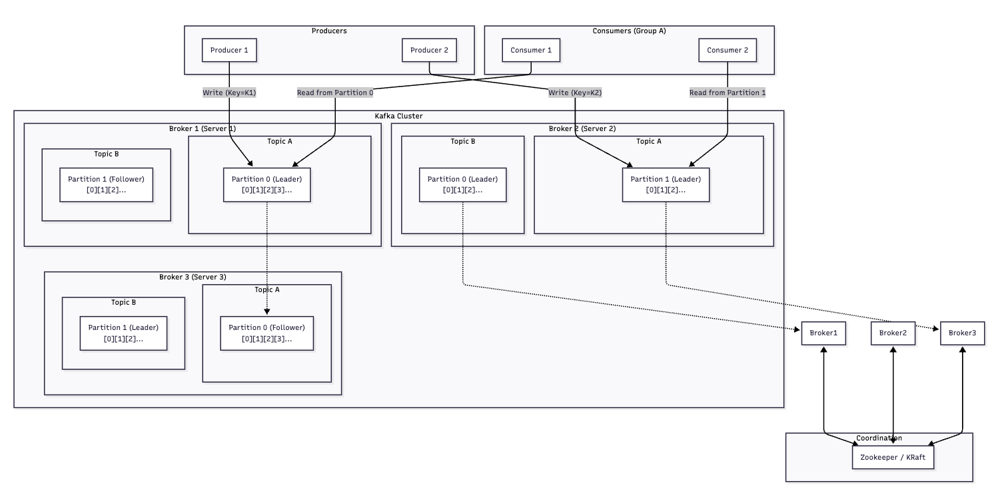

## 클러스터 개념

- 여러 개의 브로커가 묶인 개념을 의마한다 → 브로커의 그룹을 지칭하기도 함
- 클러스터라는 개념은 카프카에만 국한된 개념은 아니다
- 클러스터를 구성하는 이유는 부하를 분산하기 위해 → LB 처럼 동작하기 위해 사용한다
  - 고가용성을 위해 → 브로커를 여러 대로 구성함으로써 무중단 구성이 가능하다

 
 

## 브로커 개념

- 카프카가 설치된 서버 한대를 의미한다
- 메시지를 전달 및 저장 → 이벤트 버스의 역할을 수행한다

 
 

## 토픽 / 파티션

- 데이터를 저장하고 관리하는 기준

### 토픽

- 데이터의 종류를 클라이언트가 구분하기 위한 이름 → 키 역할/폴더 같은 역할
  - 예) A 라는 데이터만 받아서 로직 처리

### 파티션

- 카프카 성능과 병렬처리의 핵심 개념
- 하나의 토픽은 여러개의 파티션으로 나뉘어 저장됨
- 이유는 하나의 토픽이 거대한 파일 하나일 경우 모든 쓰기 작업이 해당 파일에만 몰리게되고 병목 현상이 발생
  - 토픽 데이터를 여러 파티션으로 나뉠 수 있다면 여러 파티션에 데이터를 쓸 수 있게 동작할 수 있게 된다
  - 쓰기 처리량이 늘어나는 효과 / 분산되어 저장되므로 파일 사이즈가 줄어듦

 
 

## 오프셋 / 세그먼트

### 오프셋

- 메시지가 가지는 고유 번호, MySQL 의 AutoIncrement 같이 동작한다
- **카프카는 메시지의 순서 보장을 오프셋을 통해 보장한다**
- **그러나 카프카는 토픽 전체의 메시지에 대해서는 순서를 보장하지 않음**
  - **A 라는 토픽은 여러 개의 파티션으로 분산될 수 있다 → 파티션마다 오프셋은 1대1 매핑되며 고유한 값을 가진다**
  - **토픽을 기준으로 봤을 때 어떤 파티션의 오프셋이 먼저일지 알 수 없음**
  - **오프셋의 순서 보장은 같은 파티션내에서만 유효하며 메시지가 순서대로 저장 및 소비된다**
- **순서 보장의 역할도 수행하지만 메시지를 읽은 위치의 역할도 수행한다**

### 세그먼트

- 파티션은 각각 분산되어 세그먼트라는 파일로 구성된다
- 파일의 크기나 시간이 일정 기준을 넘어서게 되면 새로운 세그먼트 파일을 생성 및 여기에 작성
- 이유는 분산 저장함으로써 오래된 데이터를 삭제, 조회시 큰 무리없이 처리될 수 있도록 지원하기 위함이다

 
 

## Zookeeper

- 모든 것을 지휘하며 관리하는 메타 데이터 서버의 역할을 수행한다
- 카프카 클러스터의 메타 데이터를 관리 및 중지하는 역할을 수행 → 컨슈머 그룹의 상태 관리, 리더는 누구인지 등을 관리한다

 
 

## 메시지 생명 주기

- Producer → Broker → Consumer

- Producer(메시지 발행) → 어떤 파티션으로 보낼지 내부적으로 결정 → 파티션 리더에게 전송 (리더가 존재한다면) → 파티션 리더가 있는 브로커 정보를 Zookeeper 에게 얻어옴 → 브로커에게 메시지 전송 
- 브로커가 메시지를 받게 되면 리더 파티션에 마지막 오프셋에 메시지를 추가, 변경사항을 복제해야하는 파티션이 있다면 해당 파티션을 복제하라고 다른 브로커에게도 브로드캐스팅 
- 저장된 파티션은 컨슈머가 주기적으로 폴링(준 실시간 성) → 메시지가 있다면 주세요 처리 → 메시지를 가져오면 원하는 비즈니스 로직을 수행 
