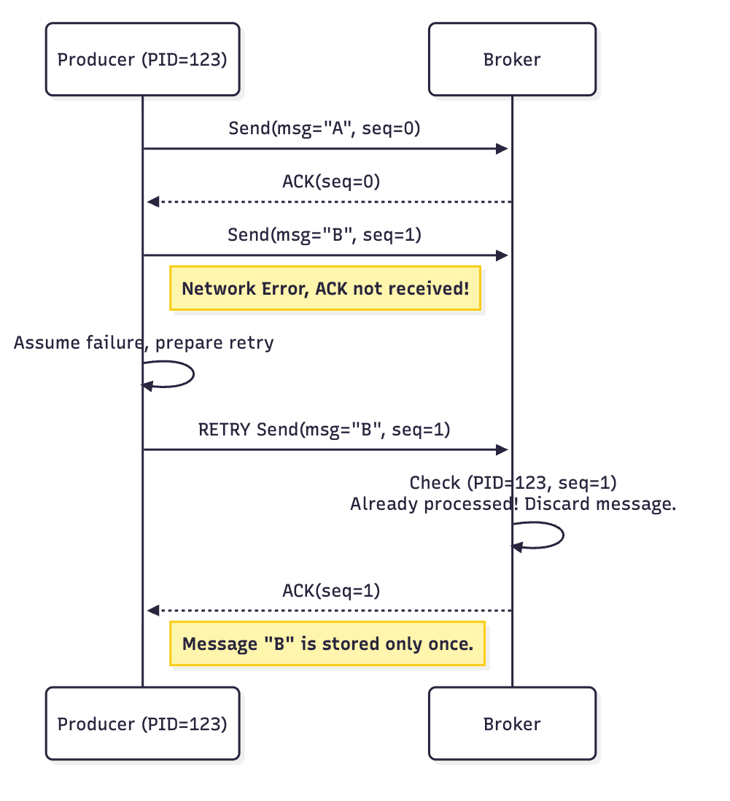
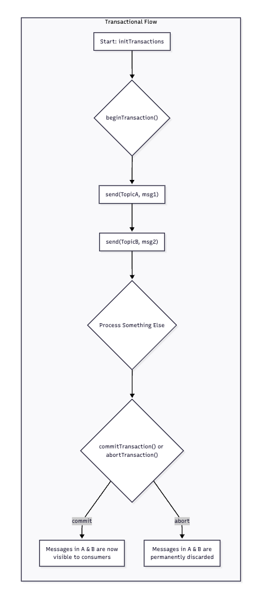
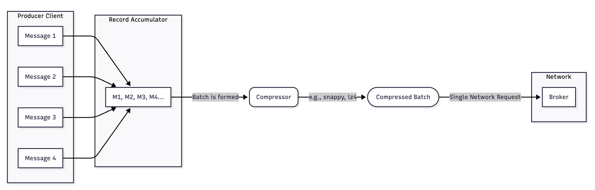
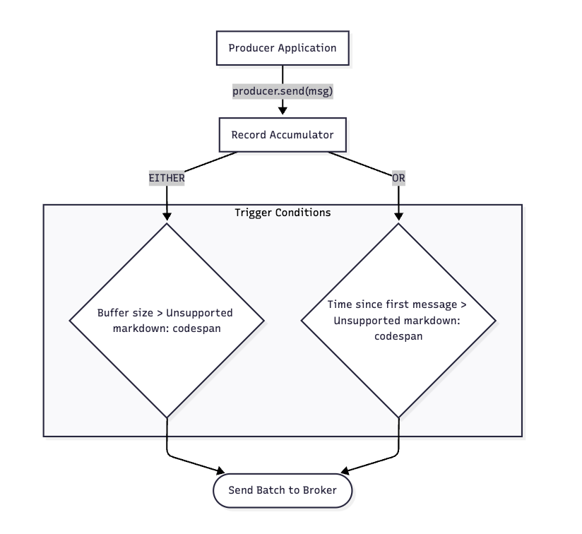

## 프로듀서 아키텍쳐, 메시지 저장 및 효율적인 동작 개념

효율적인 데이터 전송을 위한 프로듀서의 다양한 기능들에 대해 

- 프로듀서는 멱등성의 개념을 가지게 된다 → 네트워크 오류로 인해 재시도를 하더라도 메시지가 정확히 한번만 브로커에 기록이 되는 것을 보장하는 특징 

 

**문제 상황 (멱등성을 어떻게 보장하는가?)**

- 프로듀서가 메시지를 보내고 브로커로부터 ACK 신호를 기다리는 동안 네트워크 장애가 발생한다면 
- 프로듀서는 재전송을 진행하게 된다 
    - 만약 첫 번째 메시지가 성공되어 있다면? 중복된 메시지가 저장되는 현상이 발생하게 된다 
- 이를 인지하고 해결하기 위해 카프카는 프로듀서에게 고유한 아이디(PID)를 부여하여 프로듀서가 보내는 메시지에 0 부터 시작하는 시퀀스 번호를 부여하게 된다 
- 이후 브로커는 해당 PID 와 시퀀스 번호의 조합을 기록하게 되고 만약 이전에 처리한 조합의 메시지가 다시 도착하게 된다면 중복으로 간주하고 버리게 되고 ACK 응답을 다시 보내주게 된다 
- ACK, PID, 시퀀스 번호를 통해 메시지의 멱등성을 보장하게 된다

 
 

**트랜잭셔널 프로듀서**

- 멱등성을 보장하는 프로듀서가 단일 메시지, 단일 파티션 내에서 한번의 전송을 보장한다 
- 그러나 트랜잭셔널 프로듀서라는 개념은 여러 파티션에 걸쳐 여러 메시지를 보내는 작업을 하나의 원자적인 단위로 묶어서 처리하는 형태를 의미한다 
    - 전부 성공 or 전부 실패
- initTransaction → 프로듀서가 트랜잭션을 전송할거야 라는 형태로 초기화 하는 시간 
- beginTransaction → 트랜잭션 나한테 다 보내 라는 시간 
- send → 메시지 전송, 이때 트랜잭션에 포함될 메시지를 보내게 됨, 이때는 다른 컨슈머에게는 메시지가 전송되는 단계는 아님, 이후 여러번의 send 가 발생될 수 있음 
- commitTransaction → 메시지 처리를 모두 성공적으로 수행했다면 이후 commit 을 하고 이때부터 컨슈머가 메시지를 받게 된다 
- 만약 중간에 에러가 발생한다면 트랜잭션을 바로 중단하며 이때까지 보냈던 메시지를 초기화하게 된다 

 
 

**메시지 압축 기능**

- 데이터 압축 기술 
- 프로듀서는 메시지를 브로커에게 보내기전 메시지를 압축 
    - 네트워크의 대역폭과 브로커의 저장공간 확보 
- 브로커는 압축된 상태로 메시지를 저장하게 되고 컨슈머에게 메시지를 전달할때는 압축을 풀어서 메시지를 전달하게 됨 
- snappy, lz4 등의 코덱으로 압축 
- 압축은 개별 메시지 단위가 아닌 배치 단위로 압축해야지 좀 더 효과적이다 
    - 메시지가 많을수록 중복된 패턴도 많아지고 CPU를 사용해서 수행하는 작업이므로 반복해서 수행하기보다는 한 번에 처리하고 진행하는 것이 좋다 

 
 

**배치 전송**

- 프로듀서는 성능 향상을 위해 메시지를 즉각적으로 보내지 않고 내부 버퍼에 모았다가 한 번에 여러 메시지를 묶어서 전송하게 됨 
- 제어하는 설정 2 가지 
    - 배치 사이즈 : 16KB 가 기본값, 배치의 최대 크기 지정, 최대 크기 도달 시 즉시 묶어서 전송 
    - linger.ms : 기본값은 0ms, 첫 메시지가 버퍼에 도착한 후 전송을 위해 대기하는 최대 시간, 시간이 지나면 배치 사이즈에 도달하지 않아도 즉각적으로 메시지 전송 
        - 이 설정 값은 기본값이 0 이며 카프카는 최대한 실시간을 보장해줌 → 그러므로 배치 전송은 따로 설정이 없다면 기본적으로 비활성화되어 처리됨
