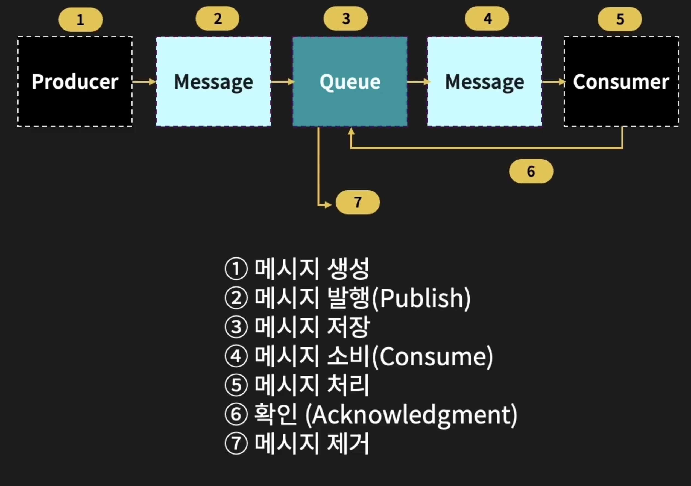
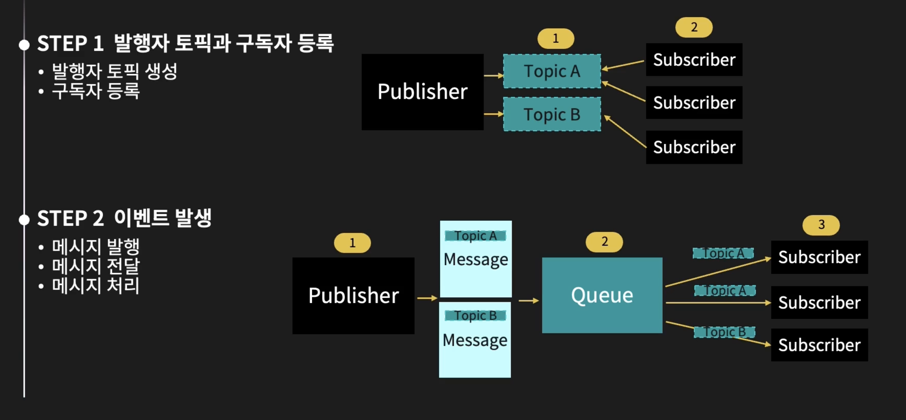
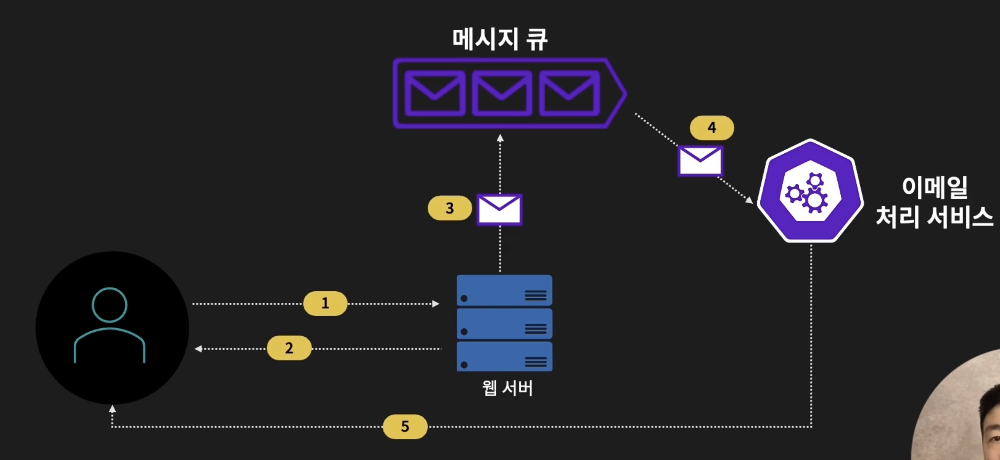
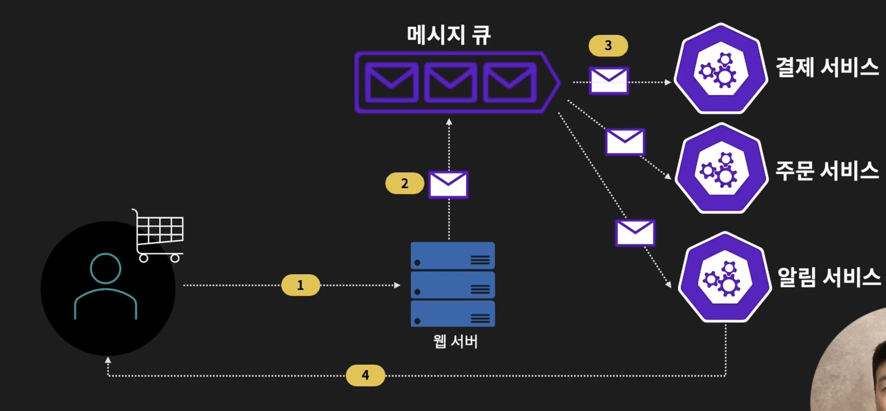
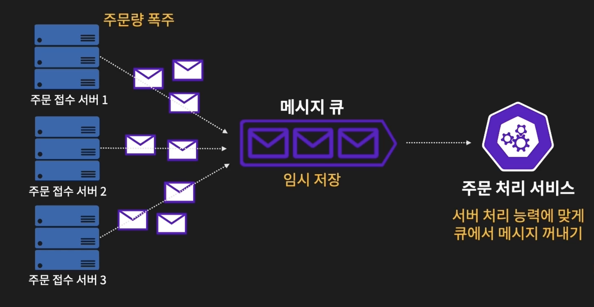

## 메시지 패턴

메시지 큐 시스템에서 메시지의 흐름과 처리방식을 정의하는 설계 방식

어떤 방식으로 메시지를 주고받고 처리할지에 대한 전략 및 패턴

주요 메시징 패턴

- P2P

  - Point-to-Point 패턴
  - 하나의 생산자가 메시지 큐에 전송하고 하나의 소비자가 해당 메시지를 가져와서 처리하는 구조
  - 1대1 통신방식
  - ex. Amazon SQS, Apache ActiveMQ, RabbitMQ
    

- Pub/Sub

  - Publisher / Subscriber 패턴
  - 하나의 생산자가 메시지를 발행하고 해당 메시지에 관심있는 소비자가 메시지를 구독, 구독을 통해서 메시지를 수신하는 방법
  - 1대 다수 통신 방식
  - 구독을 전제로 하기 때문에 크게 두 단계로 나뉨
  - ex. Redis Pub/Sub, Apache Kafka
    

  1. 발행자는 먼저 메시지를 보낼 토픽을 생성함 (ex. 주문완료, 결제완료, 배송시작 등)
  2. 구독자는 정의된 토픽에서 자신이 관심있는 토픽을 구독함
  3. `Step 2`
  4. 이벤트가 발생하면 발행자는 해당 이벤트가 담긴 메시지를 생성 및 해당 토픽에 메시지를 발행
  5. 메시지 큐는 해당 토픽을 구독한 모든 구독자에게 전달함
  6. 구독자는 수신한 메시지를 각자의 방식대로 처리

 
 

## 구축 사례

**이메일 서비스**

- 메시지 큐 사용 이유
  - 서버가 이메일 작업을 직접 처리하지 않음 → 추가 구성요소가 고려되어야 함
  - 이를 통해 웹 서버의 부하를 감소

 

**온라인 쇼핑몰**

- 메시지 큐 사용 이유
  - 웹서버가 주문, 알림, 결제 등의 역할을 직접 처리하지 않고 각 도메인 서비스에게 위임
  - 웹 서버 부하를 줄이고 독립적으로 각 도메인 서비스가 수행하도록 하기 위함

 

**데이터 버퍼링**

- 메시지 큐를 통해 대용량 트래픽을 처리
- 주문량이 폭주한 경우 메시지 큐가 주문 데이터를 임시 저장 (데이터 버퍼링)
- 주문 처리 서비스가 처리되는 준비가 되면 메시지를 소비함

