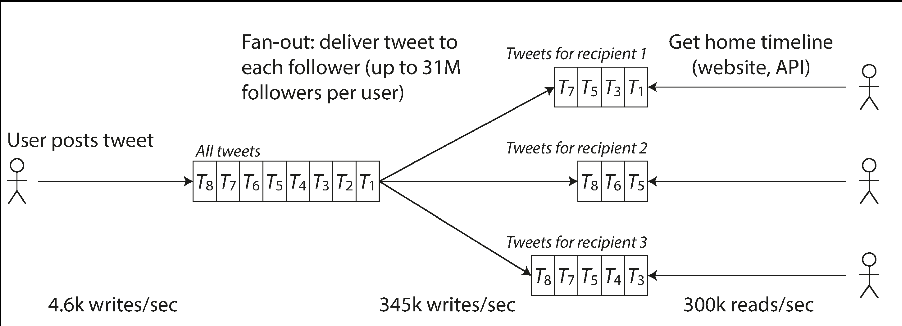

## 부하 매개변수

- 부하는 부하 매개변수라 부르는 몇 개의 숫자로 나타낼 수 있다
  - 예시) 웹 서버의 초당 요청 수, DB의 읽기 대 쓰기 비율, 오픈 대화방의 동시 활성 사용자 수, 캐시 적중률 등
- 부하 매개변수는 이렇듯 도메인에 따라 혹은 핵심 기능에 따라 혹은 서비스 자원에 따라 다를 수 있다

</br>

### Twitter 의 fan-out

- 트위터의 주요 두 가지 동작은 다음과 같다
  - 트윗(tweet) 작성 : 사용자는 팔로워에게 새로운 메시지를 게시할 수 있다
  - 홈 타임라인(timeline) : 사용자는 팔로우한 사람이 작성한 트윗을 볼 수 있다
- 단순히 트윗 작성 속도 즉 쓰기는 처리하기 쉽다, 하지만 트위터의 확장성 문제는 주로 트윗 양이 아닌 **팬 아웃(fan-out)** 때문이다
  - A가 트윗을 작성 → A를 팔로우한 사용자(B,C,D,E) 는 A 의 트윗을 각각의 홈 타임라인에 조회할 수 있어야 함

**초기 설계**

- 트위터는 첫 번째 버전으로 SQL 쿼리를 통해 조회하도록 처리하였다

```sql
SELECT tweets.*, users.* FROM tweets
  JOIN users ON tweets.sender_id = users.id
  JOIN follows ON follows.followee_id = users.id
  WHERE follows.follower_id = current_user
```

- 사용자가 자신의 홈 타임라인을 조회할 때 팔로우하는 모든 사람을 조회한 뒤, 이 사람들의 모든 트윗을 찾는다
- 이후 해당 트윗을 시간순으로 정렬하여 합친다
- **그러나 이렇게 홈 타임라인을 조회할 때마다 쿼리가 발생하면 시스템이 홈 타임라인 질의 부하를 버텨내지 못하며 트위터는 이 방식을 좀 더 개선하였다**

**1차 개선**



- 위 그림처럼 각 수신자는 개별 사용자의 홈 타임라인 캐시를 가지고 있다
- 사용자가 트윗을 작성하면 해당 사용자를 팔로우하는 사람을 모두 찾고 팔로워 각자의 홈 타임라인 캐시에 새로운 트윗을 삽입한다
- 이후 홈 타임라인을 조회할때 요청 결과를 미리 계산한 캐시를 통해 처리한다
- 이 경우는 쓰기 시점에 더 많은 일을 하고 읽기 시점에 적은 일을 수행한 결과이다
- 하지만 이 경우도 팔로워가 3천만 명이 넘는 인플루언스, 연예인 등에 대해서는 3천만 건 이상의 쓰기 요청이 처리될 수 있다는 의미이다
- **트위터의 사례는 사용자당 팔로워의 분포가 팬아웃 부하를 결정하기 때문에 확장성을 논의할 때 핵심 부하 매개변수가 된다**

**최종 개선**

- 트위터는 1차 개선에 이어서 초기 설계했던 작업과 혼합한 형태로 구성하고 있다
- 대부분 사용자의 트윗은 계속해서 사람들이 작성할 때 홈 타임라인에 펼쳐지지만 팔로워 수가 매우 많은 소수 사용자는 팬 아웃에서 제외된다
- 사용자가 팔로우한 유명인의 트윗은 별도로 가져와 초기 설계처럼 읽는 시점에 사용자의 홈 타임라인에 합친다

**애플리케이션 특성에 따른 부하 매개변수**

- 예를 들어 각 크기가 1kB 인 초당 100,000 건의 요청을 처리하도록 설계한 시스템과 각 크기가 2GB인 분당 3건의 요청을 처리하기 위해 설계한 시스템은 서로 같은 데이터 처리량이라고 해도 매우 다르다
- 특정 애플리케이션에 적합한 확장성을 갖춘 아키텍쳐는 주요 동작이 무엇이고 잘 하지 않는 동작이 무엇인지에 대한 가정을 바탕으로 구축된다
- 이 가정은 곧 부하 매개변수가 된다
- 초기 단계에는 검증되지 않은 제품의 경우에 미래를 가정한 부하에 대비한 확장보다는 빠르게 반복,실패하여 제품 기능을 개선하는 작업이 중요할 수 있다

</br>

## 백분위수

- 서비스의 평균 응답시간을 살피는 일은 일반적일 수 있다
- 하지만 실제 사용자가 경험한 응답시간을 알고 싶다면 평균은 그다지 좋은 지표가 아니다
  - 얼마나 많은 사용자가 실제로 지연을 경험했는지 알려주지 않기 때문이다
- 일반적으로 평균보다는 백분위를 사용하는 편이 좋다
  - 중앙값, p50으로 축약할 수 있으며 50% 의 응답시간보다 오래걸리는 응답을 확인할 수 있다
- 특이 값이 얼마나 좋지 않은지 알아보려면 상위 백분위를 살펴보는 것이 좋다
- 이때 사용하는 백분위는 95분위, 99분위, 99.9분위 (p95, p99, p999)
  - 95 분위 응답 시간이 1.5초라면 100개의 요청 중 95개는 1.5초 미만, 100개의 요청 중 5개는 1.5초보다 더 걸린다는 의미

</br>

### tail latency

- tail latency 는 서비스의 사용자 경험에 직접 영향을 주기 때문에 중요하다
- 예를 들어 아마존은 내부 서비스의 응답 시간 요구사항을 99.9 분위로 기술한다
- 보통 응답 시간이 가장 느린 요청을 경험한 고객들은 많은 구매를 해서 고객 중에서 계정에 많은 데이터를 가지고 있기 때문이다 → 즉 이 고객들은 헤비 고객이며 소중한 고객들이다

### HOL

- head-of-line blocking 문제는 요청 중 후속 요청이 빠르게 처리되더라도 이전 요청이 완료되길 기다리는 구조라면 이전 요청의 시간 때문에 클라이언트는 전체적으로 응답 시간이 느리다고 생각할 수 있다는 개념이다
